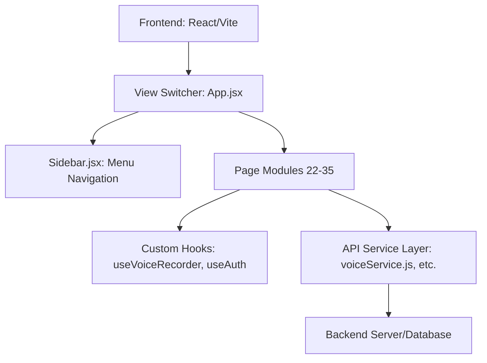
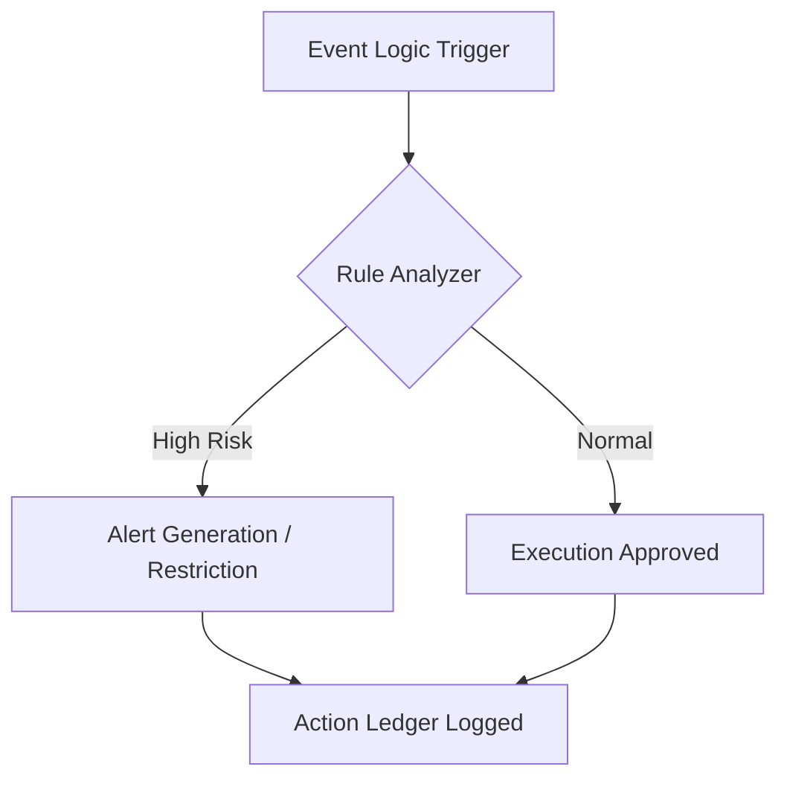

# Product Requirement Document (PRD): Superadmin Dashboard (Live M2M)

## 1. Overview
The **Dashboard** (Live M2M) is the primary monitoring interface for Superadmins and Admins. It provides a real-time summary of financial performance, user activity, and market exposure across all trading segments (MCX, NSE, Options, etc.).

---

## 2. Menu Identification
- **Menu Name:** Dashboard
- **Technical ID:** `live-m2m`
- **Icon:** `fa-table-columns` (Dashboard Icon)
- **Target Audience:** Superadmin, Admin, Broker (Limited), Client (Restricted view).

---

## 3. Data Architecture (Data Kaha se Ayega)

### Current State:
Currently, the data is hardcoded (dummy data) in the React component for UI demonstration.

### Proposed Production Data Flow:
| Widget | Potential Data Source (Backend) | Database Tables |
| :--- | :--- | :--- |
| **Live M2M Table** | API: `/api/v1/dashboard/live-m2m` | `users`, `trades`, `ohlc_data` |
| **Turnover Cards** | API: `/api/v1/analytics/turnover` | `trades` (Sum of Price * Quantity) |
| **Active Users** | API: `/api/v1/users/active-count` | `user_sessions` or `trades` (distinct count) |
| **Profit / Loss** | API: `/api/v1/analytics/pnl-summary` | `trades` (calculated against live market price) |
| **Brokerage** | API: `/api/v1/analytics/brokerage` | `trades` (Sum of brokerage_rate) |
| **Active Buy/Sell** | API: `/api/v1/positions/active` | `positions` (Filter by Status: Open) |

---

## 4. Functional Components (Data Ka Kya Kaam Hai)

### 4.1 Live M2M Table
- **Purpose:** To monitor the real-time financial health of every active trader.
- **Fields:**
    - **User ID:** Identification of the client.
    - **Active Profit/Loss:** Real-time calculated P&L based on live market rates (M2M).
    - **Active Trades:** Number of open positions the user currently holds.
    - **Margin Used:** Amount of capital locked against open positions.
- **Action:** Clicking a User ID navigates to the **Live M2M Detail Page** for that specific user.

### 4.2 Turnover Analytics (Buy/Sell/Total)
- **Purpose:** To track the total trading volume on the platform. High turnover indicates high activity and potentially higher brokerage revenue.
- **Segments:** Mcx, NSE Futures, Options, COMEX, FOREX, CRYPTO.

### 4.3 Efficiency & Usage Stats (Active Users, P&L, Brokerage)
- **Active Users:** shows how many people are currently trading in each segment.
- **P&L (by Segment):** Indicates which market segment is currently profitable for the clients (or the house).
- **Brokerage:** Tracks the revenue generated by the platform from each segment.

### 4.4 Risk Management (Active Buy/Sell)
- **Purpose:** Tracks "Long" vs "Short" exposure. If "Active Buy" is very high and the market drops, it highlights a systemic risk for the platform.

---

## 5. Ownership (Kiska Data Hai)
- **Whose Data:** This is **Aggregated Data** of all Clients and Brokers.
- **Access Level:**
    - **Superadmin:** Sees data for all users across the entire system.
    - **Admin:** Sees data for all users under their specific hierarchy.
    - **Broker:** Only sees data for clients registered under them.
    - **Client:** Only sees their own personal dashboard (M2M).

---

## 6. Business Logic (Kese Kaam Karta Hai)

1.  **Live Updates:** The dashboard should use WebSockets (Socket.io) or frequent Polling to update P&L as the market price changes every second.
2.  **Aggregation:** The system calculates "Total Turnover" by adding "Buy Turnover" and "Sell Turnover".
3.  **Real-time M2M Formula:**
    `M2M = (Current Market Price - Buy Price) * Quantity`
4.  **Color Coding:**
    - **Green:** Positive values (Profit).
    - **Red:** Negative values (Loss).

---

## 7. Importance for Superadmin
This menu is the "Heart" of the software. It allows the Superadmin to:
1.  Identify high-risk users (those with large negative P&L).
2.  Monitor margin violations.
3.  Track daily revenue (Brokerage).
4.  Make strategic decisions on which segments (e.g., MCX or Options) are performing better.
# Product Requirement Document (PRD): Admin Menu

## 1. Overview
The **Admin Menu** is a core governance module designed for the **Superadmin** to manage and delegate system responsibilities to subordinate administrators. Unlike Brokers who focus on business expansion (clients), Admins are focused on operational tasks (fund management, trade auditing, setting banned orders, etc.). This menu provides a secure way to create multiple admin accounts without sharing the master 'superadmin' credentials.

---

## 2. Menu Identification
- **Menu Name:** Admin Menu
- **Technical Path:** `App.jsx` -> `admin-users`
- **Component File:** `src/pages/admins/AdminsPage.jsx`
- **Form File:** `src/components/AddAdminForm.jsx`
- **Icon:** `fa-user-shield`

---

## 3. Data Architecture (Data Kaha se Ayega)

### 3.1 Data Source
- **Primary Source:** The system's centralized Authentication and User Management database.
- **Filter Logic:** Records where `role === 'admin'` are fetched and displayed.
- **Data Persistence:** Admin details are stored securely with hashed passwords.

### 3.2 Table Schema (List View)
| Column | Technical Key | Description |
| :--- | :--- | :--- |
| **Actions** | `pencil icon` | Trigger for the Edit/Update workflow. |
| **ID** | `id` | Unique system identifier (Primary Key). |
| **Full Name** | `name` | Legal name of the employee/admin. |
| **Username** | `username` | Case-insensitive unique login ID. |
| **Role** | `role` | Always 'admin' in this specific menu. |
| **Status** | `status` | Active or Inactive (determines login ability). |
| **Created At** | `createdAt` | Timestamp of account creation. |

---

## 4. Functional Components (Data Ka Kya Kaam Hai)

### 4.1 Search & Reset (Filtering)
- **Problem:** Managing dozens of admins becomes difficult manually.
- **Solution:** Filter by **Username** to quickly isolate a single record for auditing or modification.

### 4.2 Add Admin Workflow
- **Purpose:** Provisioning new staff members.
- **Fields:**
    1.  **Full Name:** For identity verification in logs.
    2.  **Username:** The ID used for system entry.
    3.  **Login Password:** First level of security.
    4.  **Transaction Password:** Mandated for high-risk actions (e.g., balance adjustments).
    5.  **Account Status:** Instant "Kill Switch" for access.

### 4.3 Update Admin Workflow (Pencil Action)
- **Functional Logic:** Uses the same form as 'Add Admin' but in `edit` mode.
- **Pre-filling:** Automatically populates existing data so only necessary fields (like password) need updating.
- **Security:** Allows resetting passwords if an admin loses theirs.

---

## 5. Workflow (Samjho Kese Kaam Karta Hai)

### 5.1 The Onboarding Stage
1.  **Trigger:** Superadmin needs a "Finance Admin" to handle withdrawals.
2.  **Creation:** Clicks `ADD ADMIN`, enters details, and sets a strict **Transaction Password**.
3.  **Identity:** The admin is assigned a unique username (e.g., `finance_admin_01`).

### 5.2 The Operational Stage
1.  **Task:** The newly created Admin logs in. They can see the `Trader Funds` menu.
2.  **Audit:** Every time this admin approves a withdrawal, the system records it as: `"Action by: finance_admin_01"`.
3.  **Security Check:** If they try to change a user's balance, the system asks for the **Transaction Password** created in this menu.

### 5.3 The Maintenance Stage
1.  **Suspension:** If the employee leaves the company, the Superadmin uses the **Pencil Icon** to change the status to `Inactive`, immediately barring them from the platform.

---

## 6. Ownership (Kiska Data Hai)
- **Ownership:** This is **Proprietary Staff Data**.
- **Visibility:** Highly Restricted. Only the **Superadmin** can see or edit this menu. Standard Admins or Brokers cannot see who else has admin rights.

---

## 7. Business Logic & Integrity Rules
1.  **Role Invariance:** The role is locked to `admin`. A Superadmin cannot accidentally use this form to create a `client` or `superadmin`.
2.  **Uniqueness:** Two admins cannot share the same `Username`.
3.  **Password Safety:** In 'Edit Mode', the password fields are optional to prevent accidental overwrites of existing passwords.
4.  **Accountability:** This menu is the foundation of the "Zero Trust" model. By separating duties into different admin accounts, the Superadmin ensures no single person has unmonitored control.

---

## 8. Technical Analysis (JSX/Code Breakdown)
1.  **`AdminsPage.jsx`**: Uses the `DataTable` component for consistency. It implements an `onEdit` handler that sends the specific row data back to the parent (`App.jsx`) to switch the view.
2.  **`AddAdminForm.jsx`**: A sophisticated form that toggles its UI based on the `isEdit` boolean. It uses standard React `useState` for internal form management and `onSave` to communicate with the registry.
3.  **Navigation (`App.jsx`)**: Implements the `edit-admin` case, ensuring the `selectedClient` (which holds the admin data) is passed to the form for pre-filling.
# Product Requirement Document (PRD): Trading Clients Menu

## 1. Overview
The **Trading Clients** menu is the primary user management hub for the Superadmin. It allows for the creation, configuration, and monitoring of individual trading accounts. This is the most complex menu as it controls everything from personal details to sensitive trading limits, brokerage structures, and risk parameters for every segment (MCX, Equity, Options, etc.).

---

## 2. Menu Identification
- **Menu Name:** Trading Clients
- **Technical ID:** `trading-clients`
- **Icon:** `fa-user-tie`
- **Target Audience:** Superadmin, Admin.

---

## 3. Data Architecture (Table View)

### 3.1 Main Dashboard Columns
| Field | Data Source | Description |
| :--- | :--- | :--- |
| **ID** | System Gen | Unique internal identifier for the client. |
| **Full Name** | User Input | Legal/Trading name of the client. |
| **Username** | User Input | Unique login ID (Case-insensitive). |
| **Ledger Balance** | Financial DB | Current cash balance available for trading. |
| **Gross P/L** | Trade Engine | Total profit/loss from trades (before brokerage). |
| **Brokerage** | Trade Engine | Total commissions charged to the client. |
| **Swap Charges** | Trade Engine | Overhead costs for holding positions overnight. |
| **Net P/L** | Calculation | `Gross P/L - Brokerage - Swap Charges`. |
| **Admin** | Auth DB | Which sub-admin or broker created this client. |
| **Demo Account?** | Config | Flag indicating if this is virtual money (Yes) or real money (No). |
| **Account Status** | Config | Whether the account is `Active` or `Inactive`. |
| **KYC Status** | Document DB | Status of ID verification (`Pending`, `Approved`, `Rejected`). |

---

## 4. Creation Workflow (Create Trading Client)

Creating a client involves 8 specific configuration sections:

### 4.1 Personal Details
- **Name/Mobile/City:** Basic identity.
- **Username/Password:** Login credentials.
- **Min. Time to book profit:** Prevents "scalping" by forcing a minimum holding time (e.g., 120 seconds).
- **Scalping Stop Loss:** Toggle to enable/disable stop-loss during the profit-booking lock period.

### 4.2 Account Configuration (Config)
- **Demo Toggle:** Virtual vs Real account.
- **Order Rules:** Allow fresh entries above/below High-Low, or only between High-Low.
- **Equity Units:** Toggle between "Lots" and "Units" for stock trading.
- **Auto-Close Rules:** Automatic liquidation of all positions if losses reach a certain % (e.g., 90%) of the ledger.
- **Notification Threshold:** Alerts the client when losses reach a specific % (e.g., 70%).

### 4.3 MCX Futures Settings
- **Limits:** Min/Max lot sizes per trade and per scrip.
- **Brokerage:** Supports "Per Crore" or "Per Lot" basis.
- **Exposure (Margin):** Calculated based on turnover or lots.
- **Bid Gaps:** Minimum points away an order must be placed from the current price.

### 4.4 Equity Futures Settings
- **Limits:** Separate limits for individual stocks (Equity) and Indices (Nifty/BankNifty).
- **Margins:** Exposure settings for intraday and holding.
- **Price Buffers:** Orders must be away by a certain % from the current price.

### 4.5 Options Configuration
- **Segments:** Independent toggles for Index, Equity, and MCX options.
- **Short Selling:** Restrict clients from selling options first (buying back later).
- **Margins:** Detailed exposure settings specifically for option premiums.

### 4.6 International Segments
- Toggles and limit settings for **COMEX**, **FOREX**, and **CRYPTO**.

### 4.7 KYC / Document Verification
- Mandatory uploads: **PAN Card**, **Aadhaar (Front/Back)**, **Bank Proof**.
- System prevents saving the client if mandatory documents are missing.

### 4.8 Administration
- **Broker Attribution:** Linking the client to a specific broker.
- **Transaction Password:** A secondary password required to save/update sensitive financial configurations.

---

## 5. Functional Analysis (Actions)
- **View (Eye Icon):** Detail view of client's trades and logs.
- **Edit (Pencil Icon):** Modify existing configurations/limits.
- **Copy (Copy Icon):** Duplicate a client's settings to create a new one quickly.
- **Deposit/Withdraw (Arrows):** Manually adjust the ledger balance (Cash-in / Cash-out).
- **Reset/Delete:** High-security actions to clear history or remove accounts.

---

## 6. Ownership (Kiska Data Hai)
- **Whose Data:** This is **Client Profile & Risk Data**.
- **Owner:** Superadmin.
- **Data Integrity:** Highly sensitive. Every change is logged in the "Action Ledger" to prevent administrative fraud.

---

## 7. Business Logic & Rules
1.  **Uniqueness:** Username must be unique across the entire database.
2.  **Margin Enforcement:** If exposure is 500, the system requires `(Turnover / 500)` as margin to open a trade.
3.  **Profit Booking Lock:** If `Min Time` is 120s, the "Close Trade" button for a profitable trade remains disabled or prompts an error until 120 seconds have passed.
4.  **KYC Guardrail:** The "Save" button only activates (or prevents error) when mandatory images are uploaded.

---

## 8. Importance for Superadmin
- **Risk Control:** By setting strict lot sizes and auto-close percentages, the Superadmin ensures the platform's solvency.
- **Revenue Customization:** Allows charging different brokerage rates to different clients (e.g., VIP vs Regular).
- **Compliance:** Stores ID proofs (KYC) to meet regulatory requirements and prevent anonymous illicit trading.
- **Operational Efficiency:** "Copy Client" feature reduces the manual effort of setting up hundreds of similar traders.
# Product Requirement Document (PRD): Broker Menu

## 1. Overview
The **Broker** menu (formerly referred to as 'Users') is a high-level administrative interface used to manage **Sub-Brokers**. Sub-brokers are secondary administrators who operate under the Superadmin to bring in trading clients. This menu controls their earning shares, trading limits, permissions, and specific segment configurations.

---

## 2. Menu Identification
- **Menu Name:** Broker Menu (Updated from 'Users')
- **Technical ID:** `brokers`
- **Icon:** `fa-users-gear`
- **Target Audience:** Superadmin.

---

## 3. Data Architecture (Data Kaha se Ayega)

### 3.1 Broker Registry
- **Source:** User Management System.
- **Database Table:** `users` (filtered by `role = 'broker'`) or a dedicated `brokers` table.
- **Trigger:** Created manually by the Superadmin via the "ADD SUB BROKER" form.

### 3.2 Key Data Points (Broker Profile)
| Section | Fields | Description |
| :--- | :--- | :--- |
| **Personal Details** | Name, Username, Password | Basic authentication and identity. |
| **Config** | Share P/L, Brokerage Share | The % of profit or brokerage the platform shares with the broker. |
| **Limits** | Trading Clients Limit | Max number of clients this broker can create. |
| **Permissions** | Payin/Payout, Trade Activity | Control over what actions the broker can perform for their clients. |
| **Segments** | MCX, NSE, COMEX | Custom margin and brokerage settings for the broker's hierarchy. |

---

## 4. Functional Components (Data Ka Kya Kaam Hai)

### 4.1 Sub-Broker Creation (ADD SUB BROKER)
- **Purpose:** To onboard a new partner into the system.
- **Complexity:** This is the most detailed form in the platform as it defines the entire business logic for that specific broker (their margins, their profit sharing, and their limits).

### 4.2 Search & Filter
- **Purpose:** Quickly find a broker's account to audit their status.
- **Filters:** Search by **Username** or filter by **Account Status** (Active/Inactive).

### 4.3 Password Management
- **Purpose:** Security maintenance.
- **Functionality:** Superadmin can trigger a "Reset Password" modal to re-secure a broker's account if needed.

---

## 5. Workflow (Samjho Kese Kaam Karta Hai)

1.  **Onboarding:** Superadmin meets a potential partner and agrees on a 30% Profit share.
2.  **Configuration:** Superadmin fills the **Add Broker** form, setting `Share PL` to `30` and granting `Create Clients Allowed` permission.
3.  **Margin Setting:** Admin configures specific MCX margins (e.g., GOLD Intraday) that this broker's users must follow.
4.  **Operational Phase:** The Broker logs in, sees their own dashboard, and starts creating **Trading Clients**.
5.  **Settlement:** The system uses the 'Share' values defined here to calculate how much the Broker has earned from their clients' activity.

---

## 6. Ownership (Kiska Data Hai)
- **Whose Data:** This is **B2B Partnership Data**.
- **Owner:** Superadmin.
- **Relationship:** One-to-Many (One Superadmin can have many Brokers; One Broker has many Trading Clients).

---

## 7. Business Logic & Rules
1.  **Unique Identity:** Username must be globally unique across all brokers and traders.
2.  **Permission Inheritance:** Clients created by a Broker can never have more permissions than the Broker themselves.
3.  **Brokerage Logic:** 
    - If `Share Type` is **Percentage**: Broker gets a cut of the total collected.
    - If `Share Type` is **Fixed**: Broker keeps everything above the 'base' brokerage set by the admin.
4.  **Hard Limits:** Once the `Trading Clients Limit` is reached, the broker's "Add Client" button will be disabled.

---

## 8. Importance for Superadmin
- **Scalability:** By creating Brokers, the Superadmin delegates the work of managing hundreds of individual traders.
- **Revenue Control:** This menu defines the cost of doing business. The 'Share' settings here directly determine the platform's net profit.
- **Risk Distribution:** By setting limits on sub-brokers, the Superadmin prevents any single partner from over-exposing the system.
# Product Requirement Document (PRD): Market Watch Menu

## 1. Overview
The **Market Watch** menu is a real-time monitoring and control interface that displays live market data for various trading instruments (Scrips). It allows the Superadmin to keep an eye on market movements and take administrative actions like banning specific scrips from being traded.

---

## 2. Menu Identification
- **Menu Name:** Market Watch
- **Technical ID:** `market-watch`
- **Icon:** `fa-arrow-trend-up`
- **Target Audience:** Superadmin, Admin.

---

## 3. Data Architecture (Data Kaha se Ayega)

### 3.1 Live Market Data
- **Source:** External Market Data Providers (Data Vendors) via APIs or WebSockets.
- **Data Points:** LTP (Last Traded Price), Bid Price, Ask Price, Change (%), Day High, Day Low.

### 3.2 Platform Configuration Data
- **Source:** Internal Database (SQL/NoSQL).
- **Data Points:** Ban Status (is the scrip banned for trading?), Expiry Dates for contracts.

### 3.3 User Activity Data
- **Source:** Real-time Session Manager.
- **Data Points:** **Active Clients Count** (Total number of users currently logged in and viewing the market).

---

## 4. Functional Components (Data Ka Kya Kaam Hai)

### 4.1 Scrip Monitoring Table
- **Purpose:** To show live prices of Commodities (MCX), Indices, and Options.
- **Fields:**
    - **Scrip Name:** Name of the contract (e.g., ALUMINIUM26FEBFUT).
    - **Bid/Ask:** Current buying and selling interest in the market.
    - **LTP & Change:** Current price and price fluctuation since the previous close.
    - **High/Low:** Day's price range.

### 4.2 Search & Discovery
- **Purpose:** Quickly find a specific contract or option strike price from thousands of available instruments.

### 4.3 Administrative Actions (Ban/Remove Ban)
- **Purpose:** To stop trading in a particular scrip across the entire platform. 
- **Action:** If a scrip is added to the "Ban List", clients will no longer be able to place new orders for that instrument.

### 4.4 Selection & Bulk Update
- **Purpose:** Select multiple scrips via checkboxes to perform bulk "ADD TO BAN" or "REMOVE FROM BAN" operations.

---

## 5. Ownership (Kiska Data Hai)
- **Whose Data:** 
    - **Market Prices:** Public exchange data (provided by the platform).
    - **Ban Status:** Platform-level governance data owned by the Superadmin.
    - **Active Clients:** Real-time usage statistics of the platform.

---

## 6. Business Logic (Kese Kaam Karta Hai)

1.  **Websocket Integration:** Prices are updated instantly without refreshing the page.
2.  **Ban Logic:**
    - When `ADD TO BAN` is clicked, a flag is updated in the database for that Scrip ID.
    - The `Order Execution Engine` checks this flag before accepting any "Buy" or "Sell" request from a client.
3.  **Real-time Count:** The "Active Clients: 430" updates dynamically based on active user heartbeats.
4.  **Color Indicators:** 
    - Text turns **Green** if Change > 0.
    - Text turns **Red** if Change < 0.

---

## 7. Importance for Superadmin
- **Risk Control:** During extreme market volatility, the Superadmin can ban specific scrips to prevent massive losses or system manipulation.
- **Market Sentiment:** Observing "Active Clients" helps the Superadmin understand the platform load and user engagement levels.
- **Vigilance:** Helps in spotting unusual price movements in specific contracts.
# Product Requirement Document (PRD): Accounts Menu

## 1. Overview
The **Accounts** menu is the primary financial reconciliation and settlement module for the **Superadmin**. It calculates the profit/loss (PL) and brokerage split between the platform owner (Parent Admin) and individual Brokers based on the aggregate trading activity of the clients under them. This menu is critical for determining how much money is owed to or from various sub-partners.

---

## 2. Menu Identification
- **Menu Name:** Accounts Menu
- **Technical ID:** `accounts`
- **Component Path:** `src/pages/accounts/AccountsPage.jsx`
- **Icon:** `fa-file-invoice-dollar` (Accounting icon)
- **Target Audience:** Superadmin.

---

## 3. Data Architecture (Data Kaha se Ayega)

### 3.1 Settlement Registry
- **Source:** Trade Execution & Billing Engine.
- **Database Tables:** `trades`, `users`, `commissions_config`.
- **Relationship:** 
    - Trades generate **Brokerage**.
    - Closed trades generate **Profit/Loss**.
    - Broker configuration determines the **Share %**.

### 3.2 Key Data Points (Financial Metrics)
| Field | Data Source | Description |
| :--- | :--- | :--- |
| **SUM of Client PL** | Trades Table | Total net profit/loss made by all traders under a broker. |
| **SUM of Client Brokerage** | Trades Table | Total commission/fees collected from traders' orders. |
| **SUM of Client Net** | Calculation | `PL + Brokerage` (The total financial footprint of the clients). |
| **PL Share** | Commission Table | The Admin's portion of the traders' profit or loss. |
| **Brokerage Share** | Commission Table | The Admin's portion of the collected commission. |
| **Net Share** | Calculation | The final consolidated amount due to the Admin for that period. |

---

## 4. Functional Components (Data Ka Kya Kaam Hai)

### 4.1 Date-Based Calculation (Settlement Period)
- **Problem:** Financials change every second; settlement usually happens weekly or monthly.
- **Solution:** "From Date" and "To Date" filters allow the Superadmin to generate a report for a specific billing cycle (e.g., first week of March).

### 4.2 Receivable / Payable Insight
- **Purpose:** Final verdict on money movement.
- **Logic:** Based on the `Net Share`, the system displays a human-readable string like *"Rs. X is payable to Parent Admin"* or *"Rs. Y is receivable from Broker"*.

### 4.3 Aggregate View (Total Row)
- **Purpose:** Snapshot of total platform profitability.
- **Functionality:** Sums up all brokers' data to show the Superadmin their total expected income for the selected period.

---

## 5. Workflow (Samjho Kese Kaam Karta Hai)

1.  **Period Setup:** Monday morning, the Superadmin wants to settle accounts for the previous week.
2.  **Filtering:** They select the date range in the **Accounts** menu.
3.  **Engine Processing:** The system scans thousands of trades closed between those dates and groups them by Broker.
4.  **Split Calculation:** For each group, the system applies the pre-defined split (e.g., Broker keeps 80% brokerage, Admin gets 20%).
5.  **Review:** The Superadmin sees a list of all Brokers and their respective shares.
6.  **Action:** The Superadmin uses this report to collect payments or payout brokers via the **Trader Funds** menu.

---

## 6. Ownership (Kiska Data Hai)
- **Whose Data:** **Broker-Admin Business Settlement Data**.
- **Owner:** Superadmin.
- **Scope:** Private to Superadmin (Brokers have a limited version of this menu showing only their own data).

---

## 7. Business Logic & Rules
1.  **Color Coding:** Generally, Client Loss is "Green" (Profit for the Admin) and Client Profit is "Red" (Payable by the Admin).
2.  **Immutability:** Settlement data is derived from ledger logs; it cannot be modified directly in this table.
3.  **Real-Time Sync:** While the user can choose dates, the most recent data is automatically fetched upon page load to show current status.

---

## 8. Technical Analysis (JSX/Code Breakdown)
1.  **`AccountsPage.jsx`**:
    - Implements a date-picker driven filter bar.
    - Uses a `ParseFloat` check to dynamically style text (green for positive, red for negative).
    - Features a simplified two-row structure (Total + Individual Brokers) for clarity.
2.  **State Management**: Uses `filters` state to capture start/end dates, which are then passed to an API call during `handleCalculate`.
3.  **UI Design**: Uses a dark-themed, grid-heavy layout with sticky headers to ensure financial data stays readable even when scrolling through long lists of brokers.
# Product Requirement Document (PRD): Broker Accounts Menu

## 1. Overview
The **Broker Accounts** menu is a specialized financial reconciliation tool designed for the **Superadmin** to manage complex settlements with sub-brokers. While the standard Accounts menu focuses on P&L and Brokerage, this menu includes **Swap (Overnight Interest/Rollover charges)** as a critical third pillar of platform revenue splitting.

---

## 2. Menu Identification
- **Menu Name:** Broker Accounts / TBroker Account
- **Technical ID:** `broker-accounts`
- **Component Path:** `src/pages/accounts/BrokerAccountsPage.jsx`
- **Icon:** `fa-file-invoice` (General financial statement icon)
- **Target Audience:** Superadmin.

---

## 3. Data Architecture (Data Kaha se Ayega)

### 3.1 Financial Feed
- **Primary Source:** The system's Trade Settlement Engine.
- **Data Triggers:** 
    - **P&L:** Compiled when positions are closed.
    - **Brokerage:** Compiled when orders are executed.
    - **Swap:** Compiled daily when positions are held past the market closing bell (Overnight).

### 3.2 Data Columns (The 9 Pillars of Reconciliation)
| Pillar | Technical Metric | Description |
| :--- | :--- | :--- |
| **1. Broker** | `broker_identity` | Unique name/ID of the sub-broker or 'All' for summary. |
| **2. SUM of Client PL** | `sumPL` | Aggregate profit/loss generated by clients under this broker. |
| **3. SUM of Client Brokerage** | `sumBrokerage` | Total commission generated by clients. |
| **4. SUM of Client Swap** | `sumSwap` | Total overnight interest/rollover charges collected from clients. |
| **5. SUM of Client Net** | `sumNet` | The gross financial footprint: `PL + Brokerage + Swap`. |
| **6. PL Share** | `pl_split` | The portion of the P&L belonging to the Superadmin. |
| **7. Brokerage Share** | `brk_split` | The portion of commission belonging to the Superadmin. |
| **8. Swap Share** | `swap_split` | The portion of overnight interest belonging to the Superadmin. |
| **9. Net Share** | `total_net` | The final consolidated amount due to the Superadmin. |

---

## 4. Functional Components (Data Ka Kya Kaam Hai)

### 4.1 Custom Date Calculation
- **Purpose:** To align with custom billing cycles (Weekly, Bi-weekly, or Monthly).
- **Function:** Allows fetching ledger data between any two historical dates.

### 4.2 All-Brokers Aggregation (Summary Row)
- **Purpose:** To see the total health of the platform at a glance.
- **UI Element:** The **'All'** row sums up all columns to show total receivable/payable across the entire broker network.

---

## 5. Workflow (Samjho Kese Kaam Karta Hai)

1.  **Selection:** Superadmin opens the menu and chooses a billing cycle (e.g., `From: 01/03/2026 To: 07/03/2026`).
2.  **Calculation:** Clicks **"CALCULATE FOR CUSTOM DATES"**.
3.  **Data Processing:** 
    - The engine fetches all trades closed in that week.
    - It calculates the total **Swap** charges applied to those trades during their holding period.
    - It applies the **Split Rules** defined for each specific Broker.
4.  **Verification:** Admin checks the **Net Share** column for a specific broker (e.g., `demo001`).
5.  **Settlement:** Based on this report, the Admin makes a manual ledger entry or bank transfer to settle the dues.

---

## 6. Ownership (Kiska Data Hai)
- **Whose Data:** **Broker-Admin Revenue Split Data**.
- **Owner:** Superadmin.
- **Privacy:** One broker cannot see another broker's share or performance details.

---

## 7. Business Logic & Rules
1.  **Swap Logic:** Swap can be positive (interest earned) or negative (interest paid). This menu correctly nets these out to show the total collected from the client.
2.  **Revenue Split Priority:** The Superadmin's share is usually prioritized and subtracted from the total collected before calculating the broker's payout.
3.  **Real-Time Computation:** Data reflects the state of the system at the exact moment the 'Calculate' button is pressed.

---

## 8. Technical Analysis (JSX/Code Breakdown)
1.  **`BrokerAccountsPage.jsx`**:
    - Uses a white-background date picker row to contrast with the dark theme, ensuring high visibility for critical filter inputs.
    - Employs a **btn-success-gradient** for the primary calculation action, making the "Calculate" step visually prominent.
    - Table headers use `border-r border-white/10` to clearly delineate financial columns, preventing eye-fatigue while reading long rows of numbers.
2.  **State Management**:
    - Centralized `filters` state handles the date range.
    - Table data mapping ensures that even empty records (ID only) show a consistent `'0'` instead of blank spaces, maintaining table integrity.
# Product Requirement Document (PRD): Active Positions Menu

## 1. Overview
The **Active Positions** menu is the core risk-monitoring module for the Superadmin. it provides a consolidated view of all open (live) trades across the platform. This menu is crucial for understanding the "Market Exposure" — i.e., how much the platform (and its users) stands to gain or lose based on current price movements.

---

## 2. Menu Identification
- **Menu Name:** Active Positions
- **Technical ID:** `active-positions`
- **Icon:** `fa-certificate`
- **Target Audience:** Superadmin, Admin.

---

## 3. Data Architecture (Data Kaha se Ayega)

### 3.1 Live Trade Engine
- **Source:** Real-time Trade Execution Engine.
- **Database Tables:** `orders` (Status: Executed), `user_positions` (Live aggregated view).

### 3.2 Data Points (Columns Explained)
| Field | Data Source | Calculation Logic |
| :--- | :--- | :--- |
| **Scrip** | Internal DB | Name of the trading instrument (e.g., IRFC26FEBFUT). |
| **Active Buy** | Trade Engine | Total quantity bought but not yet sold. |
| **Active Sell** | Trade Engine | Total quantity sold but not yet bought back (Shorting). |
| **Avg Buy Rate** | Trade Engine | Weighted average price of all buy entries. |
| **Avg Sell Rate** | Trade Engine | Weighted average price of all sell entries. |
| **Total/Net** | Trade Engine | `Active Buy - Active Sell` (Final open quantity). |
| **M2M** | Live Price API | `(Current Price - Avg Price) * Net Quantity`. |

---

## 4. Workflow (Kaam Kaise Karta Hai)

1.  **Market Feed Connection:** The system connects to a Live LTP (Last Traded Price) feed.
2.  **Aggregation:** As users place orders, the system sums up their quantities per scrip.
3.  **Real-Time M2M Calculation:** Every time the market price of `IRFC` changes, the `M2m` column in this table updates instantly for all users.
4.  **Equity Toggle:** Selecting "SHOW EQUITY POSITIONS" filters the view to show only cash-market stocks (Equity) instead of Futures and Options.

---

## 5. Functional Purpose (Data Ka Kya Kaam Hai)

- **Exposure Management:** If the platform has 10,000 quantities of a scrip in "Active Buy", and the market crashes 10%, the Superadmin knows there is a huge risk of default.
- **Hedging Decisions:** Superadmins check if "Active Buy" and "Active Sell" are balanced. If imbalanced, they might hedge the position in the real market.
- **Identifying High-Volume Scrips:** See which stocks are currently most popular among traders.

---

## 6. Ownership (Kiska Data Hai)
- **Whose Data:** This is **Market Exposure Data**.
- **Owner:** Managed by the System Admin. 
- **Privacy:** While the data is based on individual user trades, the Superadmin sees it in an **Aggregated Format** (Total of all users) to manage overall risk.

---

## 7. Business Logic & Rules
- **Live Updates:** Data must refresh every 500ms to 1s.
- **Zeroing Out:** If a user sells exactly what they bought, the Scrip should eventually move from "Active Positions" to "Closed Positions".
- **Color Indicators:**
    - **M2M Positive:** Green (Profit)
    - **M2M Negative:** Red (Loss)

---

## 8. Importance for Superadmin

- **Financial Safety:** Prevents the platform from going into negative balance by monitoring total live exposure.
- **Transparency:** Provides a clear picture of the liabilities the platform holds towards its clients at any given second.
- **Control:** Allows the admin to spot "unusual" positions that might indicate insider trading or system manipulation.
# Product Requirement Document (PRD): Trades Menu

## 1. Overview
The **Trades** menu is a centralized ledger for monitoring and managing every individual trade executed on the platform. It serves as the primary tool for auditing transaction history, exporting trade data for reporting, and manually creating trades (Admin entries) when necessary.

---

## 2. Menu Identification
- **Menu Name:** Trades
- **Technical ID:** `trades`
- **Icon:** `fa-arrow-right-arrow-left`
- **Target Audience:** Superadmin, Admin.

---

## 3. Data Architecture (Data Kaha se Ayega)

### 3.1 Trade Ledger
- **Source:** Core Trade Execution Engine.
- **Database Table:** `order_history` or `trade_ledger`.
- **Trigger:** A record is created here as soon as an order is executed (matched).

### 3.2 Key Data Points
| Field | Data Source | Description |
| :--- | :--- | :--- |
| **ID** | System Gen | Unique transaction identifier. |
| **Scrip** | Internal DB | Name of the traded contract (e.g., GOLD26APRFUT). |
| **Segment** | Internal DB | Market category (MCX, Equity, NSE, etc.). |
| **User ID** | Auth DB | Unique ID and name of the trader who owns the trade. |
| **Buy Rate** | Trade Engine | The price at which the scrip was bought. |
| **Sell Rate** | Trade Engine | The price at which the scrip was sold. |
| **Lots / Units** | Trade Engine | The quantity of the trade (Lots for Futures/Options, Units for Cash). |
| **Bought At** | Timestamp | Date and time of the entry (Buy) trade. |
| **Sold At** | Timestamp | Date and time of the exit (Sell) trade (if closed). |

---

## 4. Functional Components (Data Ka Kya Kaam Hai)

### 4.1 Search & Filtering
- **Purpose:** To drill down into millions of rows for specific audit tasks.
- **Filters:** Search by Date Range, Scrip Name, Segment, User, or specific price points.

### 4.2 Trade Export
- **Purpose:** Compliance and tax reporting.
- **Functionality:** Downloads the currently filtered list as a **CSV/Excel** file.

### 4.3 Create Trades (Admin Entry)
- **Purpose:** To manually insert a trade into a client's account for corrections, adjustments, or off-market settlement.
- **Inputs:** Scrip, Category (Mega/Mini/Lot), User, Quantity, Buy/Sell Rates, and Transaction Password for security.

### 4.4 Close Trades (Bulk Action)
- **Purpose:** Emergency risk management.
- **Functionality:** Allows the Superadmin to select multiple "Open" trades (using checkboxes) and force-close them at the current market price or a specified rate.

---

## 5. Workflow (Samjho Kese Kaam Karta Hai)

1.  **Selection:** Admin navigates to the Trades menu.
2.  **Audit:** Admin uses the search filters to find a specific trade (e.g., searching for scrip "GOLD" for user "SHRE043").
3.  **Correction (Optional):** If a trade needs to be manually added, the Admin uses "CREATE TRADES".
4.  **Reconciliation:** The list is exported to match against external exchange reports or bank settlements.
5.  **Force Exit:** If a client is in default, the Admin selects the trades and clicks "CLOSE TRADES" to realize the losses.

---

## 6. Ownership (Kiska Data Hai)
- **Whose Data:** This is **Transactional Audit Data**.
- **Owner:** Superadmin.
- **Security:** This data is **Immutable** for ordinary users. Every manual entry (Create Trade) via the admin panel requires a **Transaction Password** and is flagged in the system logs.

---

## 7. Business Logic & Rules
1.  **Validation:** When "Saving" a manual trade, the system checks if the user has enough margin (unless its a demo account correction).
2.  **Deduction:** Creating a trade automatically updates the user's `Ledger Balance` and `Active Positions`.
3.  **Concurrency:** Multiple trades can be selected at once for "Bulk Closing".

---

## 8. Importance for Superadmin
- **Historical Accuracy:** Provides the "Final Say" in any dispute regarding trade price or time.
- **Platform Integrity:** Allows the Superadmin to correct system glitches by manually adding/removing trades.
- **Performance Reporting:** The "Export" function is vital for daily P&L reconciliation and administrative reporting.
# Product Requirement Document (PRD): Pending Orders Menu

## 1. Overview
The **Pending Orders** menu is a management interface for all orders that have been placed but are yet to be executed. These are typically **Limit Orders** where the trader specifies a target price. The order remains "Pending" until the market price reaches the specified level. This menu allows the Superadmin to monitor, create, and audit these future-dated obligations.

---

## 2. Menu Identification
- **Menu Name:** Pending Orders
- **Technical ID:** `pending-orders`
- **Icon:** `fa-hourglass-half`
- **Target Audience:** Superadmin, Admin.

---

## 3. Data Architecture (Data Kaha se Ayega)

### 3.1 Order Book
- **Source:** Order Management System (OMS).
- **Database Table:** `order_book_pending`.
- **Trigger:** A record is created when a user (or admin) places a 'Limit Buy' or 'Limit Sell' order via the terminal.

### 3.2 Key Data Points (In Create Form)
| Field | Data Source | Description |
| :--- | :--- | :--- |
| **Script (Scrip)** | Price Feed DB | The instrument name (e.g., GOLD, SILVER). |
| **User ID** | Auth DB | Which trader the order belongs to. |
| **Lots / Units** | User Input | Quantity of the order. |
| **Price** | User Input | The target price at which the order should execute. |
| **Order Type** | Config | `BUY LIMIT` or `SELL LIMIT`. |
| **Transaction Password** | Security DB | Required to authorize the creation of an order by an Admin. |

---

## 4. Functional Components (Data Ka Kya Kaam Hai)

### 4.1 Order Monitoring
- **Purpose:** To see what quantity of orders are waiting in the queue for a particular script.
- **Importance:** Helps the Admin understand market sentiment and potential future liquidity requirements.

### 4.2 Create Pending Orders (Admin Action)
- **Purpose:** To place a limit order on behalf of a client.
- **Functionality:** A form interface allows entering target price and quantity. These orders wait until the Market LTP (Last Traded Price) matches the `Price`.

### 4.3 Automated Execution (Logic)
- **Workflow:** The system continuously compares the `Live Market Price` with the `Pending Order Price`. 
- **Trigger:** If `Market Price == Order Price`, the order moves from **Pending Orders** to **Active Positions**.

---

## 5. Workflow (Samjho Kese Kaam Karta Hai)

1.  **Placement:** A user places a Limit Order for GOLD at 60,000 (Current price is 61,000).
2.  **Queue:** The order appears in the **Pending Orders** menu.
3.  **Validation:** The system blocks (freezes) the required margin from the user's ledger as soon as the order is placed.
4.  **Waiting:** The order stays here until the price drops to 60,000.
5.  **Execution/Cancellation:**
    - If hit: Order is "Filled" and moves to Active Trades.
    - If cancelled: Order is removed, and the frozen margin is released back to the user's ledger.

---

## 6. Ownership (Kiska Data Hai)
- **Whose Data:** This is **Pre-Execution Commitment Data**.
- **Owner:** Superadmin manages it, but the trader "owns" the risk once it hits.
- **Accountability:** Every pending order created by an admin is logged in the `Action Ledger`.

---

## 7. Business Logic & Rules
1.  **Margin Locking:** You cannot place a pending order if your current `Ledger Balance < Required Margin`.
2.  **Price Validity:** The system should prevent placing orders too far away from the circuit limits (if configured).
3.  **Admin Override:** The Superadmin has the power to cancel any pending order at any time to prevent systematic risk.

---

## 8. Importance for Superadmin
- **Risk Assessment:** By seeing pending buy/sell orders, the admin knows the potential exposure that might hit the system in the next few minutes.
- **Operational Support:** Allows admins to help clients place specific trade entries during high volatility.
- **Queue Management:** Ensures that the "First-In, First-Out" (FIFO) logic is being applied correctly to the orders.
# Product Requirement Document (PRD): Closed Trades Menu

## 1. Overview
The **Closed Trades** menu serves as an archive for all completed transactions. Beyond just being a history log, this menu is critical for **Scalping Detection**. It helps the Superadmin identify trades that were opened and closed within a very short timeframe, potentially violating the platform's minimum holding time rules.

---

## 2. Menu Identification
- **Menu Name:** Closed Trades
- **Technical ID:** `closed-trades`
- **Icon:** `fa-clock-rotate-left`
- **Target Audience:** Superadmin, Risk Management Team.

---

## 3. Data Architecture (Data Kaha se Ayega)

### 3.1 Settlement Logic
- **Source:** Trade Settlement System.
- **Database Table:** `closed_trade_history`.
- **Trigger:** A record moves here from 'Active Trades' the moment a user exits their position (Buy matching Sell).

### 3.2 Data Points
| Field | Data Source | Description |
| :--- | :--- | :--- |
| **ID** | System Gen | Unique identifier for the completed trade. |
| **Scrip** | Market DB | The contract name (e.g., ALUMINIUM26FEBFUT). |
| **Segment** | Market DB | MCX, Equity, NSE, etc. |
| **User ID** | Auth DB | Which trader closed this trade. |
| **Buy/Sell Rate** | Execution Engine | Entry and Exit prices. |
| **Profit/Loss** | Calculation | `(Sell Rate - Buy Rate) * Quantity`. Shown in Green (Profit) or Red (Loss). |
| **Time Diff** | Calculation | `Sold At - Bought At`. Shown in seconds. |
| **Bought/Sold At** | Timestamps | Precise timing of the trade lifecycle. |

---

## 4. Functional Components (Data Ka Kya Kaam Hai)

### 4.1 Scalping Audit (Time Diff Filter)
- **Purpose:** Finding "Fast Trades".
- **Functionality:** Admin can enter a value (e.g., `120`) in the "Time Diff" filter to find all trades closed in less than 2 minutes.
- **Importance:** Essential for enforcing the platform's anti-scalping policy.

### 4.2 Bulk Deletion
- **Purpose:** Admin Correction / Penalty.
- **Functionality:** Admin can select suspicious trades via checkboxes and click **"DELETE TRADES"**.
- **Impact:** Removes the trade from the ledger (caution: usually used only for illegal/suspicious trades).

### 4.3 Search by Username/Scrip
- **Purpose:** To investigate a specific user's trading history or a particular scrip's performance.

---

## 5. Workflow (Samjho Kese Kaam Karta Hai)

1.  **Closing:** A user closes an active position.
2.  **Calculation:** The system instantly calculates the P&L and the **Time Difference** between entry and exit.
3.  **Archiving:** The trade is moved from 'Active' to 'Closed'.
4.  **Review:** Superadmin visits this menu, filters by `Time Diff < 60`, and checks if any trader is consistently closing trades too fast.
5.  **Action:** If a trader is caught scalping illegally, the Admin may select those trades and **Delete** them or flag the user.

---

## 6. Ownership (Kiska Data Hai)
- **Whose Data:** This is **Settled Transaction Data**.
- **Owner:** Superadmin.
- **Privacy:** Immutable for the client once settled. Only the Superadmin has the power to delete or modify these records.

---

## 7. Business Logic & Rules
1.  **P&L Calculation:** Must account for lot size and multiplier for different segments (MCX vs Equity).
2.  **Scalping Threshold:** If the "Time Diff" is less than the `Min. Time to book profit` set in the client's profile, the trade is flagged.
3.  **Negative Value Handling:** Profits are displayed in green, losses in red to provide instant visual feedback.

---

## 8. Importance for Superadmin
- **Policy Enforcement:** Without the `Time Diff` data, the admin cannot prove if a user is breaking scalping rules.
- **Financial Audit:** Provides the final settlement values for all trades, which forms the basis for the client's `Net P/L` and `Ledger Balance`.
- **Platform Integrity:** The ability to delete fraudulent trades ensures that the ledger remains accurate and free of manipulation.
# Product Requirement Document (PRD): Closed Positions Menu

## 1. Overview
The **Closed Positions** menu provides a historical record of all successfully completed (squared-off) trades. While the "Active Positions" menu shows live risk, the Closed Positions menu shows the **Realized Performance** — i.e., the final profit or loss and the revenue generated through brokerage.

---

## 2. Menu Identification
- **Menu Name:** Closed Positions
- **Technical ID:** `closed-positions`
- **Icon:** `fa-certificate` (Completed status)
- **Target Audience:** Superadmin, Admin.

---

## 3. Data Architecture (Data Kaha se Ayega)

### 3.1 Historical Trade Database
- **Source:** Trade Settlement Engine.
- **Database Tables:** `closed_trades`, `realized_pnl_summary`.
- **Fields:** `scrip_id`, `final_buy_avg`, `final_sell_avg`, `total_brokerage`, `realized_pnl`.

### 3.2 Column Definitions
| Field | Data Source | Description |
| :--- | :--- | :--- |
| **Scrip** | Internal DB | Name of the settled instrument (e.g., IRFC26FEBFUT). |
| **Lots** | Settlement DB | The total number of units/lots traded and closed. |
| **Avg Buy Rate** | Settlement DB | Final weighted average of all buy trades for that specific scrip. |
| **Avg Sell Rate** | Settlement DB | Final weighted average of all sell trades for that specific scrip. |
| **Profit / Loss** | Calculation | `(Sell Avg - Buy Avg) * Quantity`. This is the Gross Profit/Loss. |
| **Brokerage** | Calculation | Total commissions charged to the client for these trades. |
| **Net P/L** | Calculation | `Gross Profit/Loss - Total Brokerage`. (Final take-home for the client). |

---

## 4. Workflow (Samjho Kese Kaam Karta Hai)

1.  **Trading Phase:** Client starts with an **Active Position**.
2.  **Square-Off Phase:** Client sells their holding (or buys back a short position) to make the `Net Quantity = 0`.
3.  **Settlement Phase:** The Trade Engine marks these orders as "Closed".
4.  **Transfer Phase:** The system moves the data from the Active Positions view to the **Closed Positions** table.
5.  **Logging Phase:** Final Brokerage is deducted from the User's Ledger, and the final Net P/L is reconciled.
6.  **Reporting Phase:** The Superadmin sees these finalized numbers in this menu.

---

## 5. Functional Purpose (Data Ka Kya Kaam Hai)

- **Performance Auditing:** To see which segments or scrips are consistently profitable or loss-making for the user base.
- **Revenue Tracking:** The main source of income for the platform is the **Brokerage** column here.
- **Client Settlement:** Used to resolve any questions regarding why a certain amount was deducted or added to a client's wallet.
- **Data Cleanup:** Keeps the Active dashboard clean by archiving completed trades.

---

## 6. Ownership (Kiska Data Hai)
- **Whose Data:** This is **Realized Financial Data**.
- **Owner:** Owned by the Superadmin for financial reporting.
- **Nature:** This data is **Immutable** (it cannot be changed after the trade is closed) to prevent financial fraud.

---

## 7. Business Logic & Rules
- **No Live Feed Needed:** Unlike Active Positions, this menu does NOT need a live price feed because the P&L is already "locked".
- **Netting Rule:** P&L is only shown when a position is fully or partially "Squared Off".
- **Color Indicators:**
    - **Net P/L Positive:** Green (Profit)
    - **Net P/L Negative:** Red (Loss)

---

## 8. Importance for Superadmin

- **Profitability Analysis:** Helps the Superadmin understand the net revenue of the business.
- **Operational Clarity:** Provides a clear "Full-Stop" to every trade cycle.
- **Tax & Compliance:** Acts as the primary source of truth for generating profit/loss statements for clients.
- **User Behavior:** Helps in identifying which traders are "High Frequency" (generating more brokerage) vs "Long Term".
# Product Requirement Document (PRD): Group Trades Menu

## 1. Overview
The **Group Trades** menu is a specialized auditing interface designed to track and manage trades that are executed collectively for a group of users rather than individually. This is highly useful for "Master-Slave" trading or when an Admin executes a single action that applies to an entire segment of clients (e.g., placing a mandate trade for all VIP clients).

---

## 2. Menu Identification
- **Menu Name:** Group Trades
- **Technical ID:** `group-trades`
- **Icon:** `fa-users-rectangle`
- **Target Audience:** Superadmin, Admin.

---

## 3. Data Architecture (Data Kaha se Ayega)

### 3.1 Group Execution Engine
- **Source:** Bulk Order Execution Module.
- **Database Tables:** `group_trade_headers` (The master action) and `trade_ledger` (Individual entries linked by a `group_id`).
- **Trigger:** Created when an Admin uses a "Bulk Trade" or "Copy Trade" feature.

### 3.2 Data Points
| Field | Data Source | Description |
| :--- | :--- | :--- |
| **ID** | System Gen | The unique ID of the specific trade entry within the group. |
| **Scrip** | Internal DB | The instrument traded (e.g., CRUDEOIL). |
| **Segment** | Internal DB | Market segment (MCX, Equity, etc.). |
| **User ID** | Auth DB | Which specific user within the group owns this entry. |
| **Buy/Sell Rate** | Trade Engine | The price at which the group order was filled. |
| **Lots / Units** | Trade Engine | The quantity assigned to this specific user. |
| **Bought/Sold At** | Timestamp | Date and time (usually identical for all trades in a group). |

---

## 4. Functional Components (Data Ka Kya Kaam Hai)

### 4.1 Batch Auditing
- **Purpose:** To verify that a bulk order was distributed correctly among all targeted users.
- **Use Case:** If an admin places a "Buy" order for 50 users, they can use this menu to ensure all 50 trades were executed at the same price and time.

### 4.2 Group Searching
- **Purpose:** Finding trades associated with a specific group action.
- **Functionality:** Searching by `Group ID` or `Scrip` will reveal all the individual users who were part of that specific market move.

---

## 5. Workflow (Samjho Kese Kaam Karta Hai)

1.  **Macro Action:** An Admin initiates a "Group Order" from the Master Terminal.
2.  **Splitting:** The system splits the master order into individual tickets based on user permissions and available margin.
3.  **Execution:** The Trade Engine executes these tickets.
4.  **Logging:** Every individual ticket is marked with a shared `GroupID`.
5.  **Visibility:** The Superadmin views the resulting cascade of trades in this **Group Trades** menu to ensure consistency.

---

## 6. Ownership (Kiska Data Hai)
- **Whose Data:** This is **Coordinated Transactional Data**.
- **Owner:** Managed by the Superadmin.
- **Integrity:** Like standard trades, these are immutable financial records.

---

## 7. Business Logic & Rules
1.  **Synchronization:** Trades in this menu often have near-identical "Bought at" timestamps because they were triggered by a single system event.
2.  **Rate Consistency:** In a perfect execution, everyone in the "Group" should have the same "Buy Rate" or "Sell Rate".
3.  **Margin Check:** If one user in the group lacks margin, their specific trade might fail while the rest of the group succeeds.

---

## 8. Importance for Superadmin

- **Bulk Control:** Allows monitoring of large-scale market entries performed by sub-admins or master-traders.
- **Error Detection:** Easy to spot if one user in a group received a different rate than others due to system latency.
- **Operational Clarity:** Separates "Collective actions" from "Personal trades" made by individual clients, making it easier to audit administrative strategy.
# Product Requirement Document (PRD): Deleted Trades Menu

## 1. Overview
The **Deleted Trades** menu serves as the final audit trail for all transactions that have been removed from the platform's active or closed ledgers. This menu ensures that no financial activity disappears without a trace, providing accountability for administrative actions like trade cancellations or penalty deletions.

---

## 2. Menu Identification
- **Menu Name:** Deleted Trades
- **Technical ID:** `deleted-trades`
- **Icon:** `fa-trash-can`
- **Target Audience:** Superadmin, Compliance/Audit Officers.

---

## 3. Data Architecture (Data Kaha se Ayega)

### 3.1 Audit Logic (Soft Delete)
- **Source:** Administrative Override Module.
- **Database Table:** `deleted_trade_history`.
- **Trigger:** A record moves here when the Superadmin clicks "Delete Trades" in the `Closed Trades` menu.

### 3.2 Key Data Points
| Field | Data Source | Description |
| :--- | :--- | :--- |
| **ID** | System Gen | Original ID of the trade before deletion. |
| **Scrip** | Market DB | The contract name (e.g., NIFTY26FEBFUT). |
| **Segment** | Market DB | MCX, Equity, Currency, etc. |
| **User ID** | Auth DB | The trader whose trade was deleted. |
| **Buy/Sell Rate** | Execution Engine | Original execution prices. |
| **Lots / Units** | Execution Engine | Tradable quantity. |
| **Profit/Loss** | Calculation | P&L at the time of deletion. |
| **Time Diff** | Calculation | Holding time (Sold at - Bought at). |
| **Bought/Sold At** | Timestamps | Precise timing records. |

---

## 4. Functional Components (Data Ka Kya Kaam Hai)

### 4.1 Search by Username
- **Purpose:** Finding trades belonging to a specific suspected user that were deleted.
- **Functionality:** Filters the list to show only the deleted history of a particular client.

### 4.2 Immutable Record-Keeping
- **Purpose:** Accountability.
- **Functionality:** Unlike 'Active' or 'Closed' trades, the records in this menu are **Read-Only**. They cannot be modified, restored, or re-deleted. This is the "Historical Archive".

---

## 5. Workflow (Samjho Kese Kaam Karta Hai)

1.  **Suspicion:** Admin identifies a suspicious trade in the 'Closed Trades' list (e.g., scalping or erroneous rate).
2.  **Deletion:** Admin selects the trade and clicks "Delete Trades".
3.  **Transfer:** The system removes the trade's impact on the client's `Net P/L` and `Ledger` (if configured) and moves the record to the **Deleted Trades** table.
4.  **Audit:** If a client disputes a missing trade, the Superadmin checks this menu to find the proof of deletion and the reason behind it.

---

## 6. Ownership (Kiska Data Hai)
- **Whose Data:** This is **Forensic Transaction Data**.
- **Owner:** Superadmin.
- **Access:** High-level security clearance required.

---

## 7. Business Logic & Rules
1.  **Non-Restorable:** Once a trade is moved to this menu, it cannot be put back into 'Active' or 'Closed' status via the UI.
2.  **Financial Decoupling:** Deleted trades are excluded from all real-time M2M and Dashboard calculations. They exist only as "evidence".
3.  **Search Efficiency:** Since this table can grow significantly over time, the search is optimized by `Username`.

---

## 8. Importance for Superadmin
- **Protection Against Fraud:** Prevents sub-admins from hiding their tracks. If a trade is "deleted", it simply moves here rather than vanishing.
- **Dispute Resolution:** Provides the necessary data to explain to a client why a certain trade was invalidated.
- **System Integrity:** Ensures that the database maintain a complete 1:1 history of every action ever taken on the platform.
# Product Requirement Document (PRD): Trader Funds Menu

## 1. Overview
The **Trader Funds** menu is the central financial management console where the Superadmin monitors and manually controls the flow of cash into and out of trader accounts. This menu is crucial for reconciling manual deposits/withdrawals, correcting balance errors, and auditing historical fund movements.

---

## 2. Menu Identification
- **Menu Name:** Trader Funds
- **Technical ID:** `trader-funds`
- **Icon:** `fa-wallet`
- **Target Audience:** Superadmin, Financial Operations Team.

---

## 3. Data Architecture (Data Kaha se Ayega)

### 3.1 Financial Ledger
- **Source:** Core Accounting Module.
- **Database Table:** `funds_ledger` or `transaction_history`.
- **Trigger:** Created whenever a balance adjustment occurs (Manual Add/Withdraw or Payment Gateway success).

### 3.2 Main Dashboard Columns
| Field | Data Source | Description |
| :--- | :--- | :--- |
| **ID** | System Gen | Unique identifier for the fund transaction. |
| **Username** | Auth DB | Unique login ID of the trader. |
| **Name** | Auth DB | Full name of the trader. |
| **Amount** | Ledger DB | The cash value of the transaction (Green for '+' Deposit, Red for '-' Withdrawal). |
| **Txn Type** | Ledger DB | Category of movement (e.g., DEPOSIT, WITHDRAW, CREDIT_ADJ). |
| **Notes** | User Input | Internal explanation for the transaction (e.g., "Cash received in office"). |
| **PG Txn ID** | Payment Gateway | The reference ID from external processors (if online deposit). |
| **Created At** | Timestamp | Precise date and time of the entry. |

---

## 4. Functional Components (Data Ka Kya Kaam Hai)

### 4.1 Reporting & Audit
- **Purpose:** Accountability for every single rupee/dollar in the system.
- **Download Funds Report:** Generates a date-range specific report used for daily accounting settlement and bank reconciliation.

### 4.2 Manual Fund Management (CREATE FUNDS WD)
- **Purpose:** To manually adjust a client's balance without a trade.
- **Inputs:** 
    - **User Selection:** Linking the money to a specific ID.
    - **Funds (Amount):** The numerical value to add or subtract.
    - **Notes:** Mandatory context for why the manual change happened.
    - **Transaction Password:** A high-level security gate to prevent rogue administrative actions.

---

## 5. Workflow (Samjho Kese Kaam Karta Hai)

1.  **Request:** A client informs the Admin they have transferred ₹50,000 via bank transfer.
2.  **Verification:** Admin verifies the bank receipt.
3.  **Action:** Admin clicks **"CREATE FUNDS WD"**.
4.  **Entry:** Admin selects the client, enters "50000", adds a note ("Bank Transfer HDFC"), and enters their **Transaction Password**.
5.  **Impact:** 
    - A new row appears in the **Trader Funds** table.
    - The client's **Ledger Balance** in the `Trading Clients` menu is instantly topped up.
    - An entry is made in the `Action Ledger` for auditing.

---

## 6. Ownership (Kiska Data Hai)
- **Whose Data:** This is **Financial Statement Data (Cash Book)**.
- **Owner:** Superadmin.
- **Integrity:** Highly sensitive. Manual changes to funds are the most audited actions in any trading platform as they directly affect real or virtual liabilities.

---

## 7. Business Logic & Rules
1.  **Security Gate:** The "SAVE" button in the fund form remains inactive or fails if the `Transaction Password` is incorrect.
2.  **Balance Sync:** Any entry here must trigger a رeal-time update to the `users.ledger_balance` column.
3.  **Visualization:** To prevent errors, withdrawals are clearly highlighted in Red and deposits in Green.
4.  **Mandatory Notes:** An admin cannot save a fund transaction without a note. This ensures there is an external reason for every internal change.

---

## 8. Importance for Superadmin
- **Solvency Monitoring:** By looking at totals, the admin knows exactly how much cash is held on behalf of clients.
- **Operational Liquidity:** Allows quick resolution of deposit issues, ensuring clients don't miss trading opportunities due to technical delays.
- **Fraud Prevention:** The requirement of a specific transaction password for funds ensures that only authorized finance personnel can touch the money, even if someone else gets access to a sub-admin account.
# Product Requirement Document (PRD): Action Ledger Menu

## 1. Overview
The **Action Ledger** is an administrative audit log that tracks every critical action taken by the software's operators (Superadmins, Admins, and Brokers). It provides a transparent history of system changes to ensure accountability and help in resolving disputes related to trading restrictions or settings.

---

## 2. Menu Identification
- **Menu Name:** Action Ledger
- **Technical ID:** `action-ledger`
- **Icon:** `fa-podcast` (Action/Broadcast signal icon)
*Target Audience:* Superadmin.

---

## 3. Data Architecture (Data Kaha se Ayega)

### 3.1 Audit Log Events
- **Source:** Backend Event Listener / Interceptor.
- **Database Table:** `action_logs` or `audit_trail`.
- **Trigger:** Every time a sensitive API call is made (e.g., Ban Scrip, Change Password, Adjust Exposure), the system automatically creates an entry in this table.

### 3.2 Data Fields
- **Message:** A human-readable description of the action (e.g., "Scrip METROPOLIS added to ban by BROKER_NAME").
- **Created At:** The exact date and time (server-side) when the action was logged.

---

## 4. Functional Components (Data Ka Kya Kaam Hai)

### 4.1 Search & Filters
- **Purpose:** To find specific historical actions among thousands of logs.
- **Functionality:** Users can type keywords (like a Scrip name or a Broker name) in the "Message" field and click "SEARCH" to filter the list.

### 4.2 Reset
- **Purpose:** To clear all active filters and return to the complete, unfiltered view of the most recent actions.

### 4.3 Action History List
- **Purpose:** Provides a sequential, chronological record of what happened in the system.
- **Use Case:** If a trader complains that they were unable to trade a specific contract (Scrip), the Superadmin can check the Action Ledger to see if it was manually banned by a broker or admin.

---

## 5. Ownership (Kiska Data Hai)
- **Whose Data:** This is **Governance & Compliance Data**.
- **Owner:** The Superadmin is the primary owner and consumer of this data.
- **Integrity:** This data is **Read-Only** for all users. No one can delete or modify these logs once they are created, ensuring the system's integrity.

---

## 6. Business Logic (Kese Kaam Karta Hai)

1.  **Immutability:** Once a record is inserted into the Action Ledger, it cannot be edited or deleted through the UI.
2.  **Tracking Attribution:** Every message explicitly states "WHO" did "WHAT" (e.g., "...added to ban by [Name] broker").
3.  **Real-time Logging:** Actions are logged at the exact moment they are executed to maintain high precision.
4.  **Security Audit:** Superadmins use this menu to monitor if any sub-admin or broker is misusing their powers (like banning scrips unnecessarily).

---

## 7. Importance for Superadmin

- **Accountability:** It identifies exactly which official performed a specific action.
- **Dispute Resolution:** Provides hard evidence during disagreements between Clients and Brokers regarding trade availability.
- **Transparency:** Ensures all administrative changes are visible to the top-level authority.
- **Security Monitoring:** Acts as a deterrent for unauthorized or malicious changes by subordinate staff.
# Product Requirement Document (PRD): Banned Limit Orders Menu

## 1. Overview
The **Banned Limit Order** menu is a critical risk management tool used by the **Superadmin** to restrict trading activity on specific symbols (**Scrips**) for a defined period. This feature is primarily used to prevent "Limit Orders" during times of extreme volatility, market news, or potential system manipulation, ensuring platform stability and protecting against abnormal trade patterns.

---

## 2. Menu Identification
- **Menu Name:** Banned Limit Order Menu
- **Technical ID:** `banned`
- **Component Path:** `src/pages/banned/BannedLimitOrdersPage.jsx`
- **Icon:** `fa-ban`
- **Target Audience:** Superadmin.

---

## 3. Data Architecture (Data Kaha se Ayega)

### 3.1 Ban Registry
- **Source:** Risk Management Database.
- **Database Table:** `banned_orders_config` or `market_restrictions`.
- **Trigger:** Created manually by the Superadmin.

### 3.2 Key Data Points
| Field | Data Type | Description |
| :--- | :--- | :--- |
| **ID** | Integer | Unique identifier for the ban entry. |
| **Scrip ID** | String | The trading symbol to be restricted (e.g., GOLD24JANFUT). |
| **Start Time** | DateTime | The exact moment the ban becomes active. |
| **End Time** | DateTime | The exact moment the ban automatically expires. |
| **Status** | State | Derived from the current time vs. Start/End times. |

---

## 4. Functional Components (Data Ka Kya Kaam Hai)

### 4.1 Ban List (Monitoring)
- **Purpose:** To view all active and scheduled restrictions.
- **Feature:** Bulk selection (Checkboxes) to remove multiple bans at once.
- **Responsiveness:** Includes a **Mobile Card View** for administrative oversight on the go.

### 4.2 Add To Ban (Restriction Workflow)
- **Purpose:** To proactively block limit orders.
- **Form Fields:**
    - **Scrip Picker:** Dropdown to select the target instrument.
    - **Schedule (Start/End):** Precise calendar and time pickers.
    - **Security:** Requires **Transaction Password** to validate the action.

### 4.3 Remove From Ban
- **Purpose:** To manually lift a restriction before its scheduled end time.
- **Logic:** Deletes the record from the active ban list, instantly restoring trading rights for that scrip.

---

## 5. Workflow (Samjho Kese Kaam Karta Hai)

1.  **Scenario:** Significant news is expected for "CRUDEOIL" at 5 PM.
2.  **Access:** Superadmin navigates to the **Banned Limit Order** menu.
3.  **Config:** Clicks **"ADD TO BAN"**, selects `CRUDEOIL24MARFUT`, and sets the window from `16:55` to `17:15`.
4.  **Verification:** Admin enters the **Transaction Password** and saves.
5.  **Execution:** The system's Order Matching Engine checks this list for every new limit order. If a trader tries to place a limit order for Crude Oil at 5:02 PM, the system rejects it with a "Banned Scrip" notification.
6.  **Cleanup:** At 5:16 PM, the end-timer triggers, and the scrip is automatically unbanned, or the admin can manually click **REMOVE FROM BAN** if the news event passes earlier than expected.

---

## 6. Ownership (Kiska Data Hai)
- **Whose Data:** **System Safety & Governance Data**.
- **Owner:** Superadmin.
- **Distribution:** Private (Traders only see the result of the ban when they attempt to trade; they do not see this management list).

---

## 7. Business Logic & Rules
1.  **Temporal Overlap:** Multiple ban windows can be set for the same scrip; the system will block orders if *any* of the windows are currently active.
2.  **Order Type Specificity:** This ban typically affects **Limit Orders** only (as indicated by the menu name), allowing Market Orders to continue, though global bans can also be implemented.
3.  **Immutable Logs:** Every ban created or removed is logged in the `Action Ledger` for audit accountability.
4.  **Grace Period:** Bans created for a future time will appear in the list as "Scheduled" and only affect the engine once the `Start Time` is reached.

---

## 8. Importance for Superadmin
- **Volatility Protection:** Prevents "Order Padding" or "Spoofing" during high-impact news.
- **Risk Mitigation:** Stops potential exploitative trading patterns on specific illiquid scrips.
- **Centralized Control:** Allows one-click management of market integrity across the entire platform.
# Product Requirement Document (PRD): Tickers Menu

## 1. Overview
The **Tickers** menu is a communication tool used by the **Superadmin** to broadcast scrolling news, alerts, or important updates across all logged-in user platforms (Web and Mobile). It allows for time-scheduled notifications that automatically appear and disappear based on pre-defined start and end times.

---

## 2. Menu Identification
- **Menu Name:** Tickers Menu
- **Technical ID:** `tickers`
- **Component Path:** `src/pages/tickers/TickersPage.jsx`
- **Icon:** `fa-calculator` (often used as a placeholder for utility menus)
- **Target Audience:** Superadmin.

---

## 3. Data Architecture (Data Kaha se Ayega)

### 3.1 Ticker Registry
- **Source:** Centralized Notification Database.
- **Database Table:** `tickers` or `system_notifications`.
- **Trigger:** Created manually by the Superadmin via the "ADD TICKER" interface.

### 3.2 Key Data Points (Ticker Entity)
| Field | Data Type | Description |
| :--- | :--- | :--- |
| **ID** | Integer | Unique identifier for each ticker. |
| **Message** | Text | The actual scrolling content shown to users. |
| **Start Time** | DateTime | When the message becomes visible on the platform. |
| **End Time** | DateTime | When the message is automatically removed. |
| **Transaction Password** | Password | Security verification required during creation. |

---

## 4. Functional Components (Data Ka Kya Kaam Hai)

### 4.1 Ticker List View
- **Purpose:** To audit existing and historical tickers.
- **Functionality:** Displays a summary table of all scheduled messages.
- **Empty State:** Shows "Showing 0 of items" if no tickers are currently programmed.

### 4.2 Add Ticker Form
- **Purpose:** To broadcast new information.
- **Input Fields:**
    - **Date Pickers:** For selecting Start and End days.
    - **Time Selectors (HH:MM):** 24-hour format selectors for precise scheduling.
    - **Message Area:** A text area for the notification content.
    - **Security Field:** Transaction password for authorization.

---

## 5. Workflow (Samjho Kese Kaam Karta Hai)

1.  **Preparation:** Superadmin needs to inform all users that the market will close early today.
2.  **Creation:** Admin clicks **"ADD TICKER"**.
3.  **Scheduling:** 
    - Sets **Start Time** to "Now".
    - Sets **End Time** to "Market Close + 1 Hour".
4.  **Content:** Enters the message: *"Market closing at 3:30 PM today for maintenance."*
5.  **Authorization:** Enters the high-security **Transaction Password** and clicks **SAVE**.
6.  **Distribution:** The system pushes this data to the database.
7.  **Client-Side:** The Trading App/Website fetches the "Current Active Ticker" and starts scrolling the message at the bottom of every trader's screen.
8.  **Automated Cleanup:** Once the **End Time** expires, the ticker automatically stops appearing on user screens without any further admin action.

---

## 6. Ownership (Kiska Data Hai)
- **Whose Data:** **System-to-User Communication Data**.
- **Owner:** Superadmin.
- **Relationship:** Global (One ticker is visible to all users regardless of their Segment or Role).

---

## 7. Business Logic & Rules
1.  **Time Sensitivity:** A ticker is only "Active" if `CurrentTime >= StartTime` AND `CurrentTime <= EndTime`.
2.  **Character Limit:** Messages should be concise (ideally under 250 characters) to ensure readability during scrolling.
3.  **History:** Expired tickers are kept in the database for auditing purposes (to see what messages were broadcasted in the past).
4.  **Formatting:** Messages only support plain text; HTML tags are usually stripped to prevent UI breakages on the client side.

---

## 8. Importance for Superadmin
- **Urgent Communication:** The fastest way to reach thousands of traders instantly without individual SMS or Emails.
- **Automation:** Set-and-forget scheduling ensures old information isn't left displayed accidentally.
- **Platform Professionalism:** Keeps users informed about technical maintenance, holiday closures, or market volatility alerts.
# Product Requirement Document (PRD): Bank Details Menu

## 1. Overview
The **Bank Details Management** menu is a financial configuration module used by the **Superadmin** to manage the platform's official bank accounts. These accounts are displayed to Traders/Brokers when they initiate a deposit request. Accurate management of these details ensures that funds are sent to the correct corporate accounts and facilitates easier reconciliation.

---

## 2. Menu Identification
- **Menu Name:** Bank Details Management
- **Technical ID:** `bank-details`
- **Component Path:** `src/pages/bank/BankDetailsPage.jsx`
- **Icon:** `fa-university`
- **Target Audience:** Superadmin.

---

## 3. Data Architecture (Data Kaha se Ayega)

### 3.1 Bank Master List
- **Source:** Corporate Financial Registry.
- **Database Table:** `bank_accounts`.
- **Trigger:** Configured manually by the Superadmin.

### 3.2 Bank Entity Schema
| Field | Data Type | Description |
| :--- | :--- | :--- |
| **ID** | Integer | System-generated tracking number. |
| **Bank Name** | String | Name of the banking institution (e.g., HDFC Bank). |
| **Account Holder** | String | The legal entity name owning the account. |
| **Account Number** | String | The unique bank account identifier. |
| **IFSC Code** | String | Indian Financial System Code for branch identification. |
| **Branch Name** | String | Specific branch location where the account is held. |
| **Status** | Enum | **Active** (Visible to Users) or **Inactive** (Hidden from Users). |

---

## 4. Functional Components (Data Ka Kya Kaam Hai)

### 4.1 Search & Filtering
- **Search Bar:** Allows searching by **Bank Name** or **Account Number**. Essential for finding specific accounts among many.
- **Status Filter:** Allows filtering by Active/Inactive status to audit which accounts are currently live for users.

### 4.2 CRUD Operations
- **Add New Bank:** A modal-based form to entry new corporate accounts.
- **Edit Details (Actions):** Updates existing records (e.g., if a branch name changes).
- **Delete (Actions):** Permanently removes an account from the system registry.

### 4.3 Visibility Control (Status)
- **Active:** These bank details are pushed to the **Trader/Broker Dashboard** for use in deposit requests.
- **Inactive:** Accounts that are currently under maintenance or closed but kept for historical records.

---

## 5. Workflow (Samjho Kese Kaam Karta Hai)

### 5.1 The Setup Phase
1.  **Requirement:** Platform needs to start accepting UPI/IMPS payments via a new HDFC account.
2.  **Creation:** Superadmin opens **Bank Details Management**, clicks **"ADD NEW BANK"**, and fills in all branch and account details.
3.  **Activation:** The account is saved as `Active`.

### 5.2 The User Interaction Phase
1.  **Deposit Initiation:** A Trader goes to "Add Funds", clicks "Deposit Request".
2.  **Display:** The system fetches the `Active` banks from this menu and shows them to the Trader.
3.  **Payment:** The Trader copies the **Account Number** and **IFSC** shown here to make the payment.

### 5.3 The Maintenance Phase
1.  **Issue:** If the ICICI bank server is down, the Superadmin switches the status to **Inactive** in this menu.
2.  **Result:** The ICICI option instantly disappears from the Trader's deposit screen, preventing failed transactions.

---

## 6. Ownership (Kiska Data Hai)
- **Whose Data:** **Platform Financial Configuration Data**.
- **Owner:** Superadmin.
- **Audience:** The configuration is done by Superadmin, but the *output* is consumed by every Trader/Broker on the platform.

---

## 7. Business Logic & Integrity Rules
1.  **Unique Tracking:** Every bank account has a unique system ID for auditing logs.
2.  **Mandatory Fields:** Bank Name, Account Number, and IFSC are mandatory; the system will not save incomplete financial data.
3.  **Status Precedence:** Only `Active` accounts are ever shown to front-end users.
4.  **Confirm on Delete:** To prevent accidental disruption of deposit flows, a confirmation prompt is required before deletion.

---

## 8. Technical Analysis (JSX/Code Breakdown)
1.  **`BankDetailsPage.jsx`**: Manages state using `useState` for both the list display and the modal visibility.
2.  **State Management:** When a new bank is added, it is appended to the `bankData` array.
3.  **Filtering Logic:** The `filteredBankData` variable dynamically updates the table based on the search string and status selection in real-time.
4.  **Action Handlers:** `handleEdit` and `handleDelete` manage record lifecycle.
# Product Requirement Document (PRD): Bank Account Details (Primary/Centralized)

## 1. Overview
The **Bank Account Details** menu is a high-level configuration page for the **Superadmin** to set the primary corporate payment credentials. Unlike the "Bank Details Management" (which allows multiple accounts), this page focuses on the **Main Collection Hub**, including modern UPI gateways like PhonePe, Google Pay, and Paytm, to ensure traders have a one-stop view for fund transfers.

---

## 2. Menu Identification
- **Menu Name:** Bank Account Details
- **Technical Path:** `App.jsx` -> `new-client-bank-details`
- **Component File:** `src/pages/bank/NewClientBankDetailsPage.jsx`
- **Target Audience:** Superadmin.

---

## 3. Data Architecture (Data Kaha se Ayega)

### 3.1 Primary Gateway Data
- **Source:** Centralized Configuration Table (`app_config` or `primary_bank_details`).
- **Data Persistence:** Single record storage (Singleton pattern).
- **Update Frequency:** Occasional (only when the platform owner changes their primary banking or UPI merchant ID).

### 3.2 Data Fields (Form Structure)
| Section | Field | Data Type | Description |
| :--- | :--- | :--- | :--- |
| **Bank Info** | **Account Holder** | String | Name of the primary corporate entity. |
| | **Account Number** | String | Primary bank IBAN/Account Number. |
| | **Bank Name** | String | Name of the default bank. |
| | **IFSC** | String | Bank's branch code. |
| **UPI/Wallets** | **PhonePe** | String | Phone number linked to corporate PhonePe. |
| | **Google Pay** | String | Phone number linked to corporate GPay. |
| | **Paytm** | String | Phone number linked to corporate Paytm. |
| | **UPI ID** | String | The unified virtual payment address (e.g., entity@okaxis). |

---

## 4. Functional Components (Data Ka Kya Kaam Hai)

### 4.1 Global Payment Sync
- **Purpose:** To provide a single source of truth for all deposit-related components.
- **Functionality:** When updated here, the new UPI IDs/Account numbers are instantly reflected in the **Trader Dashboard's "Deposit" section**.

### 4.2 Centralized Modification
- **Purpose:** Simple, one-page management of all payment modes.
- **Action:** `UPDATE DETAILS` button triggers a global save event, ensuring all client-side views are synchronized.

---

## 5. Workflow (Samjho Kese Kaam Karta Hai)

1.  **Scenario:** The platform switches its UPI merchant from Axis Bank to HDFC.
2.  **Navigation:** Superadmin opens **Bank Account Details**.
3.  **Input:**
    - Changes the **UPI ID** from `shreenathji@okaxis` to `shreenathji@okhdfc`.
    - Updates the **Bank Name** and **IFSC** to match the new HDFC account.
4.  **Save:** Clicks **"UPDATE DETAILS"**.
5.  **Reflection:**
    - A New Trader registers and goes to "Funds".
    - They see the updated HDFC and `@okhdfc` details immediately.
    - No manual changes are needed per-client; it's a global update.

---

## 6. Ownership (Kiska Data Hai)
- **Whose Data:** **Executive Financial Config**.
- **Owner:** Superadmin.
- **Usage:** This is **Shared-View Data** (Configured by Superadmin, viewed by all Traders).

---

## 7. Business Logic & Integrity Rules
1.  **Validation:** UPI IDs and Phone numbers must follow standard formats (e.g., 10 digits for mobile).
2.  **Immediate Effect:** Any change in this menu must propagate to the mobile app and web frontend in real-time to avoid "Dirty Payments" (payments sent to old accounts).
3.  **Persistence:** Since these are the "default" details for new clients, the fields are pre-filled with the last known good configuration to avoid data loss.

---

## 8. Technical Analysis (JSX/Code Breakdown)
1.  **`NewClientBankDetailsPage.jsx`**:
    - Uses a large object-based state (`formData`) to manage eight distinct fields.
    - Implements a flat UI with a two-column grid for better readability.
    - Uses standard `onChange` handlers for real-time input synchronization.
2.  **Styling**: Uses a green floating header (`#4CAF50`) for visual hierarchy and consistent branding with the rest of the Superadmin dashboard.
3.  **UI Feedback**: Features a success alert mechanism to confirm to the Superadmin that the sensitive financial data was saved successfully.
# Product Requirement Document (PRD): Withdrawal Requests Menu

## 1. Overview
The **Withdrawal Requests** menu is a critical financial control module within the **Superadmin Dashboard**. Its primary role is to manage and process payout requests from traders. It ensures that withdrawals are handled securely by providing tools for client verification, fund availability checks, and multi-stage approval workflows.

---

## 2. Menu Identification
- **Menu Name:** Withdrawal Requests
- **Technical ID:** `withdrawal-requests`
- **Component Path:** `src/pages/requests/WithdrawalRequestsPage.jsx`
- **Icon:** `fa-money-bill-transfer` or `fa-hand-holding-dollar`
- **Target Audience:** Superadmin / Finance Department.

---

## 3. Data Architecture (Data Kaha se Ayega)

### 3.1 Payout Ledger
- **Source:** User-submitted requests from the Trader Mobile App or Web Portal.
- **Database Logic:** Links data from `withdrawals`, `users`, `user_balances`, and `ledger` tables.
- **Key Data Clusters:**
    - **Client Metadata:** KYC status, Phone, Email, Broker name.
    - **Financial Metadata:** Requested amount, available withdrawable balance, net transfer amount.
    - **Banking Metadata:** Bank Name, Account Holder, IFSC, Account Number, UPI ID.

### 3.2 Dashboard Statistics (Live Summary)
| Card | Logic | Purpose |
| :--- | :--- | :--- |
| **Total Requests** | Count of all records in the withdrawal table. | Historical volume tracking. |
| **Pending** | Count of requests with `status: Pending`. | Current workload indicator. |
| **Approved/Rejected** | Counts of completed requests. | Performance metrics. |
| **Total Amount** | Sum of all requested amounts. | Liability overview. |
| **Processing Amount**| Sum of amounts currently in `Processing` state. | Liquidity planning. |

---

## 4. Functional Components (Data Ka Kya Kaam Hai)

### 4.1 Global Filter & Search
- **Functionality:** Search by Name, Client ID, or Txn ID. Filter by Status, Broker, and Amount Range (Min/Max).
- **Purpose:** Quick retrieval of specific transactions for audit or dispute resolution.

### 4.2 Withdrawal Audit & Detail Hub (Side Panel)
When clicking the "Eye" icon, a deep-dive panel opens with four critical sections:
1.  **Client Info:** Details about the user's KYC, Account Type (Live/Demo), and Real-time Balance to verify fund sufficiency.
2.  **Withdrawal Details:** Full banking information (IFSC, Account No) and network metadata (User IP, Request Source).
3.  **Admin Action Panel:** 
    - **Modify Charges:** Allows adjusting the processing fee before final approval.
    - **Admin Note:** Internal notes for communication between audit teams.
    - **Approval/Rejection:** Decision buttons that trigger fund movement or reversal.
4.  **Audit Log:** A non-editable timeline showing exactly who requested, who handled, and when status changed.

### 4.3 Bulk Execution
- **Selection:** Checkboxes to select multiple "Pending" requests.
- **Action:** Bulk Approve or Bulk Reject to speed up high-volume reconciliation.

---

## 5. Workflow (Samjho Kese Kaam Karta Hai)

### 5.1 Standard Payout Cycle
1.  **Request Initiation:** A trader requests ₹50,000 from the app. A record is created with `status: Pending`.
2.  **Screening:** Superadmin views the request in the list, noticing "Pending" status and the highlight color.
3.  **Verification:** Admin opens the **Detail Hub** to check if the user's KYC is "Verified" and if they have enough "Withdrawable Balance".
4.  **Processing:** 
    - If okay, Admin sets charges and clicks **Approve**. 
    - The status changes to **Approved**, and the transaction is passed to the manual or integrated banking gateway.
5.  **Completion:** The "Audit Log" is updated with `Handled By: AdminID` and a timestamp.

---

## 6. Ownership (Kiska Data Hai)
- **Whose Data:** **Corporate Financial & User Fund Data**.
- **Owner:** Superadmin / Finance Lead.
- **Visibility:** Only the Superadmin can see all requests. Brokers can only see requests from their own clients. Traders can only see their own individual request status.

---

## 7. Business Logic & Integrity Rules
1.  **Pending Rule:** Actions (Approve/Reject) are *only* available if the request is in "Pending" status to prevent double-processing.
2.  **KYC Guard:** (Business Suggestion) Approved button should ideally be disabled if KYC status is "Not Verified".
3.  **Balance Integrity:** The system must check `Withdrawable Balance` at the exact moment of approval, not just at request time.
4.  **Rejection Reason:** For every "Reject" action, an "Admin Reason" field is mandatory to inform the trader.

---

## 8. Technical Analysis (JSX/Code Breakdown)
1.  **`WithdrawalRequestsPage.jsx`**:
    - **Component Design:** Uses a multi-tabbed side modal (`DetailModal`) for a clean, non-cluttered investigation experience.
    - **Visual Feedback:** Uses `STATUS_CONFIG` to apply dynamic colors (e.g., Orange for Pending, Red for Rejected).
    - **Animation:** Uses CSS keyframes (`slide-up`, `spin`) for loading states and smooth transitions.
    - **Components:** Integrated with `lucide-react` for financial-grade iconography.
# Product Requirement Document (PRD): Deposit Requests Menu

## 1. Overview
The **Deposit Requests** menu is a manual verification system within the **Superadmin Dashboard**. It serves as a bridge for offline or non-integrated payment methods (such as direct bank transfers or UPI payments without auto-settlement). Traders upload their payment success screenshots, and the Superadmin reviews these manual "Proof of Deposit" files before crediting the trader's ledger balance.

---

## 2. Menu Identification
- **Menu Name:** Deposit Requests
- **Technical ID:** `deposit-requests`
- **Component Path:** `src/pages/requests/DepositRequestsPage.jsx`
- **Icon:** `fa-money-bill-trend-up` or `fa-receipt`
- **Target Audience:** Superadmin / Accounting Team.

---

## 3. Data Architecture (Data Kaha se Ayega)

### 3.1 Submission Source
- **Origin:** The **Trader Mobile App** or **Web Portal**. 
- **Trigger:** When a trader completes a manual transfer and clicks "Upload Proof" or "Deposit Request".
- **Asset Type:** Image file (JPG, PNG, PDF) representing the "Deposit Proof".

### 3.2 Displayed Data Points
| Field | Source | Purpose |
| :--- | :--- | :--- |
| **ID** | System Generated | Unique reference for the request. |
| **User Details** | `users` database | Cross-reference the request with a specific account (Name, Username). |
| **Current Balance** | `user_wallets` | Check the user's current standing before adding funds. |
| **Broker** | `brokers` database | Identify which sub-broker the user belongs to. |
| **Deposit Proof (File)**| Secure Storage / S3 | The visual evidence provided by the trader. |
| **Time** | Request Timestamp | Tracking the age of the request. |

---

## 4. Functional Components (Data Ka Kya Kaam Hai)

### 4.1 Verification Grid
- **Function:** Displays a clean list of all pending deposit proofs.
- **File Gallery:** Large thumbnail previews of screenshots. Clicking the image allows the Admin to view it in full resolution to verify the UTR/Transaction ID.

### 4.2 Broker Attribution
- **Logic:** Each request is tagged with the user's parent broker (e.g., `rk002 (323)`). This helps the Superadmin understand which broker's "Wallet" needs to be balanced against the incoming cash.

### 4.3 Action Controls
- **REMOVE:** Used to clear the request from the list once the deposit has been manually credited or if the proof is found to be fraudulent/invalid.

---

## 5. Workflow (Samjho Kese Kaam Karta Hai)

### 5.1 The Manual Credit Cycle
1.  **Submission:** A trader pays via UPI and uploads a screenshot of the receipt in their app.
2.  **Notification:** The request appears in the Superadmin's **Deposit Requests** list.
3.  **Visual Audit:** The Admin looks at the **File** (Deposit Proof) and compares the amount and transaction ID with the platform's bank statement.
4.  **Credit Execution:** 
    - The Admin navigates to the User's Ledger (via the username link).
    - Manually adds the specified amount to the `Ledger Balance`.
5.  **Finalization:** Once the funds are credited, the Admin returns to the **Deposit Requests** page and clicks **REMOVE** to clear the queue.

---

## 6. Ownership (Kiska Data Hai)
- **Whose Data:** **Trader Payment Metadata**.
- **Owner:** Superadmin.
- **Auditing:** In a production environment, "Remove" actions should be logged to track which admin cleared which deposit request.

---

## 7. Business Logic & Integrity Rules
1.  **Multiple Uploads:** The system should allow multiple requests per user if they make multiple deposits, but flags them if they use the same screenshot (Duplicate Detection).
2.  **Broker Balancing:** When a deposit is approved, the system should ideally deduct that amount from the parent Broker's "Limit" to maintain the accounting triangle (Superadmin -> Broker -> Client).
3.  **Negative Balance Check:** If a user has a negative available balance, the new deposit should first clear the debt before increasing the available margin.

---

## 8. Technical Analysis (JSX/Code Breakdown)
1.  **`DepositRequestsPage.jsx`**:
    - **UI Style:** Uses a dark theme with `#202940` cards and cyan/white text highlights.
    - **Image Component:** Implements a `group/img` hover effect for screenshots, making it easy to focus on the proof without opening a new tab.
    - **Responsive Table:** Uses `min-w-[1000px]` to ensure data columns don't collapse on smaller monitors, preserving the professional "Record-keeping" look.
2.  **State Management:** Currently uses a `depositRequests` state array for the mock UI, which would be replaced by a `useEffect` hook fetching from the `/api/v1/deposits/pending` endpoint.
# Product Requirement Document (PRD): Global Updation Menu

## 1. Overview
The **Global Updation** (titled "Global Batch Execution" in the system) is an enterprise-grade control module designed for the **Superadmin**. It allows for the "injection" of configuration parameters across the entire trading engine at once. This tool is designed to bypass individual account overrides and enforce universal business logic, such as a platform-wide change in leverage or brokerage during special market events.

---

## 2. Menu Identification
- **Menu Name:** Global Updation / Global Batch Execution
- **Technical ID:** `global-updation`
- **Component Path:** `src/pages/settings/GlobalUpdationPage.jsx`
- **Icon:** `fa-bolt-lightning` or `fa-gears`
- **Target Audience:** Superadmin (High-level Executive access only).

---

## 3. Data Architecture (Data Kaha se Ayega)

### 3.1 Parameter Injection Engine
- **Source:** Centralized Configuration Database (`global_settings`, `asset_parameters`).
- **Target Entities:** The update can be targeted at:
    - **All Users:** Every account in the production environment.
    - **Selected Group:** Specific user segments or clubs.
    - **Active Users Only:** Only those currently logged in or trading.
    - **Dealer Specific:** Users linked to a specific sub-broker or dealer.

### 3.2 Key Editable Parameters (The Injection Logic)
| Parameter | Description | Typical Use Case |
| :--- | :--- | :--- |
| **Brokerage** | Transaction fee percentage or fixed rate. | Implementing a "Free Trade Day" or fee hike. |
| **Leverage** | The exposure multiplier for traders. | Reducing exposure during high market volatility. |
| **Max Lot** | Maximum quantity allowed per order. | Risk management for speculative scripts. |
| **Margin** | Required collateral for holding positions. | Increasing margin requirements for expiry days. |
| **Exposure Multiplier**| Total credit limit multiplier. | Controlling systemic risk at scale. |

---

## 4. Functional Components (Data Ka Kya Kaam Hai)

### 4.1 Precision Stepper (The 4-Node Wizard)
The UI uses a structured 4-step workflow to prevent accidental execution:
1.  **Node 01: Target** — Defines the reach of the change (e.g., All 8,421 users).
2.  **Node 02: Segment** — Maps the change to an asset class (MCX, NSE, Crypto, etc.).
3.  **Node 03: Value** — The specific parameter and its new universal value.
4.  **Node 04: Simulate** — A mandatory risk audit before final commitment.

### 4.2 Audit Ledger (History & Revert)
- **Log Source:** `admin_audit_logs`.
- **Functionality:** Shows the last 48 hours of global changes.
- **Emergency Revert:** A "one-click" safety button to roll back the last global injection in case of a data entry error.

### 4.3 Live Affected Reach
- **Indicator:** A real-time counter showing exactly how many "Production Units" (Users) will be affected by the current selection. This creates a sense of scale and responsibility for the Admin.

---

## 5. Workflow (Samjho Kese Kaam Karta Hai)

1.  **Define Reach:** Admin selects "All Users" to apply a change globally.
2.  **Asset Selection:** Admin selects "MCX" as the target segment.
3.  **Parameter Logic:** Admin selects "Leverage" and enters the new value `20.0`.
4.  **Enterprise Simulation:** 
    - The system calculates the total impact.
    - It flags the risk as **"HIGH CRITICAL"** if it affects a large percentage of the user base.
    - A snapshot of the current state is automatically initiated for safety.
5.  **Final Commitment:** Admin clicks **"Commit Phase 01: Finalize"**.
6.  **Signature Checkpoint:** A final modal appears showing "Injection Field", "Live Reach", and "New Node Value". Admin must click **"Execute Batch Injection"** to apply changes.

---

## 6. Ownership (Kiska Data Hai)
- **Whose Data:** **System-Wide Configuration Data**.
- **Owner:** Superadmin ONLY. 
- **Policy:** Every change is logged with the Admin's internal IP and Timestamp. Sub-admins or Brokers cannot access this menu.

---

## 7. Business Logic & Integrity Rules
1.  **Surveillance Rule:** No parameter can be increased or decreased by more than 50% in a single injection (Safety Buffer).
2.  **Snapshot Backup:** Every global execution must be preceded by an automated database snapshot.
3.  **Bypass Rule:** Global updates override individual "User-Level" settings unless a "Lock" flag is set on specific VIP accounts.
4.  **Audit Enforcement:** Every execution requires a "Signature" (Admin confirmation) and is logged in the Deep Surveillance Audit ledger.

---

## 8. Technical Analysis (JSX/Code Breakdown)
1.  **Stepper Management:** Uses a numeric `step` state (1 to 4) to control UI rendering.
2.  **`GlobalUpdationPage.jsx`**:
    - Uses `lucide-react` for high-end icons like `ShieldCheck`, `Cpu`, and `Activity`.
    - **Simulation Simulation:** The code uses a 2-second timeout (`setIsSimulating`) to mimic a heavy server-side impact analysis, enhancing the UX of a "powerful tool".
    - **Modals:** Uses a high-impact confirm modal with `backdrop-blur-xl` and `bg-red-500/10` to emphasize the gravity of the action.
    - **Responsiveness:** Grid layouts (`md:grid-cols-4`) ensure the tool is usable on both desktop "War Rooms" and mobile admin tablets.
# Product Requirement Document (PRD): Access Analytics Hub (IP Login Menu)

## 1. Overview
The **Access Analytics Hub** is a high-end security and surveillance module designed for the **Superadmin** to monitor system entry points in real-time. This menu acts as a digital "War Room" for the platform, focusing on identifying fraudulent behavior, proxy executions, VPN usage, and multi-account clusters (Sybil attacks). It ensures the platform's integrity by providing deep forensic insights into every login and session.

---

## 2. Menu Identification
- **Menu Name:** Access Analytics Hub (IP Logins)
- **Technical ID:** `ip-logins`
- **Component Path:** `src/pages/logs/IpLoginsPage.jsx`
- **Icon:** `fa-shield-halved` or `fa-user-secret`
- **Target Audience:** Superadmin / Security Officer.

---

## 3. Data Architecture (Data Kaha se Ayega)

### 3.1 Security Ingestion Engine
- **Source:** Authentication logs, Session managers, and Geo-IP database providers.
- **Signals:** 
    - **Network Data:** IP Address, ISP, VPN signatures, Proxy headers.
    - **Client Data:** Browser version, OS, Device Fingerprint (User Agent, Screen Resolution).
    - **Behavioral Data:** Multi-user IP clusters, login frequency, regional shifts.

### 3.2 Key Monitoring Metrics (The Surveillance Cards)
| Metric | Description | Purpose |
| :--- | :--- | :--- |
| **Active Sessions** | Total live connections to the trade engine. | Monitor system load and traffic spikes. |
| **Multi-User IPs** | Number of unique IPs shared by more than one user account. | **High Risk:** Identifies potential proxy trading/account management. |
| **Proxy Attempts** | Flagged attempts to connect via known VPN/Proxy nodes. | Prevent unauthorized regional access or location hiding. |
| **Global Reach** | Total number of countries from which access is currently active. | Visualize geographic traffic distribution. |

---

## 4. Functional Components (Data Ka Kya Kaam Hai)

### 4.1 Live Security Alert Stream
- **Functionality:** A real-time notification rail showing critical events (e.g., *"@Trader_X: VPN detected from Restricted Region"*).
- **Purpose:** Immediate visual cue for the Admin to investigate high-risk events without searching.

### 4.2 Tracing Engine (Forensic Search)
- **Tracing Nodes:** Search by IP, Username, Location, or Unique Access ID.
- **Date Filters (Forensic Node From/To):** Allows looking back at historical login patterns for dispute resolution.
- **Refine Cluster:** Advanced filters to show only **Multi-User Clusters** or **Critical Risks**.

### 4.3 Surveillance Table (The Forensic Grid)
- **Target Entity:** Shows the user and their last performed action (e.g., "Order Placement").
- **Network Origin:** Displays IP + ISP + Multi-user indicator (pulsing icon if IP is shared).
- **Surveillance Alert:** A visual risk bar (0-100%) indicating how much the system "trusts" this session.

---

## 5. Workflow (Samjho Kese Kaam Karta Hai)

### 5.1 Identifying a Threat
1.  **Alert:** The **Live Security Alert Stream** shows `@Demo0174` logging in from a pulsing Red "Multi-User IP".
2.  **Investigation:** Admin clicks the IP node to open the **Forensic Cluster Modal**. 
3.  **Discovery:** The modal reveals that 3 different users are accessing the trade engine from the same IP at the same time.
4.  **Deep Dive:** Admin clicks "Eye" icon to view the **Forensic Audit Log**, checking the browser fingerprint and user-agent.

### 5.2 Enforcement Action
1.  Admin clicks **"Report Surveillance Alert"** (Shield icon).
2.  **Action Selection:** 
    - **Block Access Node:** Revokes session immediately.
    - **Force KYC Node:** Locks the account until they provide ID proof.
    - **Flag for Surveillance:** Keeps user active but adds them to a watch-list.
3.  **Commitment:** Admin confirms the action, and the system instantly updates the access state.

---

## 6. Ownership (Kiska Data Hai)
- **Whose Data:** **System Governance & Security Data**.
- **Owner:** Superadmin.
- **Policy:** This data is classified. Users cannot see their own risk score or tracking metadata.

---

## 7. Business Logic & Integrity Rules
1.  **Risk Scoring Logic:**
    - High Risk (80%+): VPN detected + Shared IP + Foreign Region.
    - Stable (0-20%): Trusted ISP + Single Account + Recognized Device.
2.  **Cluster Detection:** If `User A` and `User B` share an IP within a 1-hour window, both are flagged for surveillance.
3.  **Session Persistence:** If a user switches IPs rapidly (e.g., from India to USA in 5 minutes), the session is automatically flagged as "Impossible Travel".

---

## 8. Technical Analysis (JSX/Code Breakdown)
1.  **`IpLoginsPage.jsx`**:
    - **Large-Scale Component:** ~600 lines of code managing multiple complex modals and data views.
    - **Tailwind Sophistication:** Uses `backdrop-blur-xl`, `animate-fade-in`, and custom gradients (`from-[#202940]`) to create a "Military-Grade" UI.
2.  **Surveillance Node UI**: Uses `lucide-react` icons (Globe, Shield, MapPin) to give textual data a visual context.
3.  **Action Control Hub**: Modals provide a clear, non-destructive path to enforcement (Verify -> Report -> Action).
# Product Requirement Document (PRD): Trade IP Tracking Menu

## 1. Overview
The **Trade IP Tracking** menu (titled "Trade Execution Audit" in the UI) is a high-level surveillance system for the **Superadmin**. Its primary purpose is to detect and audit **Proxy Execution** and **Multi-Account Operation**. By tracking the IP addresses used during order placement, the system identifies clusters of accounts being operated from a single location, which is a common indicator of unauthorized professional account management or market manipulation.

---

## 2. Menu Identification
- **Menu Name:** Trade IP Tracking / Trade Execution Audit
- **Technical ID:** `trade-ip-tracking`
- **Component Path:** `src/pages/logs/TradeIpTrackingPage.jsx`
- **Icon:** `fa-location-dot` or `fa-network-wired`
- **Target Audience:** Superadmin / Risk Management Team.

---

## 3. Data Architecture (Data Kaha se Ayega)

### 3.1 Enforcement Data Feed
- **Primary Source:** Order Execution Gateways.
- **Data Triggers:** Every time a "BUY" or "SELL" order is executed, the system captures the trader's network metadata.
- **Database Tables:** `trade_logs`, `ip_intel`, `user_sessions`.

### 3.2 Key Monitoring Pillars
| Pillar | Data Captured | Purpose |
| :--- | :--- | :--- |
| **Trace & User** | Username, UserID, Account Type (Premium/VIP). | Identify who is placing the trade. |
| **Execution Metadata** | Segment (MCX/NSE), Scrip, Device (Web/iOS/Android). | Audit the environment of the trade. |
| **Financials** | Price, Lot Size, Margin Used. | Assess the financial weight of the execution. |
| **Network Origin** | IP Address, ISP (Airtel/Jio), VPN status. | Detect the physical/virtual origin of the trade. |
| **Risk Metrics** | Risk Score (0-100%), Impact %. | Instant visual grading of the trade's suspiciousness. |

---

## 4. Functional Components (Data Ka Kya Kaam Hai)

### 4.1 High Heat Clusters (Surveillance Panel)
- **Function:** Automatically groups trades by IP address and flags "Hot" nodes.
- **Metrics:** Displays total volume (e.g., 84.2Cr) and PNL impact for that specific IP cluster.
- **Risk Level:** Color codes nodes as Red (Critical), Yellow (Suspicious), or Green (Stable).

### 4.2 Cross-Trade Detect Engine
- **Logic:** Scans all active sessions. If >1 unique UserID is placing trades from the same IP, it triggers a "Cross-Account Execution" alert.
- **Feature:** "Deep Audit Clusters" button to jump directly into the most suspicious nodes.

### 4.3 Execution Cluster Intel (The Investigation Hub)
- **Modal View:** triggered by clicking a shared IP.
- **Connected Accounts:** Lists all usernames operating under that IP.
- **Group Analytics:** Calculates combined exposure and "Suspicion %" (e.g., 92%).
- **Enforcement:** Allows the Admin to **"Disable Cluster"** (locking all involved accounts) or "Generate Forensic Report".

---

## 5. Workflow (Samjho Kese Kaam Karta Hai)

1.  **Monitoring:** The Superadmin sees the "Surveillance Active" pulsing indicator, meaning the engine is scanning live trades.
2.  **Detection:** A cluster appears in the **High Heat** list showing `192.168.1.45` with 2 users and high volume (84.2Cr).
3.  **Auditing:** Admin searches for that IP in the main grid or clicks the "Deep Audit" button.
4.  **Verification:** The Admin opens the **Execution Cluster Intel** modal and sees that "Rahul Sharma" and "Suresh Raina" are trading from the same Airtel Broadband node.
5.  **Action:** Seeing a "Suspicion %" of 92%, the Admin decides to **Disable Cluster** to prevent further un-audited trading.
6.  **Documentation:** Admin clicks **"Export Audit CSV"** to keep a record of the suspicious activity for compliance.

---

## 6. Ownership (Kiska Data Hai)
- **Whose Data:** **Market Integrity & Anti-Fraud Data**.
- **Owner:** Superadmin.
- **Classification:** Strictly confidential. If a trader is banned via this menu, they are simply notified of "Policy Violation" without revealing the IP tracking details.

---

## 7. Business Logic & Rules
1.  **VPN Detection:** If the ISP is a cloud provider (e.g., DigitalOcean, AWS), a "VPN" badge is automatically applied, and the Risk Score is increased by +40%.
2.  **Multi-User Logic:** 1 IP = 1 User is normal. 1 IP = 2+ Users = **High Risk**.
3.  **Margin Analysis:** Large margin usage from a shared IP indicates "Professional Group Trading," which often violates platform terms for retail segments.
4.  **Real-Time Refresh:** The "Refresh Node Audit" button allows the Admin to force a re-scan of the current order book.

---

## 8. Technical Analysis (JSX/Code Breakdown)
1.  **`TradeIpTrackingPage.jsx`**:
    - Uses `lucide-react` for high-impact visual indicators (ShieldAlert, Globe, Activity).
    - **State Management:** `showRelationModal` handles the deep-dive investigation view.
    - **Responsive Design:** Uses a 1:2 layout on large screens (Audit Summary on left, Detailed List on right).
    - **Dark Aesthetic:** Pure `#1a2035` background with vibrant accent colors (Cyan for data, Red for risk) to create a professional surveillance-grade interface.
# Product Requirement Document (PRD): Negative Balance Transactions Menu

## 1. Overview
The **Negative Balance Transactions** (Negative Balance Ledger) is an audit and reporting module within the **Superadmin Dashboard**. Its purpose is to track all instances where a user's account balance became negative (due to high market volatility or excessive leverage) and the subsequent adjustments made by the system or administrator to reset or correct that balance. This is a critical tool for risk management and financial transparency.

---

## 2. Menu Identification
- **Menu Name:** Negative Balance Transactions
- **Technical ID:** `negative-balance-txns`
- **Component Path:** `src/pages/transactions/NegativeBalanceTxnsPage.jsx`
- **Icon:** `fa-file-invoice-dollar` or `fa-circle-minus`
- **Target Audience:** Superadmin / Risk Managers.

---

## 3. Data Architecture (Data Kaha se Ayega)

### 3.1 Adjustment Ledger
- **Source:** Transactions logged in the `negative_balance_adjustments` or `ledger` table.
- **Trigger:** 
    - **Automatic:** The system resets a user's wallet to zero if "Negative Balance Protection" is enabled.
    - **Manual:** An administrator manually credits a user's account to clear a debt.

### 3.2 Displayed Data Points
| Field | Source | Purpose |
| :--- | :--- | :--- |
| **ID** | Database Primary Key | Unique identification for the specific adjustment. |
| **Username** | `users` table | Links the txn to a login handle (e.g., SHRE0294). |
| **Name** | `users` table | Full name of the trader. |
| **Amount** | Ledger entry | The exact numerical value of the correction (e.g., ₹5,000 credit). |
| **Txn Type** | Status flag | Categorizes the type of adjustment (e.g., "System Recovery", "Manual Correction"). |
| **Notes** | Admin/System Input | Internal documentation on why the adjustment was made. |
| **Created At** | SQL Timestamp | Date and time the adjustment occurred. |

---

## 4. Functional Components (Data Ka Kya Kaam Hai)

### 4.1 Date Range Intelligence (T-Day Reporting)
- **Feature:** "From Date" and "To Date" filters.
- **Functionality:** Allows the Superadmin to isolate adjustments made during specific high-volatility events or monthly settlement periods.

### 4.2 Search Hub
- **User ID Search:** Quickly find all adjustments for a specific problematic trader.
- **Amount Search:** Filter for large balance corrections that might indicate a system bug or a significant risk failure.

### 4.3 Summary Statement (The "Week-at-a-Glance")
- **Indicator:** `Total amount adjusted during the week: ₹X`
- **Logic:** Aggregates all credit adjustments made in the last 7 days. 
- **Purpose:** Helps the business owner understand how much the platform is "writing off" or losing due to traders' negative balances.

### 4.4 Report Generation
- **Action:** DOWNLOAD REPORT.
- **Output:** CSV/Excel export of the filtered results for offline accounting and compliance.

---

## 5. Workflow (Samjho Kese Kaam Karta Hai)

1.  **Market Crash Event:** A trader holds a high-leverage position in MCX Silver during a sudden 10% move. Their balance drops from ₹1,000 to -₹15,000.
2.  **Trigger:** 
    *   *Path A:* System automatically credits ₹15,000 to user wallet to return balance to ₹0 (Protection).
    *   *Path B:* Admin manually reviews the negative balance and applies a correction.
3.  **Logging:** A record is added to the "Negative Balance Txns" menu.
4.  **Audit:** Superadmin logs in, filters for "Last 7 Days," and sees the entry:
    - **User:** SHRE123
    - **Amount:** ₹15,000
    - **Note:** "Automated Reset - Margin Call Failure"
5.  **Reconciliation:** Admin downloads the report to present to the Brokers/Shareholders as "Systemic Losses".

---

## 6. Ownership (Kiska Data Hai)
- **Whose Data:** **Risk Management & Financial Loss Data**.
- **Owner:** Superadmin ONLY. 
- **Policy:** These records must never be deleted (Immutable Ledger) to ensure total accountability in financial audits.

---

## 7. Business Logic & Integrity Rules
1.  **Zero-Cross Rule:** Negative balance adjustments are usually "Credits" intended to bring a balance back to zero, not "Withdrawables".
2.  **Audit Consistency:** The sum of adjustment amounts here must match the "System Balance Corrections" in the main P&L statement.

---

## 8. Technical Analysis (JSX/Code Breakdown)
1.  **`NegativeBalanceTxnsPage.jsx`**:
    - **Visual Structure:** Uses a split layout with a "Search Card" at the top and a "Data Table" at the bottom.
    - **UI Elements:** Integrated with `lucide-react` for the "Reset" icon.
    - **Inputs:** Dynamic date inputs that switch from text to date picker on focus for better mobile compatibility.
    - **Empty State:** Handles "0 of 0 items" gracefully using a standard table layout.
# Product Requirement Document (PRD): Raise Ticket / Support Center Menu

## 1. Overview
The **Support Center** (Raise Ticket) menu is the primary communication channel between traders/administrators and the platform's technical support and engineering team. It allows users to formally report incidents, technical glitches, or account-related issues. The system is designed for high-priority resolution (TAT: 2-4 hours) and ensures data privacy through encrypted attachments.

---

## 2. Menu Identification
- **Menu Name:** Support Center / Raise Ticket
- **Technical ID:** `support-center`
- **Component Path:** `src/pages/support/RaiseTicketPage.jsx`
- **Icon:** `lucide-react` -> `Headphones` / `Ticket`
- **Target Audience:** All logged-in users (Admins, Brokers, Traders).

---

## 3. Data Architecture (Data Kaha se Ayega)

### 3.1 Input Data (Form Submission)
- **User Identity:** Pre-filled from the `user` context (e.g., `Demo001`).
- **Direct Contact:** Pre-filled mobile number for immediate follow-up.
- **Incident Category:** One of the following buckets:
    - Technical, Margin Error, Trade Limit, Withdrawal, Security, Other.
- **Statement of Concern:** Detailed textual description of the issue.
- **Evidence (File):** Screenshots or log snippets uploaded as image files.

### 3.2 Historical Data (Audit Trail)
- **Source:** `tickets` table in the database.
- **Fields:**
    - `id`: Unique ticket reference (e.g., TKT-10294).
    - `type`: Category of the issue.
    - `status`: Current lifecycle state (Open, In Progress, Resolved).
    - `date`: Submission timestamp.
    - `message`: Truncated preview of the report.

---

## 4. Functional Components (Data Ka Kya Kaam Hai)

### 4.1 Incident Report Form (New Ticket)
- **Category Selector:** Large, distinguishable buttons to quickly classify the issue.
- **Rich Textarea:** Captures the "Statement of Concern".
- **File Uploader:** A dashed drop-zone for attaching visual proof (Images).
- **OTP Verification Modal:** A security layer that triggers *before* final dispatch to ensure the person reporting is the authenticated owner of the account.

### 4.2 Ticket Ledger (History)
- **Status Badges:** Color-coded indicators (Blue for Open, Amber for In Progress, Emerald for Resolved).
- **Line-Clamp Preview:** Shows a snippet of the reported issue for quick identification in a list.
- **Empty State (Void Ledger):** A clean UI state when no tickets have been raised.

### 4.3 Direct Assist Panel (Sidebar)
- **WhatsApp Integration:** Deep links to a dedicated support number with pre-filled message templates.
- **Mail Integration:** `mailto` links with structured subject lines (e.g., `Support Request: Margin Error`).
- **Emergency Call:** Placeholder for high-priority/premium client phone support.

---

## 5. Workflow (Samjho Kese Kaam Karta Hai)

1.  **Incident Detection:** A user notices a "Margin Error" and navigates to the Support Center.
2.  **Form Entry:** The user selects "Margin Error" and types: "Deposited ₹10,000 but limit not updated." They attach a screenshot.
3.  **Identity Verification:** Upon clicking "Dispatch", a **4-digit OTP** is sent to their mobile. The user enters the code to confirm identity.
4.  **Dispatch:** The ticket is encrypted and sent to the Engineering Node.
5.  **Tracking:** The user is redirected to the **History** tab, where their ticket appears as **"OPEN"**.
6.  **Resolution:** When the engineering team fixes the issue, the status changes to **"RESOLVED"**, and the user sees the Emerald badge.

---

## 6. Ownership (Kiska Data Hai)
- **Whose Data:** **Technical Incident Metadata**.
- **Owner:** Engineering & Support Team.
- **Privacy Policy:** All "Evidence" images are encrypted and only accessible by authorized engineers.

---

## 7. Business Logic & Integrity Rules
1.  **TAT Commitment:** The UI clearly states a "2-4 hour" resolution window to manage user expectations.
2.  **Identity Guard:** Pre-filled fields like "Your Identity" prevent users from masquerading as someone else when reporting issues.
3.  **Mandatory Fields:** Full Name, Mobile, and Description are mandatory to ensure the support team has enough context to act.
4.  **Fair Usage Policy:** Users are reminded of the fair usage policy during submission to prevent spamming the engineering node.

---

## 8. Technical Analysis (JSX/Code Breakdown)
1.  **State Management:** Uses `view` state ('new' | 'history') to toggle between the form and the ledger without page reloads.
2.  **Iconography:** Heavily relies on `lucide-react` (Ticket, ShieldAlert, History) for a high-end enterprise look.
3.  **Visual Polish:**
    *   `animate-in fade-in duration-700`: Smooth page entrance.
    *   `backdrop-blur-xl`: Modern "Glassmorphism" effect for the report form.
    *   `shadow-green-900/30`: Custom glow effect on primary action buttons.
4.  **Integrated Links:** Dynamic generation of `wa.me` (WhatsApp) and `mailto` strings based on the form's current state.
# Product Requirement Document (PRD): Voice Modulation Menu

## 1. Overview
The **Voice Modulation** menu is an advanced interactive interface within the **Superadmin Dashboard**. It allows administrators to issue voice-based commands, record voice notes, and receive AI-driven responses or transcripts. This feature is designed to provide a hands-free, "Voice-to-Action" capability for managing platform operations via natural language processing (NLP).

---

## 2. Menu Identification
- **Menu Name:** Voice Modulation
- **Technical ID:** `voice-modulation`
- **Component Path:** `src/pages/voice/VoiceModulationPage.jsx`
- **Icon:** `lucide-react` -> `Radio` / `Mic`
- **Target Audience:** Superadmin / Executive Operations.

---

## 3. Data Architecture (Data Kaha se Ayega)

### 3.1 Voice Input Stream
- **Source:** Client-side Hardware Microphone.
- **API:** `MediaRecorder API` (captured via `useVoiceRecorder` hook).
- **Format:** Encrypted Audio Blob (WebM/AAC).

### 3.2 AI Integration (Processing Data)
- **Engine:** Integrated AI/NLP service via `voiceService`.
- **Outputs:**
    - **Transcript:** Natural language text extracted from the audio.
    - **AI Response:** Intelligent response or action confirmation generated by the system backend.

---

## 4. Functional Components (Data Ka Kya Kaam Hai)

### 4.1 Real-Time Voice Recorder
- **Visual Feedback:** 
    - **Pulse Animation:** Red pulsating ring indicates "Live" recording.
    - **Progress Bar:** 60-second limit indicator with gradient shift (Green to Red).
    - **Timer:** High-definition monospace timer for precision tracking.
- **States:**
    - **Idle:** Waiting for input.
    - **Recording:** Capturing live audio.
    - **Processing:** Encrypting and sending data to the server (Disables UI to prevent collision).

### 4.2 Intelligence Ledger (Recording History)
- **Inline Audio Player:** Custom player with waveform animations when playing back past recordings.
- **Dual-Output Display:**
    - **Transcript Node:** Shows exactly what the admin said in text format.
    - **AI Response Node:** Shows the system's intelligent reply or the action taken (e.g., "Adjusted MCX Leverage to 20x").
- **Audit Metadata:** Timestamps, entry status (Success/Failed/Processing), and unique ID tracking.

---

## 5. Workflow (Samjho Kese Kaam Karta Hai)

1.  **Initiation:** Admin clicks the **Mic** button. The system requests microphone permissions.
2.  **Recording:** Admin speaks a command: *"Show me all risky accounts from last night."*
3.  **Encrypted Dispatch:** Admin stops the recording. The audio blob is encrypted and sent to `submitVoiceRecording`.
4.  **Transformation:**
    - The server transcribes the audio into text (*"Transcript"*).
    - The AI analyzes the intent and prepares a report or executes a query (*"AI Response"*).
5.  **Receipt:** The dashboard automatically updates the **Recording History** card with the text and the system's reply.
6.  **Playback:** Admin can play back the recording anytime to verify the original command.

---

## 6. Ownership (Kiska Data Hai)
- **Whose Data:** **Executive Operational Commands & Audio Audit Logs**.
- **Owner:** Superadmin.
- **Privacy:** End-to-end encryption. Recordings are stored in a secure session-based/historical ledger.

---

## 7. Business Logic & Integrity Rules
1.  **Duration Limit:** Strictly capped at **60 seconds** to maintain low latency and data efficiency.
2.  **Concurrency Rule:** Only one audio track can play at a time. Playing a new track automatically pauses previous ones.
3.  **Processing Guard:** The record button is disabled while the previous recording is being processed to ensure transactional integrity.
4.  **Automatic Revocation:** Media URLs are revoked on component unmount to prevent memory leaks and ensure data security.

---

## 8. Technical Analysis (JSX/Code Breakdown)
1.  **Architecture:** Uses a `useReducer` pattern (`historyReducer`) for managing complex states of the intelligence ledger.
2.  **Hook-Driven UI:**
    - `useVoiceRecorder`: Custom hook for direct hardware communication.
    - `AudioPlayerBtn`: Logic-heavy component that syncs local playback with global state.
3.  **UI Aesthetics:**
    - `group-hover:opacity-100`: Toolbars (Delete/Play) only appear on hover to maintain a clean "Professional War Room" look.
    - `voiceWave` Animation: CSS keyframes simulate natural frequency movement during playback.
    - `toastSlideIn`: Custom notification system for status updates (Success/Failed).
# Product Requirement Document (PRD): Notifications Menu

## 1. Overview
The **Notifications** menu is a critical communication tool that allows the Superadmin to broadcast important updates, market alerts, and administrative changes to all users (Clients and Brokers) on the platform. It also serves as an audit log of all historical messages sent.

---

## 2. Menu Identification
- **Menu Name:** Notifications
- **Technical ID:** `notifications`
- **Icon:** `fa-bell`
- **Target Audience:** Superadmin, Admin.

---

## 3. Data Architecture (Data Kaha se Ayega)

### 3.1 Broadcast History
- **Source:** Internal Database (SQL/NoSQL).
- **Database Table:** `notifications` or `broadcast_logs`.
- **Fields:** `id`, `title`, `message`, `sender_id`, `delivered_at`.

### 3.2 Real-time Delivery
- **Source:** Push Notification Service (Firebase/OneSignal) and WebSockets.
- **Mechanism:** When the Admin clicks "Send", the data is pushed to the client browsers/apps instantly.

---

## 4. Functional Components (Data Ka Kya Kaam Hai)

### 4.1 Notification Log Table
- **Purpose:** To keep a record of what information was shared with the users and when.
- **Fields:**
    - **Title:** The subject of the notification (e.g., "Market Close", "Update").
    - **Message:** The detailed body of the notification (Can contain instructions in multiple languages like Gujarati, Hindi, English).
    - **Delivered at:** Exact timestamp showing when the message was successfully dispatched.

### 4.2 "SEND NOTIFICATION" Action
- **Purpose:** Opens a form for the Superadmin to compose a new broadcast message.
- **Form Fields:**
    - Title (Short & Catchy)
    - Message (Deep details)
    - Target Group (All Users, Only Clients, Only Brokers - *Future Enhancement*)

---

## 5. Ownership (Kiska Data Hai)
- **Whose Data:** This is **Administrative Communication Data**. It belongs to the platform owner.
- **Visibility:** 
    - Sent messages are visible to the Superadmin in this menu.
    - All targeted users receive this data in their "Notifications" pop-up or notification tray.

---

## 6. Business Logic (Kese Kaam Karta Hai)

1.  **Broadcast Logic:** A single message created here is linked to all active user IDs in the system.
2.  **Multilingual Support:** As seen in the screenshots, the system supports Gujarati and English, allowing the admin to communicate in local languages for better clarity on bank details.
3.  **Auditing:** Once sent, a notification cannot be edited (immutable log) to ensure there is a clear record of administrative instructions during disputes.
4.  **Formatting:** Important keywords (like "IMPORTANT", "NO CARRY FORWARD") are often used in titles to grab attention.

---

## 7. Importance for Superadmin

- **Risk Mitigation:** During extreme market events (e.g., Elections), the admin can instantly notify users about increased margin requirements or disabled orders.
- **Operational Updates:** Sharing new bank details, software maintenance schedules, or holiday notices.
- **Compliance:** Ensuring all traders are informed about "No Carry Forward" policies to avoid margin shortfall disputes at market close.
- **Engagement:** Keeping users updated on software enhancements and community news.
# Admin Panel - Documentation Intro & Menu Logic

## 1. Introduction
This documentation covers the second half of the Admin Panel modules (Module 22-35 in the sidebar). These modules focus on financial auditing, security surveillance, global settings, and user support.

## 2. Menu Sourcing (Sidebar.jsx)
The navigation menu is dynamically generated from the `ALL_MENU_ITEMS` array in `Sidebar.jsx`. 
- Each item has an `id` that matches the `view` state in `App.jsx`.
- Access control is managed in `AuthContext.js` through `ROLE_MENU_ACCESS`.

## 3. Global Flow (App.jsx)
1. **View State**: Managed at the root level (`App.jsx`).
2. **Switch Logic**: The `renderContent()` function uses a switch-case statement to map the current `view` ID to its respective Page Component.
3. **Protected Views**: A specific list called `protectedViews` ensures only authorized roles (Admins/Managers) can access critical data like IP Logs or Global Updates.

## 4. Integration with Upper Modules
To merge with the files for the first 15 menus (Dashboard to Funds), follow the existing file numbering system (`01_Dashboard.md`, etc.). This ensures a continuous flow for any team member auditing the platform.

### List of Documentation Files:
1. `01_New_Client_Bank_Details.md`
2. `02_Accounts.md`
3. `03_Broker_Accounts.md`
4. `04_IP_Logins.md`
5. `05_Trade_IP_Tracking.md`
6. `06_Global_Updation.md`
7. `07_Change_Login_Password.md`
8. `08_Change_Transaction_Password.md`
9. `09_Withdrawal_Requests.md`
10. `10_Deposit_Requests.md`
11. `11_Negative_Balance_Txns.md`
12. `12_Raise_Ticket.md`
13. `13_Voice_Modulation.md`
# Product Requirements Document (PRD): Admin Control Suite (Modules 22-35)

## 1. Overview
The Admin Control Suite provides essential financial, security, and administrative tools for platform management. This document covers modules from New Client Bank Details to Voice Modulation.

## 2. Functional Requirements

### 2.1 New Client Bank Details (`new-client-bank`)
- **Requirement**: Manage individual bank/UPI mappings for clients.
- **Features**: Update Account Holder, Bank Name, IFSC, and UPI Handles (GPay, PhonePe, Paytm).

### 2.2 Accounts & Broker Accounts
- **Requirement**: Financial oversight of total platform equity and broker-specific performance.
- **Features**: Net P&L tracking, brokerage calculation, and aggregated ledger views.

### 2.3 Security Logs (IP Login & Trade IP Tracking)
- **Requirement**: Detect unauthorized access and multi-accounting fraud.
- **Features**: Capture IP fingerprints, calculate risk scores, and link accounts by IP address.

### 2.4 Global Updation
- **Requirement**: Execute mass changes across the user base safely.
- **Features**: Multi-step wizard (Scope -> Asset -> Value -> Simulation -> Execute).

### 2.5 Request Management (Withdrawals & Deposits)
- **Requirement**: Process incoming and outgoing funds with audit trails.
- **Features**: Approval/Rejection workflow, Proof image verification, and Bulk actions.

### 2.6 Support & AI Tools
- **Requirement**: Provide technical assistance and natural language control.
- **Features**: OTP-verified ticketing and Voice recording (PCM/Blob) with AI transcription.
# Admin Panel - Module 01: Bank Details For New

## 1. Overview
The "Bank Details For New" module is a clean, form-based interface designed to manage and update a client's primary banking and digital payment information. It serves as the master entry for fund routing, ensuring withdrawal requests are processed to the correct destination.

## 2. Menu Source
- **Sidebar Position**: ID `new-client-bank`
- **Label**: Bank Details For New
- **Icon**: `fa-building-columns`
- **Navigation Logic**: Mapped in `App.jsx` to `NewClientBankDetailsPage.jsx`.

## 3. Page Flow & Component Logic
1. **Data Load**: The page loads with the `formData` state populated (initially with default values like "SHRISHREENATHJI TRADERS").
2. **User Input**: Admin can modify any of the 8 core fields. Each input uses a `border-b` (bottom border) style that highlights in **Green (`#4CAF50`)** when focused.
3. **State Sync**: The `handleChange` function ensures the `formData` remains in sync with the UI.
4. **Execution**: Clicking "UPDATE DETAILS" triggers the `handleUpdate` function, which currently provides an alert-based confirmation.

## 4. Visual Elements (As per Screenshot)
- **Header Badge**: A prominent green rounded-md badge (`bg-[#4CAF50]`) with the text "Bank Account Details".
- **Grid Layout**: Fields are organized in a 2-column grid for better readability on desktop.
- **Button Style**: A solid green `UPDATE DETAILS` button with uppercase text and tracking-wider spacing.

## 5. Field Specifications

| Label | State Key | Purpose |
| :--- | :--- | :--- |
| **Account Holder** | `accountHolder` | The registered name on the bank account. |
| **Account Number** | `accountNumber` | The primary bank account ID. |
| **Bank Name** | `bankName` | Name of the bank (e.g., HDFC, ICICI). |
| **IFSC** | `ifsc` | The 11-digit bank clearance code. |
| **PhonePe** | `phonePe` | Linked mobile number for PhonePe transfers. |
| **Google Pay** | `googlePay` | Linked mobile number/ID for GPay. |
| **Paytm** | `paytm` | Linked mobile number for Paytm wallet/UPI. |
| **UPI ID** | `upiId` | Generic Virtual Payment Address (VPA). |

## 6. Technical Flow
- **Framework**: React (Functional Component).
- **Styling**: Tailwind CSS with custom colors (`#1a2035` background).
- **Validation**: (To be implemented) - Standard checks for IFSC format and numeric account numbers.
# System Architecture: Admin Panel Integration

## 1. Component Diagram

## 2. Navigation Flow
- Navigation is triggered via `onNavigate` callbacks passed from `App.jsx` to `Sidebar.jsx`.
- State `view` is persisted in `localStorage` (`traders_view`).

## 3. Communication Patterns
- **Sync/Async API**: Standard REST for bank/account data.
- **Streaming/Blobs**: MediaRecorder API used for voice data collection.
- **Protected Routes**: Middleware check within `renderContent()` using `canAccess(view)`.
# Admin Panel - Module 02: Accounts

## 1. Overview
The Accounts module serves as a primary financial reconciliation interface. It specifically tracks "Receivable/Payable" balances between the administrator and parent entities or brokers. It calculates the net profit sharing and total brokerage earned over a custom audit period.

## 2. Menu Source
- **Sidebar Position**: ID `accounts`
- **Label**: Accounts
- **Icon**: `fa-calculator`
- **Navigation Logic**: Mapped in `App.jsx` to `AccountsPage.jsx`.

## 3. Page Flow & Component Logic
1. **Initial View**: Upon entry, the page displays a summary table. By default, financial values are set to zero until a date range is calculated.
2. **Custom Date Selection**: The user interacts with two input fields ("From Date" and "To Date"). These inputs use dynamic focus logic to switch from standard text placeholders to specific date pickers.
3. **Calculation Trigger**: Clicking the green **"CALCULATE FOR CUSTOM DATES"** button calls the `handleCalculate` function to process equity data for the selected period.
4. **Data Rendering**: The table renders a bold **Total** row at the top, followed by individual broker-wise reconciliation entries.

## 4. Visual Elements (As per Screenshot)
- **Primary Action**: A bright green button (`bg-[#5cb85c]`) for triggering calculations.
- **Date Bar**: A joint white container holding both "From" and "To" date inputs with a clean separator.
- **Dark UI Theme**: Table headers use a deep slate (`#1c2638`) background with a sticky orientation for long lists.

## 5. Table Specification (Data Points)

| Column Header | Description |
| :--- | :--- |
| **Receivable / Payable** | Summary of financial status (e.g., "Rs. 0 is payable to Parent Admin"). |
| **Broker:** | The ID and name of the linked broker (e.g., "3761: demo001"). |
| **SUM of Client PL** | Total Profit/Loss generated by clients. |
| **SUM of Client Brokerage** | Total fees collected from clients. |
| **SUM of Client Net** | P&L result after deducting brokerage. |
| **PL Share** | Admin's percentage of the total P&L. |
| **Brokerage Share** | Admin's percentage of the brokerage fees. |
| **Net Share** | Final commission/share earned by the admin. |

## 6. Technical Flow & State
- **State Management**: Uses `filters` state for dates and `accountsData` for the reconciliation list.
- **Conditional Styling**:
    - **Total Row**: Highlighted with a darker background (`bg-[#202940]`) and bold text.
    - **P&L Values**: Uses `parseFloat` checks to color text **Red** (Loss) or **Green** (Profit).
- **Responsive Layout**: The date bar and button stack vertically on mobile and align horizontally on desktop.
# API Specification (Admin Modules)

## 1. Withdrawal Requests API
- **Endpoint**: `/api/admin/withdrawals`
- **Method**: `GET`
- **Params**: `status`, `search`
- **Action Endpoint**: `/api/admin/withdrawals/:id/action`
- **Payload**: `{ status: "Approved" | "Rejected", charges: Number, note: String }`

## 2. Voice Modulation API
- **Endpoint**: `/api/voice/process`
- **Method**: `POST` (Multipart/form-data)
- **Payload**: `audio_blob (PCM)`, `metadata (Timestamp)`
- **Response**: `{ transcript: String, aiResponse: String }`

## 3. Support Ticket API
- **Endpoint**: `/api/support/tickets`
- **Method**: `POST`
- **Payload**: `{ name, mobile, category, description, screenshot }`
- **Verification**: `/api/support/verify-otp` (POST: `{ otp_code }`)

## 4. Global Update API
- **Endpoint**: `/api/admin/config/bulk-update`
- **Method**: `POST`
- **Payload**: `{ scope, assetClass, newValue, isSimulation: Boolean }`
# Admin Panel - Module 03: Broker Accounts

## 1. Overview
The Broker Accounts module is a specialized financial auditing interface that aggregates performance metrics from multiple brokers. It provides a comprehensive breakdown of P&L, Brokerage, Swap charges, and Net results, allowing administrators to audit both platform-wide ("All") and individual broker performance.

## 2. Menu Source
- **Sidebar Position**: ID `broker-accounts`
- **Label**: Broker Accounts
- **Icon**: `fa-calculator`
- **Navigation Logic**: Mapped in `App.jsx` to `BrokerAccountsPage.jsx`.

## 3. Visual Interface & Flow (As per Screenshot)
1. **Date Boundary Selection**:
    - The page features a distinctive white dual-input date bar.
    - Default state shows the current date (`02/02/2026`) in both fields.
    - On focus, placeholders switch to interactive date pickers for custom auditing.
2. **Action Trigger**:
    - A prominent green gradient button labeled **"CALCULATE FOR CUSTOM DATES"** sits next to the inputs.
    - Clicking this button prevents the default form action and logs the selected boundaries for data fetching.
3. **Data Grid**:
    - The results are displayed in a professional dark-themed table (`bg-[#1a2035]`).
    - The first row hilites the "All" broker summary, followed by specific nodes like "3761: demo001".

## 4. Interaction Components & Logic
- **`handleFilterChange`**: Updates the `filters` state (`fromDate`, `toDate`) in real-time as the user selects dates.
- **`handleCalculate`**: 
    - Function: `e.preventDefault()`.
    - Logic: Consolidates the date range and prepares the table for a fresh data injection.
- **`onFocus`/`onBlur` Logic**: Dynamically toggles input types (`text` <-> `date`) to maintain a clean UI when not actively picking dates.

## 5. Table Specification (Data Points)

| Column Header | Logic Key | Description |
| :--- | :--- | :--- |
| **Broker** | `broker` | Identity of the broker/summary node. |
| **SUM of Client PL** | `sumPL` | Total accumulated Profit/Loss. |
| **SUM of Client Brokerage**| `sumBrokerage` | Aggregate brokerage fees collected. |
| **SUM of Client Swap** | `sumSwap` | Total overnight swap charges. |
| **SUM of Client Net** | `sumNet` | Result after (PL - Brokerage - Swap). |
| **PL Share** | `plShare` | The percentage of PL allotted to the master. |
| **Brokerage Share** | `brokerageShare`| The percentage of brokerage share. |
| **Swap Share** | `swapShare` | The percentage of swap charges share. |
| **Net Share** | `netShare` | Final net commission/pay-in for the admin. |

## 6. Technical Architecture
- **State**: Uses `useState` for `filters` object.
- **UI Styling**: Tailwind CSS with custom `btn-success-gradient` and transparent border-right separators in the date bar.
- **Persistence**: Navigation state is maintained via `App.jsx` routing logic.
# Data Model: Admin & Transaction Entities

## 1. User/Bank Entity
| Field | Type | Description |
| :--- | :--- | :--- |
| `id` | PK | Unique entry ID |
| `bank_name` | String | Bank Institution |
| `upi_handles` | Object | Gpay, PhonePe, Paytm IDs |

## 2. Transaction Entity (Withdrawals/Deposits)
| Field | Type | Description |
| :--- | :--- | :--- |
| `txn_id` | PK | Transaction Reference (e.g., WD-001) |
| `status` | Enum | `Pending`, `Approved`, `Rejected`, `Hold` |
| `amount` | Decimal | Gross requested amount |
| `charges` | Decimal | Processing fees deducted by admin |

## 3. Security (IP Logs)
| Field | Type | Description |
| :--- | :--- | :--- |
| `ip_address` | String | IPv4 Capture |
| `risk_score` | Integer | Calculated 0-100 threat level |
| `device_info` | JSON | OS, Browser, Model fingerprints |
# Admin Panel - Module 04: Access Analytics Hub (IP Logins)

## 1. Overview
The "Access Analytics Hub" is an enterprise-grade cybersecurity surveillance tool designed for real-time IP governance. It monitors all entry nodes to the trading platform, specifically identifying proxy usage, multi-account clusters, and unauthorized regional access.

## 2. Menu Source
- **Sidebar Position**: ID `ip-logins`
- **Label**: IP Logins
- **Icon**: `ShieldCheck`
- **Navigation Logic**: Mapped in `App.jsx` to `IpLoginsPage.jsx`.

## 3. High-Fidelity Intelligence Layers (As per Images)
The UI is divided into four distinct intelligence zones:
1. **Analytics Header**: Displays a live count of active production units (e.g., 8,421 units) and monitors entry nodes.
2. **KRI Cards (Key Risk Indicators)**:
    - **Active Sessions**: Total users currently online.
    - **Multi-User IPs**: IPs shared by multiple distinct user accounts (High Risk).
    - **Proxy Attempts**: Blocked or flagged VPN/Proxy connections.
    - **Global Reach**: Number of unique countries accessing the platform.
3. **Live Security Alert Stream**: A real-time notification zone that flags critical unacknowledged threats like "Rapid IP Switching" or "Multiple logins from single IP".
4. **Tracing Engine**: A forensic filter bar allowing admins to search by IP, UID, Location, or Username over specific Date/Time clusters.

## 4. Forensic Table & Data Points
The surveillance table provides a 6-dimensional view of every login event:

| Column | Data Points | Logic |
| :--- | :--- | :--- |
| **Target Entity** | User ID & Username | Tracks the specific account and their last action (e.g., Order Placement). |
| **Network Origin**| IP Address & ISP | Identifies the source network (e.g., Airtel, Jio). Multi-user IPs are flagged with a red icon. |
| **Surveillance Node**| Location & Device | Geolocation (Mumbai, NY) and browser/OS fingerprinting. |
| **Access State** | Status & Timestamp | Real-time status (Active, Idle, Blocked) with high-precision time logs. |
| **Surveillance Alert**| Risk Meter (0-100) | Visual bar highlighting threat level. Red indicates "CRITICAL RISK". |
| **Actions** | Eye/Shield Icons | Triggers Forensic Audit Modals for deep-dive investigation. |

## 5. Security Action Hub (Flow)
When a threat is detected, the Admin can trigger several Enforcement Actions via Modals:
- **Forensic Audit Log**: Opens a detailed window with hardware metadata (Screen Res, User Agent String, Timezone).
- **Block Access Node**: Instantly revokes all active sessions for a specific IP.
- **Force KYC Node**: Triggers mandatory identity validation for the user.
- **Terminate Cluster**: Used when multiple accounts are linked to a single proxy node.

## 6. Component Architecture
- **State Management**: Uses `useState` to track multiple modal states (`showViewModal`, `showReportModal`, `showForensicModal`) and real-time filtering.
- **Intelligence Logic**: Filters logs based on search terms and "Forensic Node" (From/To) dates.
- **Animations**: Uses custom `@keyframes slide-up` and `fade-in` for a smooth, premium feel.
# Workflow Documentation: Admin Operations

## 1. Withdrawal Approval Workflow
1. **Entry**: Admin views `WithdrawalRequestsPage`.
2. **Review**: Clicks Eye icon to open Detail Modal.
3. **Assessment**: Reviews `ledgerBalance` and `withdrawableBalance`.
4. **Action**: 
   - Option A: Modify `charges` and click `Approve`.
   - Option B: Input `rejReason` and click `Reject`.
5. **Update**: System marks status and logs `handledBy` Admin ID.

## 2. Global Update Workflow
1. **Targeting**: Select segment (e.g. `MCX`).
2. **Payload**: Input new trading parameters.
3. **Simulation**: Execute "Dry Run" – UI displays affected user count.
4. **Commit**: Final confirmation executes the batch update on DB.

## 3. Support Ticket Workflow
1. **Report**: Client inputs issue details.
2. **Security**: System prompts for 4-digit mobile OTP.
3. **Transmission**: On success, ticket is dispatched to `Support_History`.
# Admin Panel - Module 05: Trade Execution Audit (Trade IP Tracking)

## 1. Overview
The "Trade Execution Audit" module is a high-level surveillance engine designed to detect "Cross-Account Execution". It identifies patterns where multiple distinct trading accounts are being operated from a common IP infrastructure, which often indicates proxy trading or unauthorized account management.

## 2. Menu Source
- **Sidebar Position**: ID `trade-ip-tracking`
- **Label**: Trade IP Tracking
- **Icon**: `MapPin`
- **Navigation Logic**: Mapped in `App.jsx` to `TradeIpTrackingPage.jsx`.

## 3. Intelligence Engine & Modules (As per Image)
The audit interface consists of three primary surveillance zones:

### A. High Heat Clusters (Left Sidebar)
- **Pattern Recognition**: Automatically groups active trades by IP Address.
- **Metrics**: Displays the **Total Volume** (e.g., 84.2Cr) and **PNL Impact** for each specific IP node.
- **Risk Badges**: Color-coded risk levels based on user density and volume:
    - **Red**: Multi-user clusters with high volume (Critical).
    - **Yellow**: Moderate activity or single users with unusual patterns.
    - **Green**: Stable single-user activity.
- **Node Tracking**: Lists the hardware nodes (e.g., Windows, Android, iOS) connected to that IP.

### B. Trace & Filter Bar
- **Tracing Engine**: Allows deep-dive auditing by UID, Client Name, Script, or Execution IP.
- **Risk Filter**: Dropdown to isolate "Critical" clusters or "VPN Usage".
- **Visual Analytics**: A toggle for switching between list view and cluster relationship diagrams.

### C. Execution Audit Table
A 5-dimensional view of real-time trade data:
- **Trace & User**: ID (e.g., #TXN-88210) and account tiers (Premium, VIP).
- **Execution Metadata**: Segment (MCX, NSE), Script name, and Device used.
- **Financials**: Direct Buy/Sell rates, Lots, and Margin utilization.
- **Network Origin**: Public IP, ISP name, and VPN/Proxy flags.
- **Alert Impact**: A percentage-based risk meter (0-100%) showing the threat level of the specific execution.

## 4. Interaction Components & Buttons
- **Multi-Account Pulse**: A red `Share2` icon next to an IP indicates that multiple unique User IDs have executed trades from that node.
- **VPN Flag**: Automatically highlights sessions originating from known cloud providers (e.g., DigitalOcean).

## 7. Component Architecture
- **State Management**: Uses `searchTerm` for live filtering and `showRelationModal` to manage the intelligence deep-dive.
- **Forensic Logic**: Groups `tradeLogs` by IP to calculate `ipGroups` (Clusters).
- **Animations**: Uses `animate-pulse` for active alerts and `animate-slide-up` for modal transitions.
# Admin Panel - Module 06: Core Intelligence & Compliance (Rule Engine)

## 1. Overview
The "Rule Engine" is the invisible algorithmic layer that governs the trading environment. It operates across multiple modules (Security, Finance, and Administration) to enforce platform integrity, prevent fraud, and ensure operational safety.

## 2. Financial Integrity Engine (Withdrawals)
Determines the legitimacy and safety of fund disbursements.
- **Node A: Liquidity Check**: `availableBalance >= requestedAmount`. System blocks if ledger exceeds credit limit.
- **Node B: Threshold Validation**: Minimum withdrawal set to 500 INR (Enterprise Default).
- **Node C: Identity Lock**: `kyc_status` must return `Verified` from the User Entity.
- **Node D: Charge Calculation**: Automatically applies percentage-based charges based on user tier (Premium/VIP/Default).

## 3. Surveillance Intelligence Cluster (Security)
Powers the "Risk Meter" seen in IP Logins and Trade Audits.
- **Pattern Alpha: Multi-Account Node**: 
    - Trigger: Same IP + Different User IDs within a 2-hour window.
    - Action: `riskScore +60` (Red Pulse Alert).
- **Pattern Beta: Geo-Volatility**: 
    - Trigger: Login IP City mismatch with Last Known City.
    - Action: `riskScore +40` (Yellow Caution).
- **Pattern Gamma: Proxy Penetration**:
    - Trigger: ISP identified as "DigitalOcean", "Linode", or known VPN masks.
    - Action: `riskScore +30` + "VPN" Badge tagging.

## 4. Governance Override Protection (Global Batch)
Ensures that mass updates don't destabilize the market.
- **Constraint I: Data Sanitization**: Numeric fields (Leverage/Brokerage) only accept high-precision floats. Empty strings or characters trigger an immediate `Abort`.
- **Constraint II: Pre-Flight Requirement**: The "Commit Phase" button is hard-locked until the `Simulation Engine` returns a successful impact audit.
- **Constraint III: Sensitivity Cap**: Any Batch Change exceeding 50% delta (e.g., increasing 10x leverage to 20x) triggers a "HIGH CRITICAL" Risk Warning.

## 5. Operational Processing Rules (Voice & Media)
- **Node Audio**: Maximum voice recording length is capped at 60 seconds to optimize storage and transcription latency.
- **Isolation Rule**: Only one audio stream can be active. Playing a History Card automatically sends a `pause()` command to all other active nodes.

## 6. Logic Communication Flow

# Admin Panel - Module 06: Global Batch Execution (Global Updation)

## 1. Overview
The "Global Batch Execution" module is an enterprise-grade control engine designed for mass parameter injection across the trading ecosystem. This tool allows administrators to bypass individual account overrides and enforce universal risk, brokerage, or leverage logic across defined user clusters.

## 2. Menu Source
- **Sidebar Position**: ID `global-updation`
- **Label**: Global Updation
- **Icon**: `Settings2`
- **Navigation Logic**: Mapped in `App.jsx` to `GlobalUpdationPage.jsx`.

## 3. High-Precision Stepper (Wizard Flow)
The execution logic is partitioned into four mandatory "Nodes" (Steps) to ensure data integrity and security:

1. **Node 01: Target (Scope Selection)**
    - **Purpose**: Define the user cluster for the injection.
    - **Options**: `All Users`, `Selected Group`, `Active Users Only`, `Dealer Specific`.
2. **Node 02: Segment (Asset Mapping)**
    - **Purpose**: Map the override to a specific market segment.
    - **Options**: `MCX`, `Equity`, `Options`, `Comex`, `Forex`, `Crypto`.
3. **Node 03: Value (Injection Logic)**
    - **Purpose**: Select the specific field (Brokerage, Leverage, Max Lot, etc.) and enter the new universal value.
    - **Safety Rule**: Minimum/Maximum change limits are enforced via `Surveillance Rules`.
4. **Node 04: Simulate (Impact Audit)**
    - **Purpose**: Final pre-flight check showing estimated reach and financial impact.
    - **Visual**: High-critical risk warnings are displayed if the reach exceeds a certain threshold (e.g., 8,000+ users).

## 4. Interaction Components & Safety Logic
- **Emergency Revert**: A top-level header action that allows immediate rollback of the last batch execution in case of data error.
- **Run Enterprise Simulation**: A mandatory processing phase that analyzes "Impact Nodes" before the "Commit" phase is enabled.
- **Commit Production Batch**: A final checkpoint requiring signature-level confirmation, displaying origin IP and admin node metadata.

## 5. Audit & Surveillance Panel (Right Side)
- **Audit Ledger (Last 48h)**: A real-time log of recent structural changes, showing the Ad-Master ID, IP, and the exact parameter delta (e.g., "NSE Leverage -> 20.0").
- **Live Affected Reach**: A dynamic counter showing the total number of production units linked to the currently selected "Target Node" (e.g., Reach: 8,421).
- **Deep Surveillance Audit**: A button to access the full historical ledger of all global structural overrides.

## 6. Component Architecture & Logic
- **State Management**: Uses `step` (1-4) to control the wizard and `selection` object to store consolidated parameters.
- **Simulation Delay**: Implements a `setTimeout` based pseudo-simulation to mimic deep-node analysis for better UX trust.
- **Animations**: Uses `animate-fade-in` for content transitions and `animate-pulse` for critical risk highlights.
- **UX Features**: 
    - Visual risk warnings (Red pulsing `ShieldAlert`).
    - Gradient headers for "Enterprise Mode" branding.
    - `backdrop-blur` and `animate-fade-in` for high-premium interface feedback.
# Admin Panel - Module 07: Change Login Password

## 1. Overview
The "Change Login Password" module is a security utility for updating account credentials. It features a high-contrast, green-themed interface designed for clarity and safety during sensitive credential management operations.

## 2. Menu Source
- **Sidebar Position**: ID `change-password`
- **Label**: Change Login Password
- **Icon**: `Lock`
- **Navigation Logic**: Mapped in `App.jsx` to `ChangePasswordPage.jsx` (Settings).

## 3. Visual Interface & Flow (As per Image)
- **Header Node**: A floating green gradient header containing the `Lock` icon and the title "Change Login Password".
- **Input Fields**:
    - **NEW PASSWORD**: Placeholder "Minimum 8 characters". Uses a transparent border-bottom style.
    - **CONFIRM PASSWORD**: Placeholder "Re-enter new password".
- **Action Button**: A solid green button labeled `SAVE PASSWORD` that triggers the validation and update sequence.

## 4. Interaction & Validation Logic
The system enforces the following security rules before committing the change:
1. **Length Requirement**: Password must be at least **8 characters** long.
2. **Matching Check**: Confirm password must exactly match the new password.
3. **Empty Field Block**: Both fields are mandatory; empty submissions are blocked with inline red error messages.

## 5. Success Feedback (Toast Notification)
Upon successful validation and execution:
- A success toast appears at the bottom-right of the screen.
- **Color**: Dark Green (`#16a34a`).
- **Text**: "Password changed successfully!".
- **Duration**: Auto-dismisses after 3 seconds.

## 6. Component Architecture
- **State Management**: Uses `useState` to track `formData`, `errors`, and the `toast` visibility.
- **Styling**: Leverages Tailwind CSS with custom shadow effects and linear gradients (`linear-gradient(60deg, #288c6c, #4ea752)`).
# Admin Panel - Module 08: Change Transaction Password

## 1. Overview
The "Change Transaction Password" module is a secondary security layer used to manage the "Transaction PIN/Password". This credential is required for high-sensitivity actions such as fund withdrawals and specific trade overrides.

## 2. Menu Source
- **Sidebar Position**: ID `change-transaction-password`
- **Label**: Change Transaction Pwd
- **Icon**: `Key`
- **Navigation Logic**: Mapped in `App.jsx` to `ChangeTransactionPasswordPage.jsx` (Settings).

## 3. Visual Interface & Flow (As per Image)
- **Header Structure**: A floating rectangular header with a green linear gradient (`#288c6c` to `#4ea752`) and a shadow effect. It contains the `Key` icon and the title.
- **Input Fields**:
    - **NEW TRANSACTION PASSWORD**: Main input for the secondary key. Placeholder: "Minimum 8 characters".
    - **CONFIRM PASSWORD**: Verification field.
- **Action Button**: A "btn-success-gradient" labeled `SAVE PASSWORD` in all-caps.

## 4. Interaction & Validation Logic
1. **Mandatory Check**: Both fields must be populated; otherwise, inline red errors appear.
2. **Complexity Rule**: The new transaction password must be at least **8 characters** long.
3. **Parity Check**: The confirm field must be identical to the new field.

## 5. Success Feedback (Toast Notification)
- **Indicator**: A dark green notification box appears in the bottom-right corner.
- **Message**: "Transaction password changed successfully!".
- **Cleanup**: The form automatically clears its data upon a successful submission.

## 6. Implementation Architecture
- **State Pattern**: Uses `formData` for input tracking and `errors` for real-time validation feedback.
- **UI Logic**: Built using Tailwind CSS, ensuring visual consistency with the "Login Password" update module.
# Admin Panel - Module 09: Withdrawal Management Hub

## 1. Overview
The "Withdrawal Management Hub" is a critical financial control module designed to manage, audit, and process client fund exit requests. It ensures liquidity compliance by providing a detailed trail of every transaction from request initiation to final settlement.

## 2. Menu Source
- **Sidebar Position**: ID `withdrawal-requests`
- **Label**: Withdrawal Requests
- **Icon**: `ChevronDown` (Lucide)
- **Navigation Logic**: Mapped in `App.jsx` to `WithdrawalRequestsPage.jsx`.

## 3. High-Level Financial Intelligence (Stats Grid)
The top of the page features 6 KRI (Key Risk Indicator) cards for real-time monitoring:
1. **Total Requests**: Cumulative count of all withdrawal entries.
2. **Pending**: Count of requests awaiting admin verification.
3. **Approved**: Count of successfully processed transactions.
4. **Rejected**: Count of blocked/invalid requests.
5. **Total Amount**: Gross monetary value of all requests (e.g., ₹5,10,000).
6. **Processing Amount**: Monetary value of requests currently in transit (e.g., ₹2,00,000).

## 4. Master Filter & Tracing Engine
Allows administrators to isolate specific financial clusters:
- **Search Engine**: Trace by Client Name, ID, or Transaction ID.
- **Status Filter**: Toggle between Pending, Approved, Rejected, Processing, On Hold, or Failed.
- **Broker Mapping**: Filter requests by specific brokerages (HDFC Sec, Zerodha, etc.).
- **Monetary Range**: Min/Max amount inputs to filter by transaction size.

## 5. Audit Table & Life Cycle Nodes
The data table provides a 13-column view of the withdrawal lifecycle:

| Column | Data Points | Visual Logic |
| :--- | :--- | :--- |
| **Request ID** | WD-001, WD-002 | Monospaced unique identifier. |
| **Client** | ID & Name | Displays the user entity and their unique system ID. |
| **Financials** | Amount & Net Amount| Gross requested vs. Net transfer (after charges). |
| **Balance** | Ledger Snapshot | Client's available balance at the time of request. |
| **Status Badge**| State Transition | Color-coded: Amber (Pending), Green (Approved), Red (Rejected), Blue (Processing), Purple (On Hold). |
| **Network** | Source & Agent | Tracks if the order came from "Web" or "App" and the Handle By admin. |

## 6. Forensic Action Node (Detail Sidebar)
Clicking the "Eye" icon opens a comprehensive 4-tabbed drawer:
- **Client Info**: KYC status, Withdrawable Balance, and Negative Balance checks.
- **Withdrawal Details**: Bank/UPI metadata (IFSC, A/c No, Bank Name, UPI ID).
- **Admin Action**: Interface to override charges, add internal notes, and rejection reasons.
- **Audit Log**: A high-fidelity timeline showing request vs. action timestamps.

## 7. Governance & Safety Logic
- **Bulk Enforcement**: Select multiple rows for manual batch approval or rejection.
- **Liquid Validation**: Rule 1 restricts withdrawals if `availableBalance < requestedAmount`.
- **Checkpoint**: Every major action (Approve/Reject) requires a `ConfirmDialog` to prevent accidental execution.
- **Real-Time Toasts**: Success/Error notifications for all operations (e.g., "7 requests Approved!").
# Admin Panel - Module 10: Deposit Verification Hub

## 1. Overview
The "Deposit Verification Hub" is a manual audit module where administrators verify fund injections. Since deposits are often initiated via third-party UPI/Bank transfers, this module allows admins to cross-reference user-uploaded proof screenshots with the platform's bank statements.

## 2. Menu Source
- **Sidebar Position**: ID `deposit-requests`
- **Label**: Deposit Requests
- **Icon**: `fa-gear` (Standard settings-gear icon usage)
- **Navigation Logic**: Mapped in `App.jsx` to `DepositRequestsPage.jsx`.

## 3. Visual Interface & Layout (As per Image)
The page utilizes a high-depth table layout to handle dense user metadata:
- **ID Column**: High-contrast white ID (e.g., 755, 754) for quick tracing.
- **User Intelligence Node**: Consolidated block containing:
    - **Name**: Displayed in vibrant blue (`#60a5fa`).
    - **Username**: Standard high-contrast white.
    - **Ledger/Available Balance**: Real-time balance snapshots at the time of request.
- **Broker Anchor**: Clickable blue links mapping the request to a specific broker node (e.g., `jp001 (390)`).
- **Forensic File Slot**: A 100x140px black-box container for the "Deposit Proof".
- **Temporal Node**: Exact timestamp of the request (e.g., `25-Jul-2025 03:58 pm`).

## 4. Interaction & Forensic Logic
- **Proof Inspection**: The `Deposit Proof` image sits at 60% opacity to reduce visual noise. Hovering over the image brings it to 100% opacity for clear forensic inspection of transaction IDs.
- **Broker Navigation**: Clicking the broker name redirects the admin to the broker's specific performance monitoring node.
- **Settlement Workflow**: This module follows a "Verify then Remove" pattern. Once an admin confirms the funds have arrived in the bank, they manually credit the user (via the Funds module) and then hit `REMOVE`.

## 5. Safety & Removal Logic
- **Action**: The `REMOVE` button (Red: `#d32f2f`) is used to clear settled requests from the audit stream.
- **Guardrail**: Clicking `REMOVE` triggers a browser-level confirmation: *"Are you sure you want to remove this request?"*.
- **State Management**: Upon confirmation, the item is filtered out from the `depositRequests` state in real-time.

## 6. Technical Stack
- **Architecture**: Functional React Component using `useState` for local data simulation.
- **Styling**: Tailwind CSS for the dark-mode grid (`bg-[#1a2035]`) and Material-design inspired card containers (`bg-[#202940]`).
# Admin Panel - Module 11: Negative Balance Txns

## 1. Overview
The "Negative Balance Txns" ledger is an audit module for monitoring accounts that have exceeded their credit limits or required manual debit-adjustments. It focuses on recovery and risk oversight for accounts in a negative financial state.

## 2. Menu Source
- **Sidebar Position**: ID `negative-balance`
- **Label**: Negative Balance Txns
- **Icon**: `fa-bell` (surveillance/alert icon usage)
- **Navigation Logic**: Mapped in `App.jsx` to `NegativeBalanceTxnsPage.jsx` (Transactions).

## 3. Visual Interface & Layout (As per Image)
The page is organized into three stacked functional nodes:

### 3.1 Top Filter Bar
- **From Date / To Date**: A joint white capsule input container side by side.
  - Text type by default, converts to a date-picker on focus.
  - Reverts to text if left blank, maintaining a clean placeholder look.
- **DOWNLOAD REPORT**: A solid cyan button (`#17a2b8`) placed directly next to the date bar for exporting compliance reports.

### 3.2 Search Control Node
A dark card (`#1f283e`) with two underline-style inputs:
- **USER ID**: For targeting a specific client account.
- **Amount**: For filtering by the exact monetary value of the adjustment.

Action buttons below the inputs:
- **SEARCH** (Green `#5cb85c`): Applies filters to the table.
- **RESET** (Grey `#808080`): Clears all filters — includes a `RotateCcw` (Lucide) icon for visual clarity.

### 3.3 Weekly Summary Statement
A prominent `<h3>` heading in bold white (25px font):
> **"Total amount adjusted during the week: 0"**

This provides an immediate financial pulse for management oversight.

## 4. Audit Ledger Table (7 Columns)
| Column | Description |
| :--- | :--- |
| **ID ↑↑** | Unique sortable transaction ID. |
| **username** | Login handle of the affected client. |
| **name** | Full registered name of the client. |
| **Amount** | Monetary value of the negative balance adjustment. |
| **Txn Type** | Classification (e.g., Auto-correction, Manual Debit). |
| **Notes** | Admin's forensic comment on the adjustment. |
| **Created At** | High-precision timestamp of the event. |

**Pagination**: Default shows "1" in footer, expands as records load.

## 5. Technical Implementation
- **Architecture**: Functional React component. Table body is empty on initial load ("Showing 0 of 0 items").
- **Styling**: Tailwind CSS dark theme (`#1a2035`), green (`#5cb85c`) for SEARCH, grey (`#808080`) for RESET.
# Admin Panel - Module 12: Support Center (Raise Ticket)

## 1. Overview
The "Support Center" is a high-security ticket management system. It serves as the primary bridge between the user/administrator and the engineering resolution team for logging incidents, margin errors, or security concerns. Tickets are resolved within **2-4 business hours** as stated in the UI.

## 2. Menu Source
- **Sidebar Position**: ID `support`
- **Label**: Raise Ticket
- **Icon**: `fa-ticket` (Lucide: `Headphones` in header)
- **Navigation Logic**: Mapped in `App.jsx` to `RaiseTicketPage.jsx`.

## 3. Visual Interface (As per Image)

### 3.1 Page Header
- **Title**: "SUPPORT CENTER" (large bold uppercase, green headphones icon on the left).
- **Subtitle**: *"Experiencing an issue? Our engineering and support team is here to help. Usually, tickets are resolved within 2-4 business hours."* (green highlight on "2-4 business hours").
- **Top-Right Tabs**:
  - **NEW TICKET** — Green gradient button (active state), with `Ticket` (pulse) icon.
  - **HISTORY** — Outline style, with `History` icon and count badge showing total tickets.

### 3.2 Incident Report Form (Main Panel — Left 2/3)
Label: **"INCIDENT REPORT FORM – STEP 1: PROVIDE DETAILS OF YOUR CONCERN"**

**Fields visible in image:**

| Field | Pre-filled Value | Icon |
|:---|:---|:---|
| **YOUR IDENTITY** | `admin` (auto-populated from session) | User icon |
| **DIRECT CONTACT** | `9876543210` (auto-populated from session) | Phone icon |

**CONTEXT / CATEGORY** — 6 toggle buttons in a 2-row × 3-column grid:
- Row 1: **TECHNICAL** *(green/active by default)* · MARGIN ERROR · TRADE LIMIT
- Row 2: WITHDRAWAL · SECURITY · OTHER

**STATEMENT OF CONCERN** — Full-width textarea:
- Placeholder: *"Explain the situation briefly..."*
- 5 rows tall, dark rounded input with green border on focus.

**EVIDENCE (IMAGE)** — Dashed-border upload zone:
- Label: "ATTACH SCREENSHOT OR SNIPPET"
- Clicking opens native file picker (`FileUp` icon visible in center).

**Bottom Action Bar:**
- Left: *"BY SUBMITTING, YOU AGREE TO OUR FAIR USAGE SUPPORT POLICY"* (tiny disclaimer text).
- Right: 
  - **RESET** button (grey `bg-white/5`): Clears description and screenshot.
  - **DISPATCH TICKET** button (green `bg-green-600`, `Send` icon): Triggers OTP verification modal.

## 4. Security Enforcement (OTP Modal)
Before the ticket enters the queue, a full-screen **"Verify Identity"** modal appears:
- Green `ShieldAlert` shield icon (pulsing).
- **4 monospaced single-character input boxes** for OTP entry.
- **CONFIRM & SEND** button (green, locks while verifying).
- **CANCEL** link to go back without submitting.
- Resend timer: *"RESEND OTP IN 0:54"*

## 5. History Ledger (Right Section)
The "HISTORY" tab shows past ticket cards with:
- **TKT-ID** badge (green pill, e.g., `TKT-10294`).
- **Ticket Type** label (e.g., Margin Error, Technical).
- **Status Badge** (colored pill with animated dot):
  - **OPEN** — Blue
  - **IN PROGRESS** — Amber
  - **RESOLVED** — Emerald

## 6. Direct Assist Channels Sidebar (Right 1/3)
Panel title: **"DIRECT ASSIST CHANNELS"**

| Channel | Details |
|:---|:---|
| **WhatsApp Chat** (Green icon) | "Responds in 5 mins" — Opens `wa.me` link with pre-filled message. |
| **Official Email** (Blue icon) | `support@traders.com` — Opens `mailto:` with issue metadata. |
| **Emergency Call** (Amber icon) | "Premium Clients Only" — No link, display only. |

**Trust Banner** below channels:
- **DATA PRIVACY LOCKED** — *"All attachments and descriptions are encrypted. Only authorized support engineers have decryption keys."* (Green `ShieldCheck` icon).

## 7. Implementation Architecture
- **State Management**: `view` state ('new' vs 'history'), `formData` object, `showOTP` flag.
- **Validation**: Regex check for 10-digit mobile, mandatory Name and Description fields.
- **Animations**: `animate-in`, `fade-in`, `slide-in-from-left/right` for view transitions.
# Admin Panel - Module 13: Voice Modulation

## 1. Overview
The "Voice Modulation" module is an AI-driven interface for recording verbal commands and notes. Up to **60 seconds** per recording — all recordings are **encrypted end-to-end**. The audio blob is submitted to the backend for transcription and AI analysis.

## 2. Menu Source
- **Sidebar Position**: ID `voice-modulation`
- **Label**: Voice Modulation
- **Icon**: `fa-microphone` (Lucide: `Radio` in header)
- **Navigation Logic**: Mapped in `App.jsx` to `VoiceModulationPage.jsx`.

## 3. Visual Interface (As per Image)

### 3.1 Page Header
- **Title**: "VOICE MODULATION" (large bold uppercase, green `Radio` icon left).
- **Subtitle**: *"Record voice commands and messages. Up to **60 seconds** per recording. All recordings are encrypted end-to-end."*
  - **"60 seconds"** is highlighted in green to emphasize the time limit.

### 3.2 Two-Panel Layout

#### Left Panel — "VOICE RECORDER" (1/3 width)
- **Sub-label**: `PRESS MIC TO BEGIN`
- **Central Mic Button** (Idle State):
  - Large circular button with a green glowing border (`border-green-500/50`).
  - **Mic icon** (`Mic` Lucide) in green at center.
  - Label below: **"START RECORDING"** in grey uppercase.
- **Quick Tips** section (visible only in idle state):
  - 🟢 *Speak clearly into your microphone*
  - 🟢 *Max recording length is 60 seconds*
  - 🟢 *Recordings are encrypted and private*

**State Transitions of Mic Button:**
| State | Visual |
|:---|:---|
| **Idle** | Green border, Mic icon, "START RECORDING" label |
| **Recording (Active)** | Red pulsing + ping animation, Square/Stop icon, red "Live · 0:00" indicator in top-right |
| **Processing** | Spinner (`Loader2`), amber color, disabled |

#### Right Panel — "RECORDING HISTORY" (2/3 width)
- **Sub-label**: `0 RECORDINGS · SESSION ONLY`
- **Empty State** (shown in image):
  - Large muted grey Mic icon centered.
  - Heading: **"NO RECORDINGS YET"** (bold white uppercase).
  - Hint: *"PRESS THE MIC BUTTON TO START YOUR FIRST RECORDING"*

**When recordings exist (post-recording state):**
Each recording card contains:
- **Play/Pause button** + animated waveform during playback (4 CSS bars).
- **Timestamp** (Clock icon, e.g., `02 Mar 2026 – 12:09 PM`).
- **Status Badge** (colored pill):
  - **Processing** — Amber pulsing dot.
  - **Success** — Emerald dot.
  - **Failed** — Red dot.
- **Trash icon** (hover-visible) to remove session.
- **Transcript** section (FileText icon).
- **AI Response** section (Bot icon).

## 4. Security & Constraints
- **60-second Hard Limit**: A gradient progress bar (Green → Red) fills as recording approaches the limit.
- **Session-Only Storage**: History is not persisted across page refreshes.
- **Isolation Logic**: Only one audio track can play at a time.

## 5. Implementation Architecture
- **Custom Hook**: `useVoiceRecorder.js` manages `MediaRecorder` API (start/stop/complete/error).
- **State Management**: `useReducer` with ADD, UPDATE, REMOVE actions for the history ledger.
- **Resource Cleanup**: `blob:` URLs are revoked and media tracks stopped on unmount.
- **Animations**: Custom CSS `@keyframes voiceWave` for waveform and `toastSlideIn` for notification toasts.
# Admin Panel - Module 14: Dashboard (Live M2M)

## 1. Overview
The "Dashboard" is the primary real-time financial monitoring hub for the admin panel. It maps the live **Mark-to-Market (M2M)** performance of every active broker/client, providing immediate visibility into profit, loss, margin, and trading turnover across all market segments.

## 2. Menu Source
- **Sidebar Position**: ID `live-m2m`
- **Label**: Dashboard
- **Icon**: `fa-table-columns`
- **Navigation Logic**: Mapped in `App.jsx` to `LiveM2MPage.jsx`.

## 3. Role-Aware Views
The dashboard renders completely differently based on the authenticated user's role:

| Role | View Rendered |
|:---|:---|
| **Admin / Broker** | Full broker-wise Live M2M table + all Turnover/Status Stat Cards |
| **Client** | Personalized `SegmentDashboard` component showing the client's own live market data for their assigned segment (e.g., NIFTY50) |

The role check uses: `const isClient = user?.role === 'client';`

## 4. Visual Interface — Admin View

### 4.1 Live M2M Table (Green Gradient Offset Header)
Title card: **"Live M2M under: RK002"** — uses the floating green-gradient offset header style consistent with the platform.

| Column | Logic | Example Value |
|:---|:---|:---|
| **User ID** | Green-gradient clickable pill button — navigates to `live-m2m-detail` | `323 : rk002` |
| **Active Profit/Loss** | `parseFloat` check — Green if ≥ 0, Red if < 0 | `-22,678.11` (Red) / `1,81,794` (Green) |
| **Active Trades** | Count of open positions | `50`, `18` |
| **Margin Used** | Current margin currently consumed | `47,999.42` |

**Total Row** (bold, pinned at bottom):
> Total PL: **2,46,654** | Active Trades: **115** | Margin: **1,80,924**

### 4.2 Market Segment StatCards
A responsive 3-column grid of offset-header `StatCard` components:

#### Row 1 — Turnover Analysis
| Card | Segments Covered |
|:---|:---|
| **Buy Turnover** | MCX (12.45L), NSE Futures (8.20L), Options (45.12L), COMEX, FOREX, CRYPTO |
| **Sell Turnover** | MCX (10.15L), NSE Future (7.45L), Options (32.88L), COMEX, FOREX, CRYPTO |
| **Total Turnover** | MCX (22.60L), NSE Future (15.65L), Options (78.00L), COMEX, FOREX, CRYPTO |

#### Row 2 — Status Metrics
| Card | Data |
|:---|:---|
| **Active Users** | Per-segment active user counts (MCX: 9, Options: 12, etc.) |
| **Profit / Loss** | MCX: 48,250 | NSE Future: -12,400 (Red) | Options: 1,85,600 |
| **Brokerage** | MCX: 4,500 | NSE Future: 2,100 | Options: 18,400 |

#### Row 3 — Active Positions
| Card | Data |
|:---|:---|
| **Active Buy** | MCX, NSE Future, NSE Spot, Options, COMEX (all 0 in default state) |
| **Active Sell** | MCX, NSE Future, NSE Spot, Options, COMEX (all 0 in default state) |

### 4.3 StatCard Design Pattern
Each `StatCard` uses the **Material Dashboard offset-header** style:
- A green-gradient ribbon header (`linear-gradient(60deg, #288c6c, #4ea752)`) floats `-top-6` above the card body.
- Values are right-aligned, 3xl bold — "Lakhs" suffix renders as a smaller ``.
- Rows are separated by `
`.

## 5. Technical Implementation
- **Components**: `LiveM2MPage.jsx` (main) + `SegmentDashboard.jsx` (client sub-view).
- **Navigation**: Clicking a broker User ID pill calls `onNavigate('live-m2m-detail', client)` to pass the full client data object to the detail view (`LiveM2MDetailPage.jsx`).
- **Styling**: All card headers use `linear-gradient(60deg, #288c6c, #4ea752)` with `shadow-[0_4px_20px_0_rgba(0,0,0,0.14),0_7px_10px_-5px_rgba(76,175,80,0.4)]`.
- **Scroll**: Custom scrollbar `width: 0px` is applied to hide the scrollbar while keeping scroll functionality.
# Admin Panel - Module 15: Market Watch

## 1. Overview
The "Market Watch" module provides live scrip price monitoring with the ability to manage ban lists on specific instruments. Admins can track real-time Bid/Ask/LTP prices and instantly ban scrips to restrict trading across the platform.

## 2. Menu Source
- **Sidebar Position**: ID `market-watch`
- **Label**: Market Watch
- **Icon**: `fa-arrow-trend-up`
- **Navigation Logic**: Mapped in `App.jsx` to `MarketWatchPage.jsx`.

## 3. Visual Interface & Layout

### 3.1 Header & Stats
- **Green Banner**: A solid green rectangular header ribbon with "Market Watch" text.
- **Active Clients Counter**: Large font header below the banner — *"Active Clients: 430"* (Bold white text).

### 3.2 Search Bar
- **Input**: Minimalist white search field (`search`) used for filtering the scrip list.

### 3.3 Live Monitoring Table
The table uses a high-contrast black background for the data area:

| Column | Visual Logic |
|:---|:---|
| **Checkbox** | Left-aligned for multi-select bulk operations. |
| **Scrip** | Bold white title (e.g., `ALUMINIUM26FEBFUT`) with sub-date `2026-02-17`. |
| **Bid** | Red text (e.g., `309.35`). |
| **Ask** | Red text (e.g., `309.7`). |
| **Ltp** | White bold text (e.g., `309.35`). |
| **Change** | Conditional: **Green** for Profit (+0.65), **Red** for Loss (-108.3). |
| **High / Low** | Clean white font. |
| **Action** | **ADD TO BAN** (Red rounded button with white text) for row-level control. |

### 3.4 Bulk Action Overlay (Bottom Bar)
- Positioned at the bottom left with a white background.
- **ADD TO BAN** (Purple Gradient): Bans all selected scrips.
- **REMOVE FROM BAN** (Purple Gradient): Unbans all selected scrips.

## 4. Technical Implementation
- **State Management**: Uses `selectedScrips` (array) to track checkbox states for bulk updates.
- **Conditional Styling**: Change values use `parseFloat(val) >= 0 ? 'text-green-500' : 'text-red-500'`.
- **Live Updates**: Data feeds are likely managed via WebSocket or high-frequency polling to update Bid/Ask/LTP prices in real-time.
# Admin Panel - Module 16: Notifications

## 1. Overview
The "Notifications" module is a broadcast management system. Admins can view the entire history of notifications sent to traders and send new broadcasts for market updates, policy changes, or urgent alerts.

## 2. Menu Source
- **Sidebar Position**: ID `notifications`
- **Label**: Notifications
- **Icon**: `fa-bell`
- **Navigation Logic**: Mapped in `App.jsx` to `NotificationsPage.jsx`.

## 3. Visual Interface & Layout

### 3.1 Top Action Bar
- **SEND NOTIFICATION** button: A green rectangular button (`#5cb85c`) with white bold text, positioned at the top left.

### 3.2 Notification Table (3 Columns)
The interface features a clean, high-contrast dark table (`bg-[#1a2035]`) with the following structure:

| Column | Content Style | Details |
|:---|:---|:---|
| **Title** | Bold White | Short headers like "MARKET CLOSE", "SOFTWARE UPDATE", "IMPORTANT ELECTION RESULT". |
| **Message** | Slate/Grey | Full descriptive text. Supports **Multilingual characters** (e.g., Gujarati script for bank updates). |
| **Delivered at**| Right-aligned | Precise timestamp (Date + Time) stacked vertically. |

**Observed Data Patterns:**
- **Market Closure Alerts**: Notifications about NSE/MCX being closed for elections or holidays (e.g., "Maharashtra election closure").
- **Policy Updates**: Announcements regarding intraday margins (50%) and holding margins during high volatility events.
- **Security Updates**: Reminders to check updated bank details in the app before depositing.

### 3.3 Pagination System
- **Style**: Circular paginator at the bottom left.
- **Active State**: The current page (e.g., "1") is highlighted with a solid white circle and dark text.
- **Range**: Supports large volumes of data (e.g., paginating up to 43+ pages: `1 2 3 ... 42 43 >>`).

## 4. Technical Stack
- **Architecture**: Functional React component using the standard layout.
- **Data Handling**: Table is hydrated via `dummyNotifications` array in the code.
- **Visuals**: Uses `divide-y divide-white/5` for subtle row separation and `hover:bg-white/[0.02]` for interactive highlighting.
# Admin Panel - Module 17: Action Ledger

## 1. Overview
The "Action Ledger" is a system-wide audit trail that logs administrative and broker-level actions. It is primarily used to track scrip management activities (like adding/removing scrips from the ban list) to ensure accountability across the platform.

## 2. Menu Source
- **Sidebar Position**: ID `action-ledger`
- **Label**: Action Ledger
- **Icon**: `fa-podcast`
- **Navigation Logic**: Mapped in `App.jsx` to `ActionLedgerPage.jsx` (Logs).

## 3. Visual Interface & Layout

### 3.1 Audit Ledger Table
The ledger uses a minimalist dark theme (`bg-[#1a2035]`) with two primary columns:

| Column | Style | Description |
|:---|:---|:---|
| **Message** | Slate/White | Detailed action log (e.g., *"Scrip METROPOLIS added to ban by SHRISHREENATHJI TRADERS broker."*). |
| **Created At** | Right-aligned | Precise timestamp of the recorded action (e.g., `2026-02-09 08:53:13`). |

**Audit Data Examples (from Image):**
- Scrip METROPOLIS added to ban.
- Scrip MFSL added to ban.
- Scrip BIOCON25SEPFUT added to ban.
- Scrip EXIDEIND added to ban.
*(All actions attributed to "SHRISHREENATHJI TRADERS broker").*

### 3.2 Pagination Navigation
- **Location**: Bottom left of the ledger.
- **Visual Style**: Minimalist pagination using numbers and arrows (`<< 1 >>`).
- **Active State**: The current page is shown as a solid white circle indicating the user's position in the audit trail.

## 4. Technical Implementation
- **Logging Logic**: Every record is an immutable entry tracking the `What`, `Who`, and `When`.
- **Styling**: Uses standard dashboard spacing with high-transparency row borders (`divide-white/5`) for a clean, non-obstructive reading experience.
- **Filtering**: (Implicit) Designed to allow admins to search for specific scrips or brokers within the ledger.
# Admin Panel - Module 18: Active Positions

## 1. Overview
The "Active Positions" module provides a real-time monitor of all outstanding market obligations across the platform. It aggregates live trading data per scrip, allowing admins to oversee exposure, average rates, and current Mark-to-Market (M2M) performance.

## 2. Menu Source
- **Sidebar Position**: ID `active-positions`
- **Label**: Active Positions
- **Icon**: `fa-certificate`
- **Navigation Logic**: Mapped in `App.jsx` to `ActivePositionsPage.jsx` (Positions).

## 3. Visual Interface & Layout

### 3.1 Segment Control
- **"SHOW EQUITY POSITIONS" Button**: A primary purple button positioned at the top left. Used to toggle between market segments (e.g., Commodities and Equities).

### 3.2 Positions Monitor Table (8 Columns)
The table features a dark background with specific column headers as seen in the UI:

| Column | Visual/Data Logic |
| :--- | :--- |
| **Scrip** | The trading instrument name (e.g., `IRFC26FEBFUT`). |
| **Active Buy** | Total buy quantity currently open. |
| **Active Sell** | Total sell quantity currently open. |
| **Avg buy rate** | Weighted average price of buy entries. |
| **Avg sell rate** | Weighted average price of sell entries. |
| **Total** | Net volume across trades for the scrip. |
| **Net** | Net open exposure. |
| **M2m** | Live Mark-to-Market P/L. |

### 3.3 Aggregate Analytics Row
The table includes a distinct **Total Row** at the bottom:
- **Styling**: Bold white text (`Total` label on the left).
- **Function**: Sums up Active Buy, Active Sell, Total, Net, and M2m across all active scrips.
- **Empty State**: Displays `0` values when no active positions exist, ensuring layout consistency.

## 4. Technical Implementation
- **Visual Design**: Uses a wide table format (`whitespace-nowrap`) to prevent data wrapping, ensuring high legibility for traders.
- **Responsiveness**: The table container is scrollable horizontally to handle large numbers of scrips without breaking the layout.
# Admin Panel - Module 19: Trading Clients

## 1. Overview
The "Trading Clients" (Users) module is the central management hub for account oversight. It provides tools for creating clients, managing balances, tracking performance metrics (P&L), and performing forensic account resets or password changes.

## 2. Menu Source
- **Sidebar Position**: ID `users`
- **Label**: Trading Clients
- **Icon**: `fa-user-group` / `fa-face-flushed`
- **Navigation Logic**: Mapped in `App.jsx` to `TradingClientsPage.jsx` (Clients).

## 3. Visual Interface & Layout

### 3.1 Advanced Search & Control Node
A deep-filter card (`#1f283e`) with horizontal input alignment:
- **Username**: Text search with placeholder *"Search username..."*.
- **Account Status**: Dropdown defaulting to *"All Status"*.
- **Date Range**: *"FROM DATE"* and *"TO DATE"* pickers with `dd-mm-yyyy` format.
- **Actions**:
    - **SEARCH**: Green gradient button.
    - **RESET**: Grey button with a circular retry icon.

### 3.2 Client Lifecycle Actions
- **CREATE TRADING CLIENT**: A primary green gradient button positioned at the left above the results table.

### 3.3 Mastery Table (14 Columns)
The table manages complex data with the following column headers (all uppercase as per UI):

| Column | Description |
| :--- | :--- |
| **ACTIONS** | 5 icons in a grid: View (Eye), Edit, Copy (Row 1); Deposit (Green Down Arrow), Withdraw (Red Up Arrow) (Row 2). |
| **ID ↑** | System-generated client ID (e.g., `3705377`). |
| **FULL NAME ↑** | Registered name (e.g., `Demo ji`). |
| **USERNAME** | Account login handle (e.g., `Demo0174`). |
| **LEDGER BALANCE ↑** | Current available equity balance. |
| **GROSS P/L ↑** | Real-time profit/loss before charges. |
| **BROKERAGE ↑** | Total commissions collected. |
| **SWAP CHARGES ↑** | Overnight holding fees. |
| **NET P/L** | Final financial outcome (Gross - Brokerage - Swap). |
| **ADMIN** | Associated admin/broker handle. |

### 3.4 Pagination
- **Style**: A square green badge positioned at the bottom left of the table container.

## 4. Operational Modals (Lifecycle Management)
The module utilizes several dedicated sub-pages/modals accessible via the Actions column or the detail view:
- **Client Detail (Eye Icon)**: Full dashboard view of a specific user.
- **Update Client (Pencil Icon)**: Form for modifying master profile details.
- **Copy Client (Square Icon)**: Duplicate client settings for quick onboarding.
- **Deposit/Withdraw (Arrow Icons)**: Quick-action overlays for manual fund adjustments.

## 5. Technical Implementation
- **Navigation Flow**: Uses internal states like `showDetailPage` and `showUpdatePage` to manage a complex SPA (Single Page Application) transition.
- **Visual Theme**: Uses high-precision typography with `font-mono` for balance and ID fields to ensure readability.
- **P/L Logic**: Net P/L is calculated as a sum of gross, brokerage, and swap charges.
# Admin Panel - Module 20: Trades

## 1. Overview
The "Trades" module is the central transaction ledger for all executed market orders. It allows admins to monitor trade details, filter historical performance, manage bulk trade closures, and export trading data for compliance and reporting.

## 2. Menu Source
- **Sidebar Position**: ID `trades`
- **Label**: Trades
- **Icon**: `fa-tag`
- **Navigation Logic**: Mapped in `App.jsx` to `TradesPage.jsx`.

## 3. Visual Interface & Layout

### 3.1 Global Action Header
- **CREATE TRADES**: A green gradient button at the top left for manual trade intervention.
- **Date Filters**: White background "From Date" and "To Date" input fields.
- **EXPORT TRADES**: A cyan button (`#00BCD4`) with a download icon for CSV exports.

### 3.2 Forensic Search Node
A wide card (`#1f283e`) containing underline-style inputs:
- **Top Row**: ID, Scrip, Segment (Dropdown: All), User ID.
- **Bottom Row**: Buy Rate, Sell Rate, Lots / Units.
- **Actions**:
    - **SEARCH**: Green gradient button.
    - **RESET**: Grey button.

### 3.3 Transaction Ledger Table (11 Columns)
| Column | Description |
| :--- | :--- |
| **Checkbox** | For selecting multiple trades for bulk actions. |
| **Actions** | Interface for row-level modifications. |
| **ID ↑** | System trade identifier (e.g., `4238782`). |
| **Scrip** | Instrument name in blue text (e.g., `GOLD26APRFUT`). |
| **Segment** | Market classification (e.g., `MCX`). |
| **User ID** | Client handle with sub-label (e.g., `4424 SHRE043 : Lv`). |
| **Buy Rate** | High-precision entry price. |
| **Sell Rate** | High-precision exit price. |
| **Lots / Units** | Trade volume with "lots" suffix (e.g., `0.2 lots`). |
| **Bought at** | Entry timestamp record. |
| **Sold at** | Exit timestamp (displays "-" if the position is open). |

### 3.4 Bulk Management
- **CLOSE TRADES**: A purple button (`#9C27B0`) at the bottom left of the table for liquidating selected positions.

## 4. Technical Implementation
- **Data Display**: Shows a "Showing 1 of 1 items" counter for data context.
- **Visuals**: Uses `font-mono` for Rates and IDs to ensure character alignment and readability.
- **Responsiveness**: Supports horizontal scrolling for extensive data viewing on desktop.
# Admin Panel - Module 21: Trader Funds

## 1. Overview
The "Trader Funds" module is the financial settlement ledger. It tracks all deposits, withdrawals, and manual adjustments (Wallet Credits/Debits), providing a comprehensive view of cash flow and payment gateway transactions.

## 2. Menu Source
- **Sidebar Position**: ID `funds`
- **Label**: Trader Funds
- **Icon**: `fa-circle-dollar-to-slot`
- **Navigation Logic**: Mapped in `App.jsx` to `TraderFundsPage.jsx`.

## 3. Visual Interface & Layout

### 3.1 Report & Date Control
- **Date Capsule**: "From Date" and "To Date" white inputs stacked next to each other.
- **DOWNLOAD FUNDS REPORT**: A cyan action button (`#00BCD4`) for generating financial compliance reports.

### 3.2 Transaction Filter Node
A dark card (`#1f283e`) for targeting specific financial events:
- **User ID**: Filter by client username.
- **Amount**: Target exact monetary transactions.
- **Control Buttons**:
    - **SEARCH**: Green gradient button.
    - **RESET**: Grey button for clearing filters.

### 3.3 Fund Entry Management
- **CREATE FUNDS WD**: A primary green gradient button used to manually create withdrawal or credit entries from the admin side.

### 3.4 Financial Ledger Table (8 Columns)
| Column | Description |
| :--- | :--- |
| **ID ↑** | Unique system transaction index. |
| **username** | Blue-link style handle of the client. |
| **name** | Full name associated with the account. |
| **Amount** | Transacted value (Green for Credits, Red for Debits). |
| **Txn Type** | Classification (e.g., Deposit, Withdrawal, Manual Adj). |
| **Notes** | Description of the transaction origin. |
| **PG Txn ID** | Audit ID from the Payment Gateway (if applicable). |
| **Created At** | Timestamp of entry. |

## 4. Technical Implementation
- **Styling**: Uses the high-precision table design with `bg-[#151c2c]` for the header row and `white/[0.02]` row hover effects.
- **Visibility**: Implements an "Showing X of Y items" counter for quick data volume reference.
- **Navigation**: The "CREATE FUNDS WD" button triggers a navigation event to `create-fund`, passing control to a sub-routing module.
# Admin Panel - Module 22: Group Trades

## 1. Overview
The "Group Trades" module is a specialized filtered view of the master trade ledger. It enables admins to query and group trade executions based on specific parameters like instrument IDs, user IDs, or trading volume, facilitating easier auditing of grouped market activities.

## 2. Menu Source
- **Sidebar Position**: ID `group-trades`
- **Label**: Group Trades
- **Icon**: `fa-tag`
- **Navigation Logic**: Mapped in `App.jsx` to `GroupTradesPage.jsx` (Trades).

## 3. Visual Interface & Layout

### 3.1 Forensic Group Filter Node
A shadow-rich search card (`#1f283e`) with two rows of underline-style inputs:
- **Row 1**:
    - **ID**: Manual target for specific trade IDs.
    - **Scrip**: Instrument filtering.
    - **Segment**: Dropdown (defaults to *"All"*).
    - **User ID**: Targets trades from a specific client.
- **Row 2**:
    - **Buy Rate / Sell Rate**: Price-based filtering.
    - **Lots / Units**: Volume-based filtering.
- **Actions**:
    - **SEARCH**: Green gradient button.
    - **RESET**: Grey button (`#6c757d`).

### 3.2 Audit Table (10 Columns)
The module displays trade data in a high-contrast ledger:

| Column | Description |
| :--- | :--- |
| **Actions** | Record management tools. |
| **ID ↑** | Sortable system ID. |
| **Scrip** | Instrument identifier. |
| **Segment** | Market classification. |
| **User ID** | The originating trader handle. |
| **Buy Rate / Sell Rate** | Performance execution prices. |
| **Lots / Units** | Trade Size. |
| **Bought at / Sold at** | Time-of-execution timestamps. |

### 3.3 Empty State
- Displays *"No trades found."* centered in the table when no records match the filter criteria.
- Shows a status counter above the table (e.g., *"Showing 0 of 0 items."*).

## 4. Technical Implementation
- **Data Filtering**: Uses a combined `filters` state to query the trade database synchronously.
- **UX**: Uses a minimalist layout without bulk-action checkboxes (unlike the main Trades module) to focus purely on grouped auditing.
# Admin Panel - Module 23: Closed Trades

## 1. Overview
The "Closed Trades" module serves as the historical archive for all fully executed (Entry + Exit) positions. It includes specialized metrics like **Time Difference** (duration of trade) and resulting **Profit/Loss**, providing admins with forensic tools to audit and manage settled transactions.

## 2. Menu Source
- **Sidebar Position**: ID `closed-trades`
- **Label**: Closed Trades
- **Icon**: `fa-tag`
- **Navigation Logic**: Mapped in `App.jsx` to `ClosedTradesPage.jsx` (Trades).

## 3. Visual Interface & Layout

### 3.1 Forensic Settlement Filter Node
A dark card-based interface (`#1f283e`) with high-contrast inputs:
- **Time Diff.**: Filter by trade duration with placeholder *"No. of seconds"*.
- **Scrip**: Instrument targeting with placeholder *"e.g. GOLD"*.
- **Username**: Filter by trader handle.
- **Controls**: Green **SEARCH** (`#4CAF50`) and Grey **RESET** action buttons.

### 3.2 Detailed Settlements Table (12 Columns)
The table manages comprehensive historical data with the following columns:

| Column | Description |
| :--- | :--- |
| **Checkbox** | Bulk selection for deletion or auditing. |
| **ID ↑** | Sortable system trade identifier. |
| **Scrip** | Trading instrument name. |
| **Segment** | Market classification. |
| **User ID** | Trading client handle. |
| **Buy Rate** | Entry execution price. |
| **Sell Rate** | Exit execution price. |
| **Lots / Units** | Volume traded. |
| **Profit/Loss** | Financial outcome of the closed trade. |
| **Time Diff** | Duration between entry and exit. |
| **Bought at** | Entry timestamp. |
| **Sold at** | Exit timestamp. |

### 3.3 Status & Management
- **Empty State**: Displays *"No trades found."* centered when no records exist.
- **Counter**: Shows *"Showing 0 of 0 items."* above the table.
- **DELETE TRADES**: A purple action button (`#9C27B0`) at the bottom left for permanent removal of selected records.

## 4. Technical Implementation
- **Bulk Selection**: Implements selection logic to manage the `selectedTrades` state array.
- **UI Persistence**: Adheres to the platform's dark theme with `#1f283e` panels and `whitespace-nowrap` for high-density data viewing.
# Admin Panel - Module 24: Deleted Trades

## 1. Overview
The "Deleted Trades" module serves as a read-only archive for transactions that have been removed from the active or closed trade ledgers. It acts as a permanent audit trail for compliance, ensuring that no trade data is permanently lost without a record of its final state.

## 2. Menu Source
- **Sidebar Position**: ID `deleted-trades`
- **Label**: Deleted Trades
- **Icon**: `fa-tag`
- **Navigation Logic**: Mapped in `App.jsx` to `DeletedTradesPage.jsx` (Trades).

## 3. Visual Interface & Layout

### 3.1 Trace Analysis Node
A simplified search interface (`#1f283e`) designed for targeting specific client archives:
- **Username**: Underline-style input field to filter the archive by a specific trader handle.
- **Controls**: Green **SEARCH** (`#4CAF50`) and Grey **RESET** action buttons.

### 3.2 Audit Archive Table (11 Columns)
The module features a comprehensive, non-interactive (read-only) table for data verification:

| Column | Description |
| :--- | :--- |
| **ID ↑** | Sortable system trade ID. |
| **Scrip** | Trading instrument name. |
| **Segment** | Market classification. |
| **User ID** | Trading client handle. |
| **Buy Rate** | High-precision entry price. |
| **Sell Rate** | High-precision exit price. |
| **Lots / Units** | Volume traded. |
| **Profit/Loss** | Financial outcome prior to deletion. |
| **Time Diff** | Duration of the trade execution. |
| **Bought at** | Entry timestamp record. |
| **Sold at** | Exit timestamp record. |

### 3.3 Archive Status
- **Empty State**: Displays *"No trades found."* centered when the search result is null.
- **Data Counter**: Shows *"Showing 0 of 0 items."* above the table container.

## 4. Technical Implementation
- **Data Policy**: The interface is strictly for record-keeping; there are no "Restore" or "Modify" buttons within this module.
- **UI Architecture**: Uses the standard platform dark theme with high-density data spacing to allow forensic auditing of multiple deleted entries simultaneously.
# Admin Panel - Module 25: Pending Orders

## 1. Overview
The "Pending Orders" module allows admins to manage and create limit orders that are not yet executed. This module provides a dual-view interface: a list view for monitoring existing pending orders and a high-precision form for creating new limit orders with specific price targets.

## 2. Menu Source
- **Sidebar Position**: ID `pending-orders`
- **Label**: Pending Orders
- **Icon**: `fa-swatchbook`
- **Navigation Logic**: Mapped in `App.jsx` to `PendingOrdersPage.jsx`.

## 3. Visual Interface & Layout

### 3.1 List View (Initial State)
- **CREATE PENDING ORDERS Button**: A solid green gradient button (`#4CAF50`) at the top left, used to switch to the order creation form.
- **Order Queue Table**: 
    - **Empty State**: Displays *"No Pending Orders"* centered within a dark bordered container (`bg-[#151c2c]`) when the queue is empty.
    - **Full State**: (When populated) Displays columns for Scrip, User ID, Price, and Order Type.

### 3.2 Create Limit Order Form (Floating Header Style)
A structured 2-column input grid with the platform's signature green gradient offset header:
- **Field 1: Script**: Dropdown selection (e.g., GOLD, SILVER).
- **Field 2: User ID**: Dropdown for selecting the target client (e.g., SHRE072).
- **Field 3: Lots / Units**: Input for trade volume.
- **Field 4: Price**: Input for the target execution price.
- **Field 5: Order Type**: Dropdown selection (BUY LIMIT or SELL LIMIT).
- **Field 6: Transaction Password**: Mandatory security field for order authorization.

### 3.3 Action Toolbar
- **SAVE**: Green gradient button that processes the order and returns to the list.
- **CANCEL**: Grey button (`#344675`) to discard changes.

## 4. Technical Implementation
- **State Transition**: Uses a `view` state toggle between `'list'` and `'add'`.
- **Styling**: Features `border-b` underline-style inputs and high-contrast typography for financial values.
- **Security**: Implements a `transactionPassword` requirement to prevent unauthorized order entry.
# Admin Panel - Module 26: Tickers

## 1. Overview
The "Tickers" module manages public scrolling announcements or alerts displayed on the trader interface. Admins can schedule specific messages with precise start and end times to keep clients informed about market timings, holidays, or platform updates.

## 2. Menu Source
- **Sidebar Position**: ID `tickers`
- **Label**: Tickers
- **Icon**: `fa-calculator`
- **Navigation Logic**: Mapped in `App.jsx` to `TickersPage.jsx`.

## 3. Visual Interface & Layout

### 3.1 Master List View
- **ADD TICKER Button**: A solid purple button (`#ab47bc`) with white bold text at the top left, used to toggle to the message creation form.
- **Tickers Counter**: Displays *"Showing 0 of items."* above the action button.

### 3.2 Ticker Ledger Table (4 Columns)
The module features a dark-themed table container (`bg-[#1a2035]`) with the following headers:

| Column | Description |
| :--- | :--- |
| **ID ↑↑** | Sortable system ID for the ticker record. |
| **MESSAGE** | The actual broadcast text content. |
| **START TIME** | Activation timestamp for the ticker. |
| **END TIME** | Expiration timestamp for the ticker. |

### 3.3 Add Ticker Form (2-Column Grid)
Features the standard green gradient floating header (accessible via the purple Add button):
- **Duration Tuning**:
    - **Start Date / End Date**: Date inputs for the active period.
    - **Time Selectors**: 24-hour hour (`00-23`) and minute (`00-59`) dropdowns for precise activation and expiration.
- **Content Row**:
    - **Message**: A full-width input for the ticker text.
- **Security Check**:
    - **Transaction Password**: Required to authorize the announcement broadcast.

### 3.4 Confirmation Workflow
- **SAVE**: Green gradient button (`#4ea752`).
- **CANCEL**: Return to the ticker ledger without broadcasting.

## 4. Technical Implementation
- **Data Structure**: Tickers are stored with high-precision time components (`startHour`, `startMin`, `endHour`, `endMin`).
- **UX Design**: Focuses on "Underline" input style for the dark theme.
- **Validation**: Ensures that start/end times are logically captured via a centralized `formData` object.

# Admin Panel - Module 27: Banned Limit Orders

## 1. Overview
The "Banned Limit Orders" module is a surveillance tool for restricting specific scrips from being used in limit-based trading during defined time slots. It provides an automated way to prevent high-volatility trades on certain instruments at specific hours.

## 2. Menu Source
- **Sidebar Position**: ID `banned`
- **Label**: Banned Limit Orders
- **Icon**: `fa-ban`
- **Navigation Logic**: Mapped in `App.jsx` to `BannedLimitOrdersPage.jsx`.

## 3. Visual Interface & Layout

### 3.1 Surveillance Ledger (List View)
- Displays current active bans with a multi-column table:
    - **ID**: Ban record ID.
    - **Scrip ID**: The instrument under trade restriction.
    - **Active Slot**: "From" and "To" timestamps for the ban duration.
- **Bulk Action**: A trash/selection icon for removing items from the ban list.

### 3.2 Mobile-First Interface
- Implements a specialized `MobileBannedItemCard` layout:
    - **Card Colors**: Uses `#202940` (dark card) with a green border highlight (`bg-green-500/10`) when selected.
    - **High-Contrast IDs**: Scrip IDs displayed in Cyan (`#01B4EA`).

### 3.3 Add Ban Workflow
- **"ADD TICKER" (View Toggle)**: Switches to the ban creation form.
- Form includes scrip selection and precise time-window inputs.

## 4. Technical Implementation
- **Bulk Removal**: The `handleRemoveFromBan` function processes multiple `selectedItems` in a single state update with a summary alert for the admin.
- **Visual Feedback**: Uses `active:scale-95` on action buttons for tactile UI response.
- **Logic**: Integrates individual and bulk toggle methods (`toggleItemSelection`) to manage the surveillance queue.
# Admin Panel - Module 28: Bank Details

## 1. Overview
The "Bank Details" module is the master administrative registry for all official bank accounts used by the platform. It manages the collection of accounts that appear to traders for funding purposes, allowing admins to manage the bank portfolio that is visible to the public.

## 2. Menu Source
- **Sidebar Position**: ID `bank`
- **Label**: Bank Details
- **Icon**: `fa-building-columns`
- **Navigation Logic**: Mapped in `App.jsx` to `BankDetailsPage.jsx`.

## 3. Visual Interface & Layout

### 3.1 Portal Header
- **Title**: *"Bank Details Management"* (Stylized bold italic font).
- **Primary Action**: **+ ADD NEW BANK**: A green rounded-corner button (`#4CAF50`) at the top right to trigger the account creation form.

### 3.2 Registry Controls
A dark search bar container featuring:
- **Keyword Search**: Input with a magnifying glass icon and placeholder *"Search by bank or account number..."*.
- **Status Filter**: A dropdown menu defaulting to *"All Status"* to filter between active and inactive accounts.

### 3.3 Administrative Bank Ledger (8 Columns)
The table displays account details in a high-density dark theme:

| Column | Description |
| :--- | :--- |
| **ID** | Record identifier (e.g., `#1`). |
| **BANK NAME** | The banking institution name in white bold (e.g., **HDFC Bank**). |
| **ACCOUNT HOLDER** | The registered name of the business account. |
| **ACCOUNT NUMBER** | Displayed in high-contrast cyan/blue text (e.g., `50200012345678`). |
| **IFSC CODE** | The bank's branch-specific code (e.g., `HDFC0001234`). |
| **BRANCH** | Physical location of the account branch. |
| **STATUS** | Pill-style badges: **ACTIVE (Green)** or **INACTIVE (Red)**. |
| **ACTIONS** | Interface for Edit and Delete operations. |

### 3.4 Footer Status
- **Count Indicator**: Displays *"SHOWING X RECORDS"* in uppercase at the bottom left.
- **Pagination**: A square navy button with the page number (e.g., `1`) at the bottom right.

## 4. Technical Implementation
- **Data State**: Uses the `bankData` state array to manage the registry lifecycle.
- **Visual Formatting**: Account numbers are highlighted using a custom class (likely `text-blue-400` or similar) for quick visual isolation in dense data sets.
- **Role Control**: This module is strictly for admins/supervisors who manage corporate funding channels.
# Admin Panel - Module 29: Closed Positions

## 1. Overview
The "Closed Positions" module provides a summarized view of the realized performance for all liquidated trades. Unlike the raw "Closed Trades" ledger, this view aggregates data by instrument (Scrip) to show total volume, average rates, and the final financial outcome (Profit/Loss vs. Brokerage).

## 2. Menu Source
- **Sidebar Position**: ID `closed-positions`
- **Label**: Closed Positions
- **Icon**: `fa-certificate`
- **Navigation Logic**: Mapped in `App.jsx` to `ClosedPositionsPage.jsx` (Positions).

## 3. Visual Interface & Layout

### 3.1 Realized Performance Ledger (7 Columns)
The module features a high-density dark table (`bg-[#1a2035]`) with the following headers:

| Column | Description |
| :--- | :--- |
| **Scrip** | The instrument name (e.g., `IRFC26FEBFUT`). |
| **Lots** | Total volume traded and closed. |
| **Avg buy rate** | The volume-weighted average entry price. |
| **Avg sell rate** | The volume-weighted average exit price. |
| **Profit / Loss** | Gross financial outcome before commissions. |
| **Brokerage** | Total commission accumulated for these positions. |
| **Net P/L** | Final realized outcome (Profit/Loss - Brokerage). |

### 3.2 Aggregate Summary (Footer Row)
- **TOTAL Row**: A high-contrast bold row at the bottom of the table.
- **Functionality**: Summarizes the totals for **Lots**, **Profit / Loss**, **Brokerage**, and **Net P/L** across all instruments.

## 4. Technical Implementation
- **Aggregation Logic**: Data is likely processed on the server or via a frontend reducer to group multiple trades into single scrip-level rows.
- **Styling**: Uses `whitespace-nowrap` for column headers to ensure high legibility of financial terms.
- **Performance**: Managed via the `closedPositions` state array in `ClosedPositionsPage.jsx`.
# Admin Panel - Module 30: Users (Sub Brokers)

## 1. Overview
The "Users" module is a specialized administrative interface for the hierarchical management of the platform's broker network. Unlike the Trading Clients module, this section is dedicated to managing **Sub-Brokers**, providing tools for account provisioning, status monitoring, and critical security overrides.

## 2. Menu Source
- **Sidebar Position**: ID `trading-clients` (Label: Users)
- **Label**: Users
- **Icon**: `fa-user-group`
- **Navigation Logic**: Mapped in `App.jsx` to `UsersPage.jsx`.

## 3. Visual Interface & Layout

### 3.1 Advanced Filter Node
A prominent administrative card (`bg-[#1f283e]`) featuring a high-density layout with `p-10` padding:
- **Username Search**: A text input field with an underlined focus style for targeted broker identification.
- **Account Status Dropdown**: A clean white selector (`bg-white` with `text-slate-900`) for filtering between **Active**, **Inactive**, or **All** accounts.
- **Search Actions**:
    - **SEARCH**: A premium green gradient button (`linear-gradient(60deg, #288c6c, #4ea752)`) with a drop shadow.
    - **RESET**: A neutral grey button with a `RotateCcw` icon to clear all filter parameters.

### 3.2 Sub-Broker Ledger (6 Columns)
A data-rich table displaying the intermediary network:

| Column | Description |
| :--- | :--- |
| **ID** | The unique system identifier for the broker. |
| **Username** | Displayed in high-visibility **Cyan (`#00BCD4`)** with a medium font weight. |
| **Full Name** | The registered legal identity of the sub-broker. |
| **Role** | Displays a badge (e.g., "broker") with context-specific coloring. |
| **Status** | Pill-style badges: **Active (Green)** or **Inactive (Red)**. |
| **Created At** | Timestamp of account creation. |

### 3.3 Security & Feedback
- **Password Management**: Features a password reset workflow triggered via the `ConfirmModal` for security compliance.
- **Success Notification**: Upon successful password resets or updates, a high-visibility green toast (`bg-[#16a34a]`) with a `Key` icon appears at the bottom-right.

## 4. Technical Implementation
- **Component**: Implemented in `UsersPage.jsx` using the modular `DataTable` pattern.
- **Navigation Integrates**: Connects to `client-details` and `edit` views for deep-dives into broker performance.
- **State Management**: Uses `filters` and `usersData` states to handle real-time search and rendering.
- **User Experience**: Employs `lucide-react` icons (UserPlus, Key, RotateCcw) for a modern, intuitive administrative experience.
# Product Requirement Document (PRD): Broker Full Dashboard

## 1. Overview
The **Broker Dashboard** is a business-centric interface designed for Sub-Brokers to manage their delegated network of traders. It provides real-time visibility into client performance, trade activity, and financial ledger status. Unlike the Superadmin, the Broker's view is strictly filtered to show only those clients and trades that belong to their specific hierarchy ("Tenant Isolation").

---

## 2. Menu Sequential Analysis (Menu Wise Detail)

### 2.1 Dashboard (Live M2M)
- **Menu Name:** Dashboard
- **Technical ID:** `live-m2m`
- **Component:** `src/pages/dashboard/LiveM2MPage.jsx`
- **Data Source:** WebSocket LTP + `user_positions` table (filtered by `broker_id`).
- **Functionality:** 
    - Shows real-time aggregated Profit/Loss for all clients of the broker.
    - Displays turnover stats (MCX, NSE, etc.) for the broker's specific group.
- **Business Logic:** Broker monitors "High Volatility" clients to prevent them from hitting auto-square-off limits too quickly.

### 2.2 Notifications
- **Menu Name:** Notifications
- **Technical ID:** `notifications`
- **Component:** `src/pages/notifications/NotificationsPage.jsx`
- **Data Source:** Platform Message Bus / Backend Notification Table.
- **Functionality:** Displays system alerts, price ticker updates, and administrative broadcasts.
- **Business Logic:** Brokers receive notifications when a client's margin is low or when the Superadmin bans a specific script.

### 2.3 Active Positions
- **Menu Name:** Active Positions
- **Technical ID:** `active-positions`
- **Component:** `src/pages/positions/ActivePositionsPage.jsx`
- **Data Source:** Live Trade Engine (filtered for broker clients).
- **Functionality:** Shows all open trades. Summarizes "Net Buy" and "Net Sell" quantities for the broker's entire network.
- **Business Logic:** Allows the broker to see their total market exposure (e.g., "How many lots of Gold are my clients buying right now?").

### 2.4 Closed Positions
- **Menu Name:** Closed Positions
- **Technical ID:** `closed-positions`
- **Component:** `src/pages/positions/ClosedPositionsPage.jsx`
- **Data Source:** Historical Trades Table.
- **Functionality:** Shows a summary of positions that have been squared off (closed). 
- **Business Logic:** Used for daily P&L auditing. Shows the realized profit or loss for the day.

### 2.5 Trading Clients
- **Menu Name:** Trading Clients
- **Technical ID:** `users` (mapped to `TradingClientsPage.jsx`)
- **Component:** `src/pages/clients/TradingClientsPage.jsx`
- **Data Source:** Client Registry (filtered by `parent_broker_id`).
- **Functionality:** 
    - Create new traders (within the `client_limit` set by Superadmin).
    - Configure individual client margins and lot-size limits.
- **Business Logic:** This is the broker's "Client Manager". They use this to onboard users and set their "Risk Profile".

### 2.6 Trades
- **Menu Name:** Trades
- **Technical ID:** `trades`
- **Component:** `src/pages/trades/TradesPage.jsx`
- **Data Source:** Central Trade Ledger.
- **Functionality:** A historical record of every individual order execution (Entry and Exit).
- **Business Logic:** Provides a forensic trail of client activity. Useful for resolving disputes about "Who bought what at what price".

### 2.7 Pending Orders
- **Menu Name:** Pending Orders
- **Technical ID:** `pending-orders`
- **Component:** `src/pages/orders/PendingOrdersPage.jsx`
- **Data Source:** Pending Order Book.
- **Functionality:** Lists all Limit Orders that have not yet been executed because the market price has not reached the target.
- **Business Logic:** Brokers monitor these to see "Future Intent" of their clients and ensure they have enough margin if these orders get executed.

### 2.8 Trader Funds
- **Menu Name:** Trader Funds
- **Technical ID:** `funds`
- **Component:** `src/pages/funds/TraderFundsPage.jsx`
- **Data Source:** Financial Ledger.
- **Functionality:** 
    - Adjust client balances (Credit/Debit).
    - View the complete financial history (Cash Logs) of a trader.
- **Business Logic:** This is where the broker "Loads" or "Withdraws" money from a client's virtual wallet.

### 2.9 Change Login Password
- **Menu Name:** Change Login Password
- **Technical ID:** `change-password`
- **Component:** `src/pages/settings/ChangePasswordPage.jsx`
- **Data Source:** Authentication Database.
- **Functionality:** Form to update the broker's own login credentials.
- **Business Logic:** Security maintenance for the broker's panel access.

### 2.10 Change Transaction Password
- **Menu Name:** Change Transaction Pwd
- **Technical ID:** `change-transaction-password`
- **Component:** `src/pages/settings/ChangeTransactionPasswordPage.jsx`
- **Data Source:** Security/Transaction DB.
- **Functionality:** Form to update the secondary 8-character password.
- **Business Logic:** Essential for authorizing fund adjustments and client limit changes.

### 2.11 Raise Ticket
- **Menu Name:** Raise Ticket
- **Technical ID:** `support`
- **Component:** `src/pages/support/RaiseTicketPage.jsx`
- **Data Source:** Support Ticket System.
- **Functionality:** Incident reporting hub with OTP verification.
- **Business Logic:** Broker communicates technical or financial issues to the Superadmin's engineering team on behalf of their clients.

### 2.12 Voice Modulation
- **Menu Name:** Voice Modulation
- **Technical ID:** `voice-modulation`
- **Component:** `src/pages/voice/VoiceModulationPage.jsx`
- **Data Source:** `MediaRecorder API` + AI Transcription Service.
- **Functionality:** Record voice-based instructions or operation notes.
- **Business Logic:** Hands-free logging of important business decisions or client requests during active market hours.

### 2.13 Log Out
- **Function:** Clears the `localStorage` values (`traders_user`, `traders_session_valid`, etc.) and redirects the broker back to the `LoginPage`.

---

## 3. Data Architecture Summary (Kaha se Data Ayega)
- **Primary Database:** All client configurations and historical trades come from a centralized relational database.
- **Real-time Stream:** Market prices (LTP) and M2M updates come from a Socket.io server.
- **Encryption:** Personal credentials and voice recordings are stored using end-to-end encryption to maintain broker-client privacy.

---

## 4. Workflow (Workflow Samjho)
1.  **Onboarding:** Broker creates a client in "Trading Clients" -> Set Limits.
2.  **Funding:** Broker adds initial balance via "Trader Funds."
3.  **Active Monitoring:** Broker watches "Dashboard" and "Active Positions" during market hours.
4.  **Audit:** Broker checks "Closed Positions" and "Trades" at the end of the day.
5.  **Settlement:** Broker reconciles their earnings via the aggregated settlement data provided.
6.  **Support:** Broker uses "Raise Ticket" if any technical discrepancy arises.

---

## 5. Ownership (Kiska Data Hai)
- **Whose Data:** **Sub-Tenant Business Data**.
- **Privacy Rule:** Brokers cannot see the Superadmin's global data, nor can they see the data of clients belonging to other brokers. They only own and control the data within their "Parent ID" branch.
